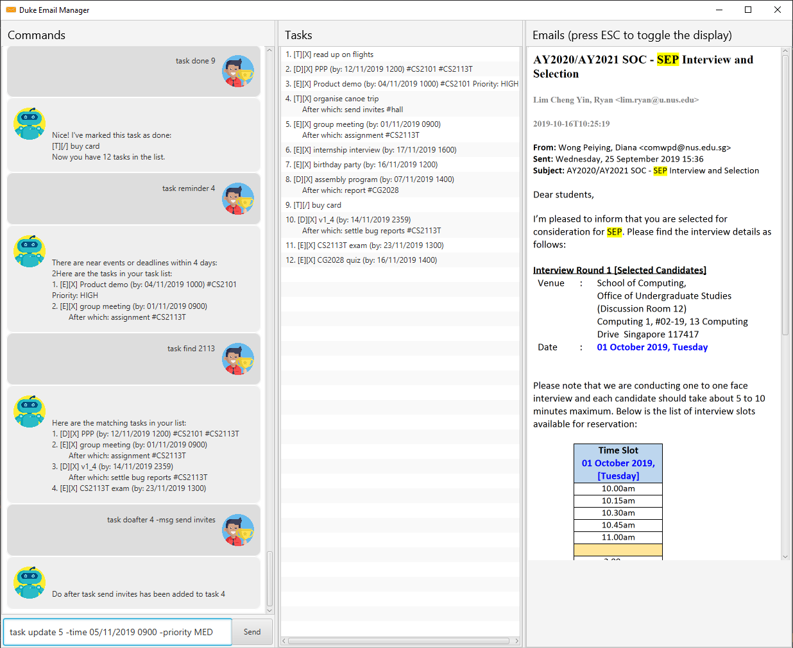

= Duchess

image::https://travis-ci.org/AY1920S1-CS2113T-T09-2/main.svg?branch=master[]

* Duchess is a calendar application tailor-made for NUS students. 
* It provides an interface for students to manage both their school and extra-curriculum commitments while providing academic contextual information.
* User interactions happen using a Command Line Interface.

== Site Map
* https://github.com/AY1920S1-CS2113T-T09-2/main/blob/master/docs/UserGuide.adoc[User Guide^]
* https://github.com/AY1920S1-CS2113T-T09-2/main/blob/master/docs/DeveloperGuide.adoc[Developer Guide^]
* https://github.com/AY1920S1-CS2113T-T09-2/main/blob/master/docs/AboutUs.adoc[About Us^]
* https://github.com/AY1920S1-CS2113T-T09-2/main/blob/master/docs/ContactUs.adoc[Contact Us^]

== Acknowledgements
* This application is a morph of the CS2113 Duke application.
* Libraries used: https://github.com/FasterXML/jackson[Jackson]