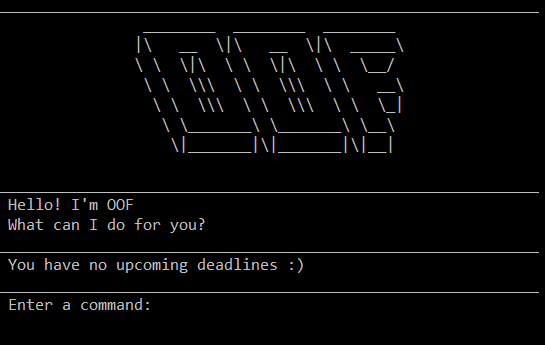

= OOF - Outstanding Organisation Friend
ifdef::env-github,env-browser[:relfileprefix: docs/]

ifdef::env-github[]
:figure-caption: Figure
.Oof welcome screen

endif::[]

* The Outstanding Organization Friend (OOF) is catered towards university students who want to use a desktop application to manage their tasks to be done. 

* OOF is optimized for users who prefer to work with the Command Line Interface (CLI) while still reaping the benefits of a Graphical User Interface (GUI).

* OOF allows users to:
** store tasks in the application
** track time spent on tasks
** plan your semesters
** display tasks in a calendar
** display free time slots
** view upcoming tasks in weekly table format
** provide reminders for users for approaching deadlines

== Site Map

* <<UserGuide#, User Guide>>
* <<DeveloperGuide#, Developer Guide>>
* <<AboutUs#, About Us>>
* <<ContactUs#, Contact Us>>

== Acknowledgements

* Libraries used: https://github.com/johnrengelman/shadow[shadowJar], https://github.com/junit-team/junit5[JUnit5], https://github.com/fusesource/jansi[Jansi]
** We use `shadowJar` to assemble our `Jar` file.
** We use `Junit5` for running our test codes.
** We use `Jansi` to emulate terminal colours.

* Original source: https://github.com/nusCS2113-AY1920S1/PersonalAssistant-Duke[PersonalAssistant-Duke]
created by https://github.com/se-edu/[SE-EDU initiative]

== Licence : link:LICENSE[MIT]
