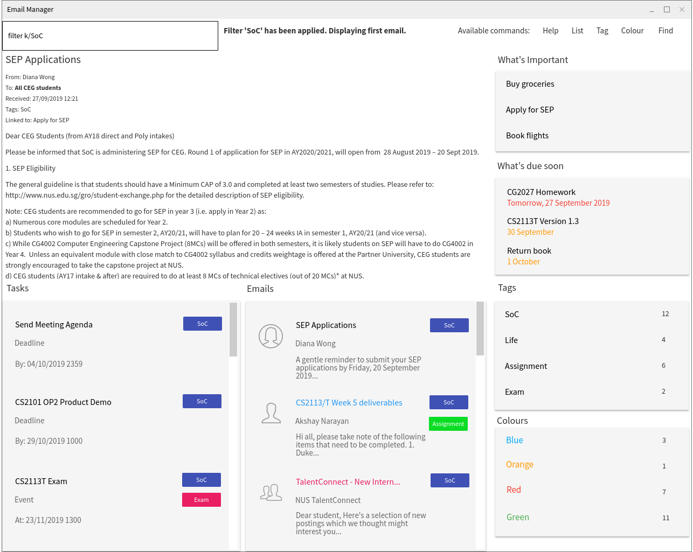

= Le Duc

:imagesDir: docs/images

ifndef::env-github[]

endif::[]

* Le Duc (The Duke in French) is a Java sample application for student who have multiple life and have to manage them all.
* Outside, they have to go to school, work part-time, attend club and have fun at some party. At home, they have to do homework, undertake a project, do some chore, cook some nice food.
* Pretty busy, right ? With this new tool, a student can manage and organise his time more efficiently.

*Site Map*

* <<docs/[AY1920S1-CS2113-T16-1]-[Le Duc]-UG.adoc#, User Guide>>
* <<docs/[AY1920S1-CS2113-T16-1]-[Le Duc]-DG.adoc#, Developer Guide>>
* <<docs/AboutUs.adoc#, About us>>

*Quick Start*

.  Please ensure that you have Java `11` or above installed.
.  Download the latest leduc jar file.
.  Execute the jar file.
.  Type the command in the shell.
.  Please refer to our <<docs/[AY1920S1-CS2113-T16-1]-[Le Duc]-UG.adoc#, User Guide>> for details of each command.
