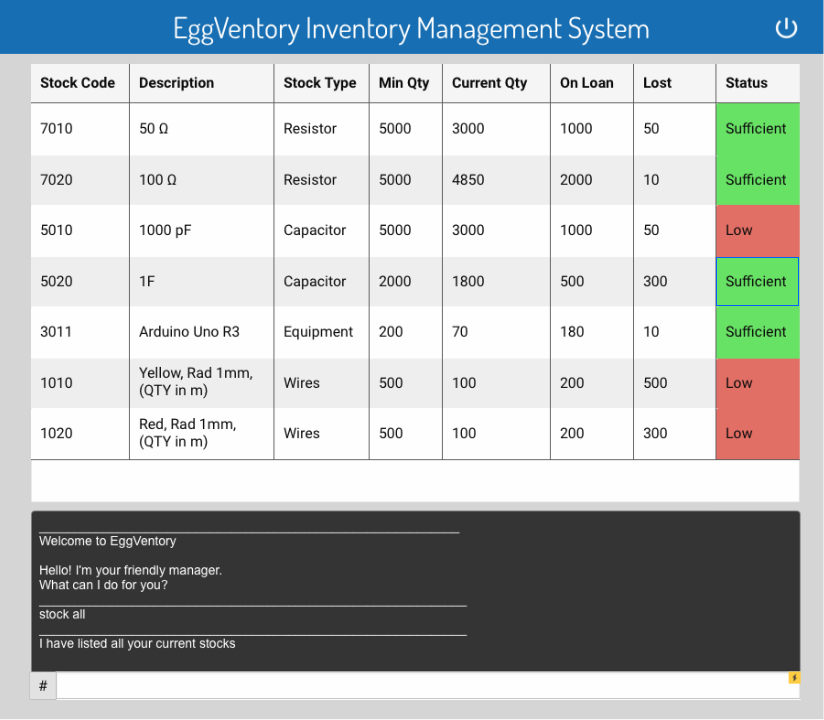

# Eggventory Systems Ltd.

## Introduction

    

Say bye to piles of paper records. Our inventory management system allows you to quickly and conveniently view all the stock and loan records. With our colour based status indicator, hours slicing through inevntory data have been cut down into seconds. As students we care, you wont have to stay back after 5pm to account for our lab logistics anymore!

## Project scope

An inventory management system specialised towards laboratory technicians in NUS Faculty of Engineering.

## Target Users

Supervisors of labs
Lab technician officers
Professors and teachers
Teaching assistants and educator assistants
Students borrowing lab equipment items
(in the future can extend to other groups like students)

Value Proposition https://www.youtube.com/watch?v=VZ5rgVgn5qk
Eggventory is a system to consolidate the management of inventories that stock electronic components. It is designed to facilitate the tracking of movement of inventory in an engineering laboratory in an easy to use interface. It can also be used to offer additional information specific to electronics, such as datasheets and links to similar components. 

In particular, it is to be [deployed in situations like schools where items from the inventory are often loaned out] idk 

## Use Cases

/* ASK THE TA THIS: If we want to implement an alternative way to achieve a functionality (e.g. Delete an item through CLI or GUI), do we have to write two use cases for it or combine them in one use case? */

Issue #25 
System: Eggventory
Actor: Lab Technician
Use Case: View all items in inventory
User types in command to list all
System displays every item in inventory

Issue #26
System: Eggventory
Actor: Lab Technician
Use Case: Search and view item
User inputs search command and the query term
System retrieves all items matching the query and item identifier, then displays the items and count as a list on the display.

Issue #46
System: Eggventory
Actor: Lab Technician
Use Case: Delete an items
User inputs delete command and item identifier 
System identifies the item requested and deletes the item object (with all its information).

## Non-Functional Requirements

It must be responsive to many commands in succession
It must be able to store at least 10,000 items
The saved inventory data must be readable and editable manually.

## Glossary

Part/Component/Equipment/Item - The items that our inventory system is managing. 

Item identifier - Item name, serial number of the part, or the index number of the item (within the system). The system will be able to identify the item based on any of these information. 

Instance index - The index number automatically assigned

Lab tech - technician in charge of keeping track of the inventory of the lab. The primary user of our system. 

Professor - educator in charge of creating classes and lab activities. Usually the user who defines what items are required for a class. 

TA - teaching assistant who helps students in their class or lab activities. May need to view and filter inventory lists, but unlikely to need to edit or create their own. 

Student - participant in class or lab activities. May use the lab equipment in class, but may also need to loan out some for projects. Students may loan a fixed inventory list or be allowed to choose what they need for their project. 

