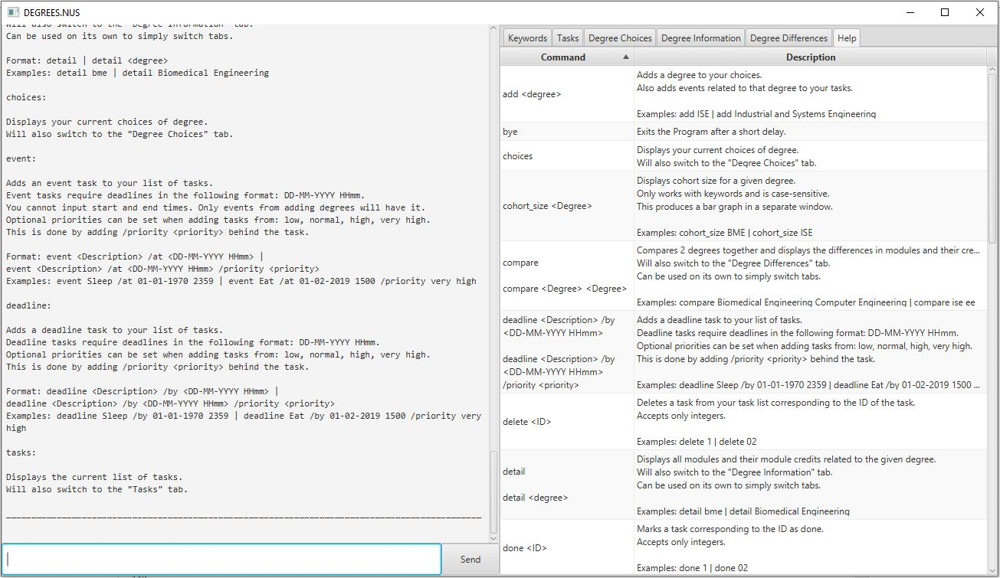

# Duke 2.0

A java program for prospective applicants who prefer to use a desktop app for researching on degrees from NUS' Faculty of Engineering. 

## Features
* Scrapes course information from the NUS database
* Ranking system for courses
* Display course information and module information
* Accepts commands for input
* Task manager to organise faculty events

## Technologies Used
Project is created with:
* Java Development Kit 11
* JavaFX 11 (via Gradle openJFX)
* Gradle
* IntelliJ IDEA Community Edition 2019.2.1

## User Guide

For those who wish to use Duke 2.0 as-is, please refer to the [User Guide](docs/UserGuide.adoc).

## For Developers

For those who wish to modify the source files for their own project, or just to see how Duke 2.0 works, refer to [here](docs/DeveloperGuide.adoc).

For a quick guide to modifying gradle for this project, refer to [this guide](docs/GradleUsage.md)

## Status

Currently, this project only contains a task manager. We are currently in the process of designing a UI that best displays the course information and adding functions to manage the course data.

## UI Mock-ups

## Contributers

[About Us](docs/AboutUs.adoc)
