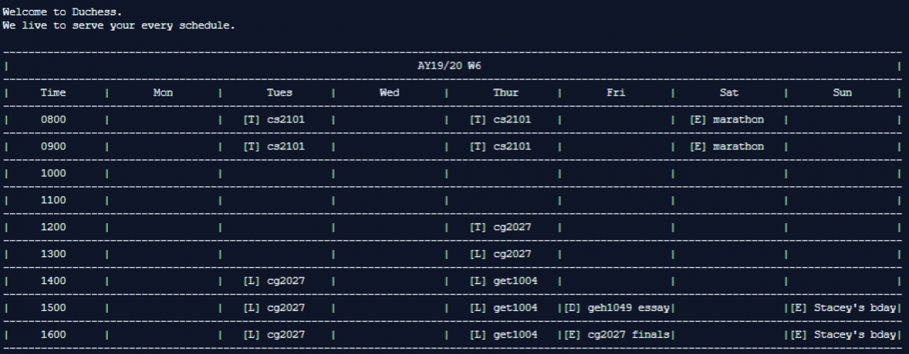

# AlphaNUS

* AlphaNUS is an app intended for the treasurers of NUS clubs. The user interactions will occur using the CLI.
* The purpose of the app is to categorize the deadline of the payment forms, expenses of events and history of tasks completed. This allows the treasurer to be organized and efficiently keep track of their tasks. 
* AlphaNUS is written in OOP fashion. 
* [User Guide](https://github.com/AY1920S1-CS2113T-F10-3/main/blob/master/docs/UserGuide.adoc)
* [Developer Guide](https://github.com/AY1920S1-CS2113T-F10-3/main/blob/master/docs/DeveloperGuide.adoc)
* [AboutUs](https://github.com/AY1920S1-CS2113T-F10-3/main/blob/master/docs/AboutUs.adoc)

