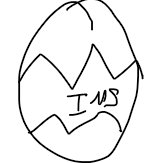
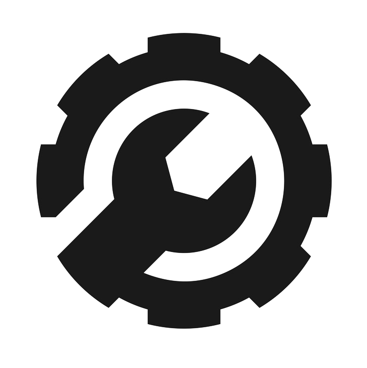

# Eggventory Systems Ltd.

  

## What is Eggventory?
For far too long the Faculty of Engineering's (FoE) lab technicians have had to deal with convoluted and time-consuming methods of tracking their inventory through Excel sheets or even sometimes using pen and paper!

Worse still, when it comes to loaning out items to students, items often go missing without any system to remind lab technicians to recollect items or renew loans.

The time spent on this administrative burden could be better spent on continually improving lab facilities, and even opening up the lab to more students to support an improved culture of innovation within FoE!

We hope to drive this change by creating an inventory management system that is specialized and technical enough to meet the requirements of lab technicians, while being general enough to be used across multiple Engineering labs.

## Why the name Eggventory?

  

There are two reasons:
1. Eggventory stands for Engineering Got General Inventory. 
2. Our philosophy of the Egg at Team Eggventory.

More on our philosophy: At Eggventory we believe in the power of the potential to be, and to do something greater. Just as the unhatched egg cannot comprehend the infinite possibilities in the world outside until it is hatched, humans can be limited in their perspective and can often enclose their thinking within a box conforming to archaic and inefficient ideas of the past. 

The Egg therefore serves as a reminder, that unless we choose to move past our comfort zones and hatch into something greater, we will be unable to achieve paradigmatic change.

It is this change that we at Eggventory strive towards timelessly.

## Eggventory in action

  

*Insert UI image here*

### Seamless switching between CLI and GUI

  

Whether you're someone who wants more power at their fingertips, or someone just looking for an intuitive and minimalist interface for their inventory management, Eggventory has the tools for you. Choose between the Augmented CLI or the GUI, and switch seamlessly between them as and when you see fit.
 
### Inventory exporting to CSV

  

Need to use your inventory with another software? That's easy! Simply export your entire inventory to a CSV file for use with any databasing software - with just a single click! Eggventory does not try to restrict you to its ecosystem, but rather wants to augment yours. :)

### Frequent updates and bugfixes

  

Eggventory is an in-house solution - made by NUS students, for NUS. This means that any bugs or feature requests can be met on a timely basis with utmost flexibility.

## Learn Eggventory
If you would like to learn how to use Eggventory to maximize its capabilities, or if you just need help, please view the [User Guide.](placeholder)

## Meet Team Eggventory
Please visit [here](./docs/AboutUs.md) if you would like to learn more about the members of Team Eggventory.

## Contributing to Eggventory
We welcome you to join us in contributing to Eggventory and to give back to the community. Please see [guidelines on contributing.](./CONTRIBUTING.md)
If you would like to get familiar with Eggventory's implementation, please view the [Developer Guide.](placeholder)