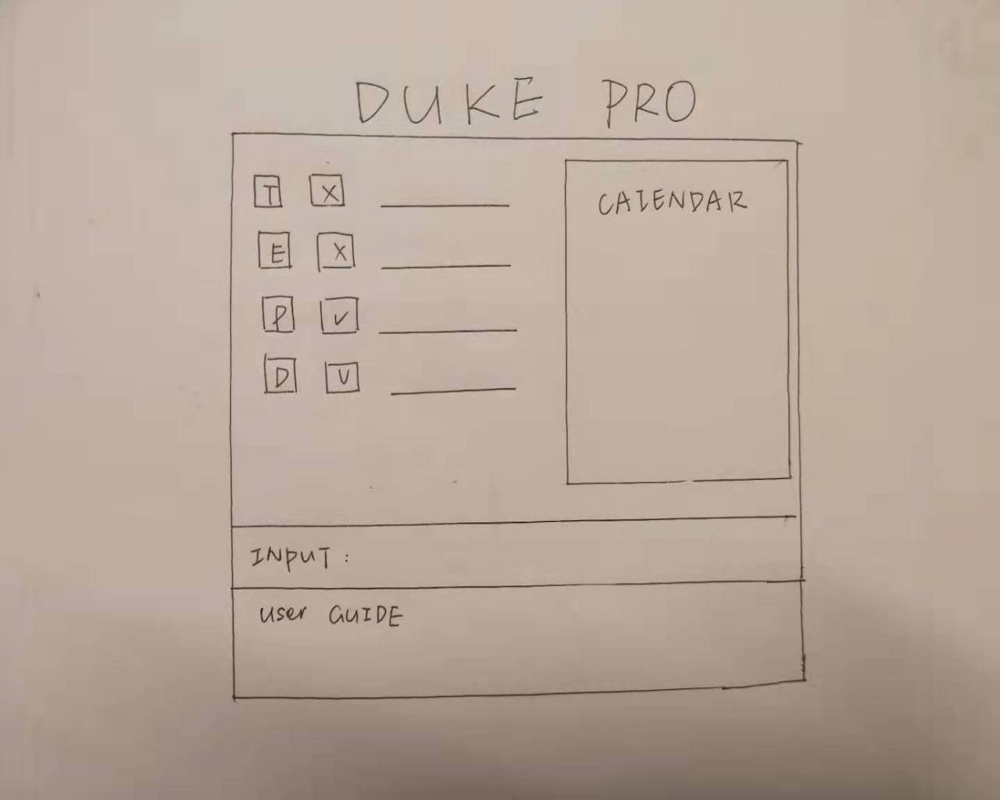

# Duke 2.0

A program for those who prefer to use a desktop app for researching on degrees from NUS' Faculty of Engineering. It primarily uses CLI for inputs, and scrapes information from the NUS database to ensure that the course and module information are always accurate. It allows the user to rank the courses according to their preferences and makes it easier to determine which course they wish to enter.

## User Guide

For those who wish to use Duke 2.0 as-is, please refer to the [User Guide](docs/README.adoc).

## Setting up

For those who wish to modify the source files for their own project, or just to see how Duke 2.0 works,

**Prerequisites**

* JDK 11
* Recommended: IntelliJ IDE
* Fork this repo to your GitHub account and clone the fork to your computer
* Gradle integration (Should be done automatically. If not, see Tutorials)

**Importing the project into IntelliJ**

1. Open IntelliJ (if you are not in the welcome screen, click `File` > `Close Project` to close the existing project dialog first).
1. Set up the correct JDK version.
   * Click `Configure` > `Structure for new Projects` (in older versions of Intellij:`Configure` > `Project Defaults` > `Project Structure`).
   * If JDK 11 is listed in the drop down, select it. If it is not, click `New...` and select the directory where you installed JDK 11.
   * Click `OK`.
1. Click `Import Project`.
1. Locate the project directory and click `OK`.
1. Select `Import project from external model -> Gradle` and click `Next`.
1. Rename the project if you want. Click `Next`.
1. Ensure that your src folder is checked. Keep clicking `Next`.
1. Click `Finish`.

## Tutorials 

Duke Components | Tutorial
---------------|---------------
`Gradle` | [Gradle Tutorial](tutorials/gradleTutorial.md)
`TextUiTesting` | [Text UI.UI Testing Tutorial](tutorials/textUiTestingTutorial.md)
`JavaFX` | JavaFX tutorials:<br>→ [Part 1: Introduction to JavaFX][fx1]<br>→ [Part 2: Creating a GUI for JavaFX.Main.Duke][fx2]<br>→ [Part 3: Interacting with the user][fx3]<br>→ [Part 4: Introduction to FXML][fx4]

[fx1]: <tutorials/javaFxTutorialPart1.md>
[fx2]: <tutorials/javaFxTutorialPart2.md>
[fx3]: <tutorials/javaFxTutorialPart3.md>
[fx4]: <tutorials/javaFxTutorialPart4.md>


## Gradle Usage

This assumes the project has been imported as a gradle project. If not, follow the instructions at [Gradle Tutorial](tutorials/gradleTutorial.md).

Gradle Commands | Usage
-----------------|--------------------
`gradlew build` | Runs all available gradle tasks
`gradlew task`| Displays all available gradle tasks
`gradlew checkstyleMain` | Checks source code against a given code style
`gradlew checkstyleTest` | Checks test code against a given code style
`gradlew run` | Runs the main class as specified in build.gradle
`gradlew properties` | Displays the properties of this gradle project
`gradlew shadowjar` | Compiles and creates a standalone executable .jar file

### Using build.gradle
The dependencies and properties of the gradle project can be changed in [build.gradle](build.gradle).

**Shadowjar**

When `gradlew shadowjar` is run, it will create a .jar file in the format {archiveBaseName}-{archiveVersion}.jar.
Modify the the following part in the `build.gradle` file to update the name of the jar file.
```
shadowJar {
	archiveBaseName = "duke"
	archiveVersion = "0.1.0"
	archiveClassifier = null
	archiveAppendix = null
}
```
**Working directory**

The following lines determines the working directory of the gradle project when `gradlew run` is used.
For the gradle project to detect the save file in `../data`, the working directory must be set to `../main/bin`.
```
File runningDir = new File('../main/bin')
runningDir.mkdirs()
tasks.run.workingDir = runningDir
```
**Main class**

This part of `build.gradle` determines which class is to be the main class of the project. 

Using `javafx.Launcher` means Duke 2.0 will launch with a GUI, while using `main.Duke` means Duke 2.0 will run in console mode only.
```
application {
	// Change this to your main class.
	mainClassName = "javafx.Launcher"
	//mainClassName = "main.Duke"
}
```

## UI



