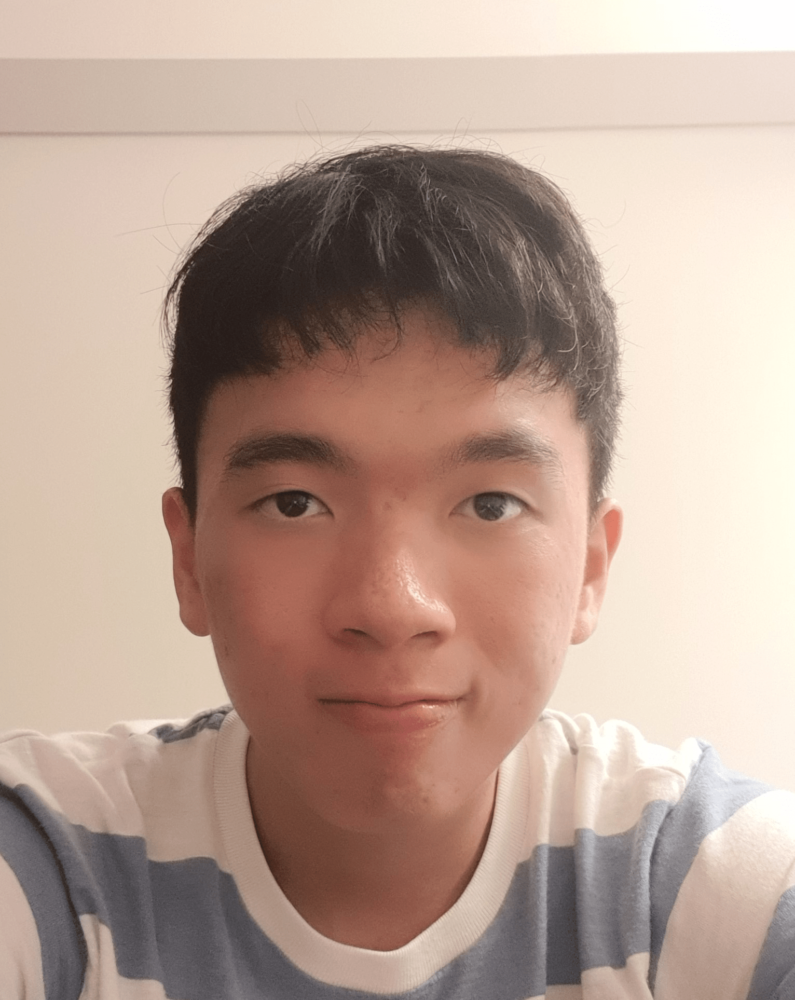
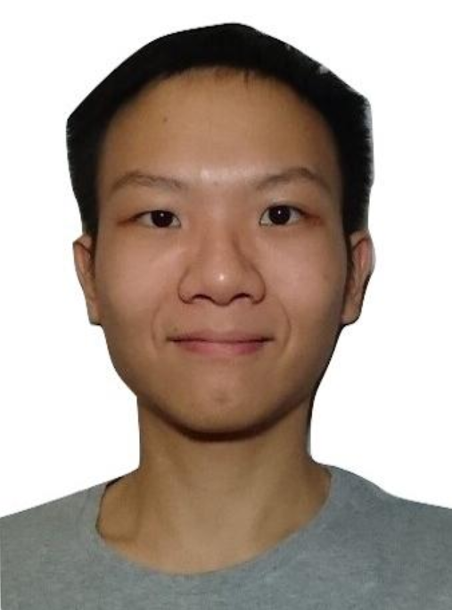
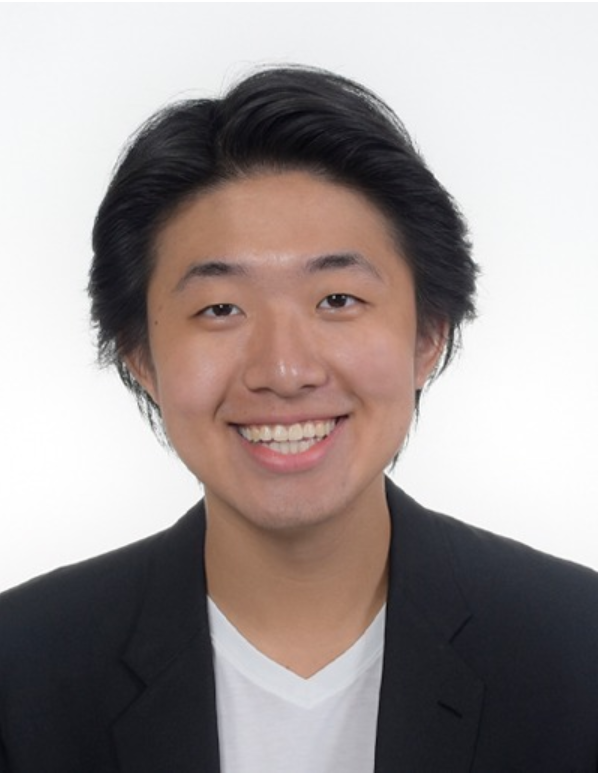
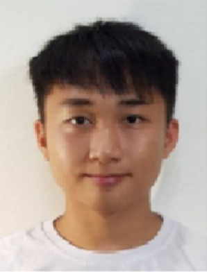

# About Us
Optix was developed by the AY1920S1-CS2113T-T12-1 team. 
We are a team from the National University of Singapore, taking CS2113T in AY19/20 S1.
This is a group project as part of this module. We are an egoless team.

## Project Team
### Nicholas Liu

{empty}[https://https://github.com/NicholasLiu97[github]]

Role: Team Lead

Responsibilities: Deliverables & Deadlines

### Kennedy Oung

{empty}[https://https://github.com/OungKennedy[github]]

Role: Developer

Responsibilities: Integration & Testing

### Tian Chang

{empty}[https://https://github.com/TianchangLiao[github]]

Role: Developer

Responsibilities: Scheduling & Tracking

### Brian

{empty}[https://https://github.com/CheeSengg[github]]

Role: Developer

Responsibilities: Code Quality
