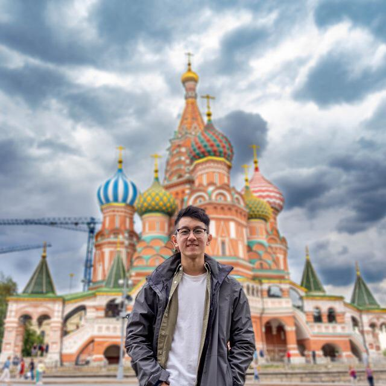

= About Us
:site-section: AboutUs
:relfileprefix: team/
:imagesDir: images-about-us
:stylesDir: stylesheets

PersonalAssistant - Duke was developed by the https://se-edu.github.io/docs/Team.html[Beastie bois] team. +
We are a team based in the http://www.comp.nus.edu.sg[School of Computing, National University of Singapore].

== Project Team

=== Mohammad Yousuf
image::images/yzia2000.png[width="150", align="left"]
{empty}[http://github.com/yzia2000[github]] [<<yzia2000#, portfolio>>]

Role: Team Lead +
Responsibilities: Data + Merging

'''

=== Nathan Yeo
image::images/nystera.png[width="150", align="left"]
{empty}[http://github.com/nystera[github]] [<<nystera#, portfolio>>]

Role: Project Advisor +
Responsibilities: Dev Ops

'''

=== Nigel Tan
image::images/enriquekhai.png[width="150", align="left"]
{empty}[[homepage]] [https://github.com/enriquekhai[github]] [<<enriquekhai#, portfolio>>]

Role: Developer (Productivity) +
Responsibilities: Model

'''

=== Ng Jie Wu
image::images/ngjiewu.png[width="150", align="left"]
{empty}[http://github.com/ngjiewu[github]] [<<ngjiewu#, portfolio>>]

Role: Developer (Productivity) +
Responsibilities: Threading

'''

=== Ng Jing Kang

{empty}[http://github.com/jingkang97[github]] [<<johndoe#, portfolio>>]

Role: Developer (Game) +
Responsibilities: UI

'''
