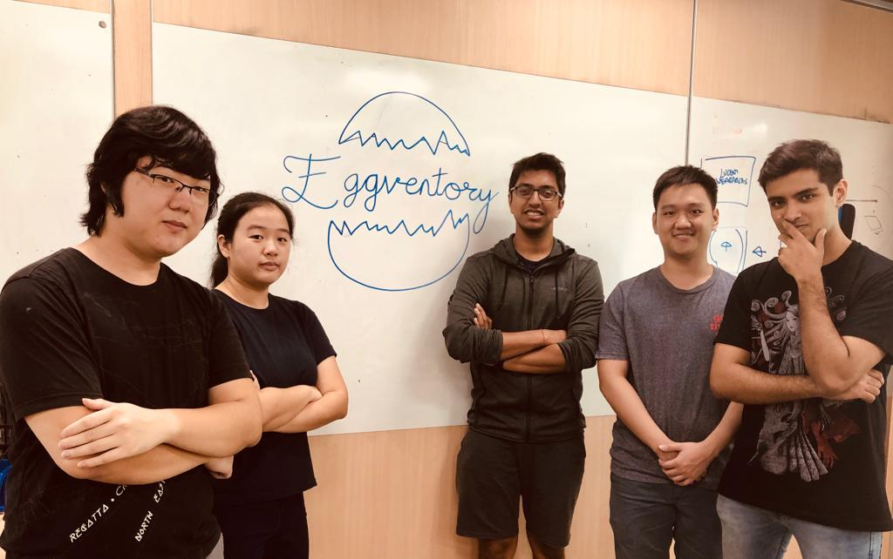
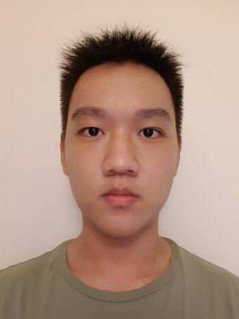
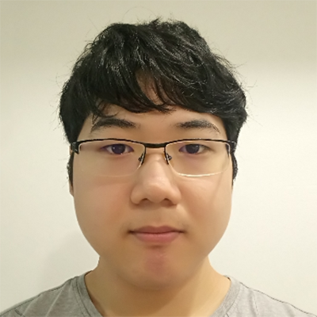

# About Us

At **Eggventory** we believe in the power of the potential to be, and to do something greater. Just as the unhatched egg cannot comprehend the infinite possibilities in the world outside until it is hatched, humans can be limited in their perspective and can often enclose their thinking within a box conforming to archaic and inefficient ideas of the past. 

The 'Egg' in Eggventory therefore serves as a reminder, that unless we choose to move past our comfort zones and hatch into something greater, we will be unable to achieve paradigmatic change.

It is this change that we at Eggventory strive towards timelessly.

---

# Project Team

   

## Raghav

  

[[github](https://github.com/Raghav-B)][[portfolio](https://github.com/Raghav-B)]

**Roles:** 
* Frontend Developer
* Marketing Writer

**Responsibilities:** 
* GUI & CLI
* Managing Git repo
* Adorning the repo with marketing speech

---

## Rebecca

  

[[github](https://github.com/cyanoei)][[portfolio](https://github.com/cyanoei)]

**Role:**
* Team Lead
* Backend Developer
  
**Responsibilities:**
* Deliverables and deadlines
* Debugging of code

---

## Yanbo

  

[[github](https://github.com/yanprosobo)][[portfolio](https://github.com/yanprosobo)]

**Role:** 
* Backend Developer
  
**Responsibilities:** 
* Integration of code

---

## Rishab

  

[[github](https://github.com/patwaririshab)][[portfolio](https://github.com/patwaririshab)]

**Role:**
* Software Tester  

**Responsibilities:** 
* JUnit testing
* Code quality assurance

## Benjamin

  

[[github](https://github.com/Deculsion)][[portfolio](https://github.com/Deculsion)]

**Role:**
* Backend Developer
* Scheduling and tracking
  
**Responsibilities:**
* Ensuring meetings and overall timeline is on task

---
