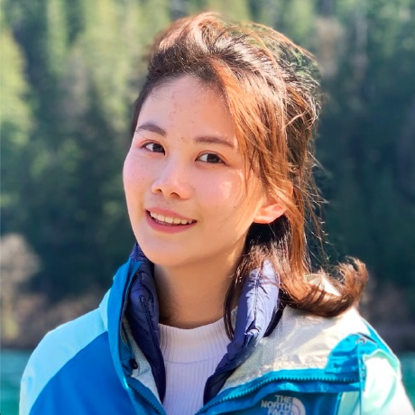
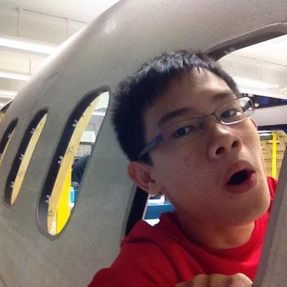

# About Us

Duke - Level 3 was developed by the [se-edu](https://se-edu.github.io/docs/Team.html) team.
*{The dummy content given below serves as a placeholder to be used by future forks of the project.}*

We are a team based in the [School of Computing, National University of Singapore](http://www.comp.nus.edu.sg/).

## Project Team

### Hafidz Bin Hussain

[[github](https://github.com/9hafidz6)] [profolio]

Role: Team Lead

Responsibilities:

### Sara Djambazovska

[[github](https://github.com/saradj/)] [profolio]

Role: Developer

Responsibilities:

### Jiahan Yu

[[github](https://github.com/VirginiaYu)] [profolio]

Role: Developer

Responsibilities:

### Goh Zhen Hao Joey

[[github](https://github.com/x3chillax)] [profolio]

Role: Developer

Responsibilities:

### Lincoln Lim

[[github](https://github.com/CEGLincoln)] [profolio]

Role: Developer

Responsibilities:
