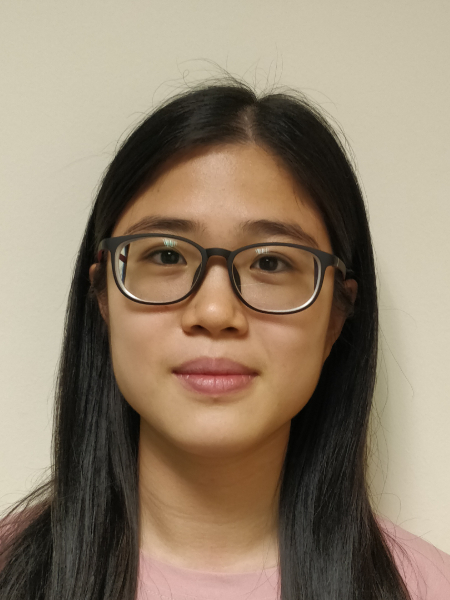
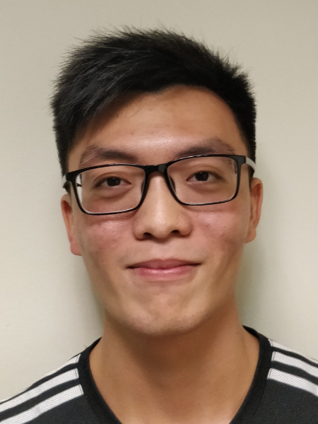
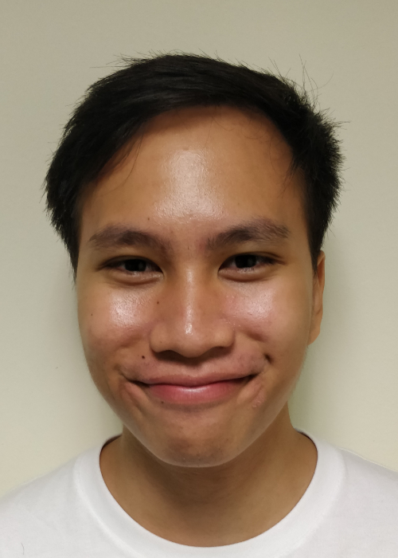

About Us
============

compal - A CLI (Command Line Interface) scheduling application that targets students who prefer to use a desktop application for managing their schedule easily with reminders!  
We are a team based in the [School of Computing, National University of Singapore](http://www.comp.nus.edu.sg).

Project Team
============

**Jaedon Kee**

\[[github](http://github.com/jaedonkey)\] \[[portfolio](#jaedonkey#)\]

Role: Developer  
Responsibilities: Edit & Find Command,Storage Component

---

**Catherine Tan**

\[[github](http://github.com/catherinetan99)\] \[[portfolio](#catherinetan99#)\]

Role: Developer  
Responsibilities: Set-Reminders,View-Reminders & FindFreeTimeSlot Commands

---
**Liu Peize**

\[[github](http://github.com/ltpz)\] \[[portfolio](#ltpz#)\]

Role: Developer  
Responsibilities: Recurring Deadline & Help Command ,Model Component

---
**Yue Jun Yi**

\[[github](http://github.com/yueyeah)\] \[[portfolio](#johndoe#)\]

Role: Developer  
Responsibilities: Recurring Events & Delete Command,Model Component 

---
**Sholihin Kamarudin**

\[[github](https://github.com/sholihink)\] \[[portfolio](#sholihink#)\]

Role: Team Lead,Developer  
Responsibilities: View,List & Done Command,Daily View Interface,Ui Component

---
