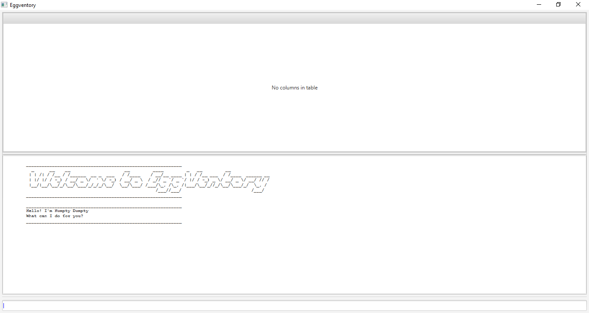

# Eggventory User Guide
By: Team F09-03  
Dated: 7 November 2019  
## Table of contents  
### [1. Introduction ](#introduction)  
### [2. Quick Start ](#quickstart)  
### [3. Features and Command Usage ](#features-and-command-usage)  
##### [3.1 Viewing help ](#viewing-help-help)  
##### [3.2 Working with Stock Types ](#working-with-stock-types)  
##### [3.3 Working with Stocks ](#working-with-stocks)  
##### [3.4 Managing your list of People ](#managing-your-list-of-people)  
##### [3.5 Managing your list of Loans ](#managing-your-list-of-loans)  
##### [3.6 Loaning using Templates](#loaning-using-templates)
##### [3.7 Marking Stock as Lost ](#marking-stock-as-lost--coming-in-v2.0)  
##### [3.8 Searching the Inventory ](#searching-the-inventory)  
##### [3.9 Using Undo and Redo Commands ](#using-undo-and-redo-commands-coming-in-v2.0)  
##### [3.10 Setting autosave options ](#setting-autosave-options-coming-in-v2.0)  
##### [3.11 Exiting the program: bye ](#exiting-the-program-bye)  
### [4. FAQ ](#faq)  
### [5. Command Summary ](#command-summary)  
### [6. Glossary ](#glossary)  
  
  
## 1. Introduction  
Eggventory is an inventory management system targeted towards engineering laboratory inventories. It is designed to make tracking of stock and inventory fast and painless. There are visual elements for all functionalities which makes learning the system easy, but there are also command-line equivalents that allow advanced users to do everything in one or two short commands.  
  
## 2. Quick start  
  
1. #### [Download and install Java 11 on your machine. ](https://www.oracle.com/technetwork/java/javase/downloads/jdk11-downloads-5066655.html)  
2. #### [Download the latest eggventory.jar the github repository. ](https://github.com/AY1920S1-CS2113T-F09-3/main)  
3.   #### Copy the file to the folder you want to use as the home folder for your inventory management system.  
4. #### Double-click the file to start the app. The GUI should appear in a few seconds.  
 
    
  
5. #### Type the command in the command box and press Enter to execute it  
   - Typing help and pressing `Enter` will open the help window.  
  
6. #### Some example commands you can try:  
    
    - `add stocktype Resistors` : Creates a category of stock named “Resistors”. 
         
    - `add stock Resistors R500 200 500-ohm resistor` : Creates a new stock item with 200 500-ohm resistors and a stock code of “R500”, under the “Resistors” Stock Type.  
          
    - `edit stock Resistors R500 50` : Reduces the stock count of item R500 (500-ohm resistor) to 50.  
          
    - `add stocktype Capacitors`: Creates a category of stock named "Capacitors".
    
    - `add stock Capacitors C1k 75 1000pF` :  Creates a new stock item with 75 1000pF Capacitors and stock code “C1k”. The stock type will be defaulted to “Uncategorised”.   
         
    - `list stocktype Resistors` : Displays all stock that is categorised as Resistors.  
          
    -  `bye` : exits the app    
  
7. #### Refer to Section 3 for a more detailed list of commands you can use.  
    
## 3. Features and command usage  
  
The following section describes the command line interface commands that Eggventory recognises. Each command you input has to follow a specific format of words and parameters.  
  
Command Format    Text in <Angled Brackets> are mandatory parameter to be supplied by the user. E.g. add stocktype <Stock Type> , <Stock Type> is a parameter which is the name of the stocktype the user wishes to add.  
  
- Parameters in {Braces} can be repeated multiple times in the same command, separated by a space. E.g. loan add <Matric. No> {<Stock Code> <Quantity>} , more <Stock Code> <Quantity> pairs can be added after the first pair as such: `loan add A0191234A R500 20 R250 10 R100 5`  
  
-   [coming in v2.0] Some commands have optional parameters available. Optional parameters are added to the end of the corresponding command, after all mandatory parameters. E.g. `add stock R500 50 “500-ohm Resistors” -st Resistors` , will create a new stock, and placed under the “Resistors” Stock Type with the “-st” tag.  
  
### 3.1 Viewing help: ``help``  
  
General help: Displays a basic list of commands and their input formats.  
  
Format: `help`  
  
Specific help: Displays a more detailed list of commands of that type, with information about each input required.  
  
Format: `help <Command>`  
  
eg. `help edit`
  
---  
  ### 3.2 Working with Stock Types  
Stock Types are the main categories of the inventory, and each Stock Type stores multiple Stocks. For example, your inventory may have Stock Types such as Resistors, Tools or Wires. You are required to add your Stock Types to the inventory before Stocks can be added. By default, Eggventory comes with an Uncategorised Stock Type, where Stocks not assigned to a specified Stock Typee added.  
  
Note: Stock Type names are not allowed to have spaces in them.  
  
#### 3.2.1 Adding new Stock Types: `add stocktype`  
  
This adds a new category of stock to the inventory.  
  
Format: `add stocktype <StockType> ` 

eg. add stocktype Resistor  
  
#### 3.2.2 Deleting Stock Types: `delete stocktype`  
    
This removes a stocktype from the inventory, and all stock under it.  
  
Format: `delete stocktype <StockType>`  

#### 3.2.3 Editing Stock Types: `edit stocktype`  
    
This changes the name of the selected stock type.
  
Format: `edit stocktype <StockType> <NewStockType>`

#### 3.2.4 Listing Stock Types: `list stocktype`  
  
This lists out all Stock Types that are present in the inventory.  
  
Format: `list stocktype all`  

---  
### 3.3 Working with Stocks  
Stocks are the main types of items that Eggventory helps you to manage. Every Stock belongs to a Stock Type. For example, you may have the Stocks “500 ohm resistor” and “1k ohm resistor” in the Resistor Stock Type.  
  
Stocks may be Collective or Unique. Collective stocks consist of items that are not tracked individually. They generally are stocks that do not have each have their own serial number, and are considered interchangeable. Unique stocks are items that are often expensive or limited in quantity. Such stocks usually are each assigned a serial number, and are loaned out and tracked by this number. Stocks are set as Collective by default.  
  
Stocks have the following properties:  

| Property | Description |  
|---:|---| 
StockType|The category the stock belongs to. The StockType should have previously been added to the inventory system before being referenced.  
StockCode|A unique string of numbers and letters, used to identify the stock.  
Quantity | The number of items under the stock.
Description | The common name of the item.  
  
Note: Stock codes are not allowed to have spaces in them, and no two stocks can share the same stock code.  
  
#### 3.3.1 Adding new Stocks: `add stock`  
  
This adds a new stock to the inventory.  
  
Format: `add stock <StockType> <StockCode> <Quantity> <Description>`  
  
eg. `add stock Resistor R500 1000 500ohm resistor`  
  
**[coming in v2.0]**  
In addition to the required parameters, stocks can also be added with the following optional parameters:  

Format|Purpose|  
|---|---|  
`-mq <MinQuantity>` |Sets the minimum quantity of stock that should be maintained in the inventory  
`-u`|Sets the stock to contain items that are unique  
  

Format: `add stock <StockType> <Stock Code> <Quantity> <Description> {<optional parameter>}`  
  
eg. `add stock Resistor R500 1000 500ohm resistor -mq 100`  
  
#### 3.3.2 Deleting Stocks: `delete  stock`  
    
This removes a stock from the inventory, including any references to loaned out stock.  
  Format: `delete stock <Stock Code>`
  
#### 3.3.3 Editing Stock: `edit  stock`  
    
This directly modifies the value of a property stock. You may modify as many properties as you wish in one command.
  
Keywords to modify each property:  

- stockcode  
      
- description  
      
- stocktype  
      
- quantity  
      
- minquantity  
      
    
Format: `edit stock <Stock Code> <Property> <New Value>`  
  
eg. `edit stock R500 quantity 1000` : Changes the quantity of the stock R500 to 1000.
  
#### 3.3.4 Listing Stock: `list stock`  
    
This lists out all Stocks that are present in the inventory.  
Format: `list stock`
  
#### 3.3.5 Listing Stock of a particular StockType: `list <StockType>`  
    
This lists out all Stock under a particular Stock Type  
  
Format: `list <Stock Type>`  
  
eg. `list Resistor`  
  
---  
### 3.4 Managing your list of People  
People have to be added to the system before they can take loans from the inventory. Each person is identified by their matric number, as the inventory primarily loans out stock to students.  
  
#### 3.4.1 Adding a Person: `add person`
  
This adds a new person to keep track that will loan stock.  

Format: `add person <Matric No.> <Name>`  
  
eg. `add person A0123456 Akshay`  

Note: By nature, the matric number of each Person should be unique, meaning no two individuals are allowed to share the same matric number.  
  
  
**[coming in v2.0]**  
Optional Parameters:  

|Format|Purpose|  
|---|---|  
|`-n <Name>`|Sets the name of the person being added|
|`-c <Course>`|Sets the course of the person being added|

Format: `add person <Matric. No> {<flag> <optional parameter>}`  
  
eg. `add person A0187654 -n Raghav -c CEG`  
  
#### 3.4.2 Deleting a Person:` delete person`  
  This removes a person from being tracked. All outstanding loans are automatically returned.  
  
Format: `delete person <Matric. No>`  
  
eg. `delete person A0123456`  
  
#### 3.4.3  Editing a Person’s details: `edit person`  
    
This directly modifies the value of a property of a person. You may modify as many properties as you wish in one command.  
  
Properties:  
- matric 
- name 
  
Format: `edit person <Matric No.> <Property> <New Value>`
e.g. `edit person A0123456 name Alex`
  
#### 3.4.4 Listing all People: `list person`  
    
This lists all the people in the system, along with any information recorded about them.  
  
Format: `list person`  
  
---  
### 3.5 Managing your list of Loans  
    
#### 3.5.1 Adding a Loan: `add loan`
    
This adds a new Loan and assigns it to a Person.
  
Format: `add loan <Matric No.> <Stock Code> <Quantity>`  
  
eg. `add loan A0123456 R500 1000 X123 80`  

#### 3.5.2 Deleting a Loan: `delete loan`
This deletes an existing Loan assigned to a Person. If there are multiple loans of the same StockCode to the same
 Person, the first instance of such a Loan will be deleted.

Format: `delete loan <MatricNo> <StockCode>`

e.g. `delete loan A0123456 R500`
  
#### 3.5.3 Returning specific Loans: `loan return` [coming in v2.0]  
    
This marks specific Loans of a Person as returned.  
  Format: `loan return <Matric No.> {<Stock Code> <Quantity>}`  
  
#### 3.5.4 Returning all Loans: `loan returnall` [coming in v2.0] 
    
This marks all Loans of a Person as returned.  

Format: `loan returnall <Matric No.>`  
  
#### 3.5.5 Listing all Persons and their Loans: `list  loan`
    
This lists out all loans currently recorded, listed by the Person who made the loan.  
  
Format: `list loan`  
  
---  
### 3.6 Loaning using Templates
    
To speed up the loaning process, Eggventory allows you to create loan templates. These templates are simply lists of
 stocks and quantity to be loaned out all at once. 
  
#### 3.6.1 Adding loan templates: `add template`  
This creates a new template of Loans. 
  
Format: `add template <TemplateName> {<StockCode> <Quantity>}`  
  
e.g. `add template CG1112_Alex R500 5 A123 1`  
 
 Note: The name of each template must be unique, or it will not be added. 
  
#### 3.6.2  Deleting a Template: `delete template`  

  This deletes a loan template.  
  
  Format: `delete template <Template Name>`  
  
eg. `delete template CG1112_Alex`  
  
#### 3.6.3 Making a Loan from a template: `add loan`

This adds a Loan to a Person from a Template. Every loan in the template will be added to the person as if you added
 them individually. 

Format: `add loan <Matric. No> <Template Name>`  
  
eg. `add loan A0187654 CG1112_Alex`  
  
Note: Additional Loans can still be added on to the same Person afterwards using the loan add command.  

#### 3.6.4 Listing Loan Templates: `list template` 
  
This lists out all the templates and their associated loans that you have created.
  
Format: `list template`
  
---  
### 3.7 Marking Stock as lost **[coming in v2.0]**
Marks a certain quantity of a stock as lost. Differs from deleting stock in the fact that the quantity of stock will still be saved in the inventory (eg. for administrative purposes). Lost stock will not be included in tallies of available stock.  
  
#### 3.7.1 Marking Stock as lost: `lost`  
    
Format:` lost <Stock Code> <Quantity>`  
  
eg. `lost R500 10`  
  
#### 3.7.2 Marking Loaned Stock as lost:   
This directly marks a quantity of a Person’s Loan as lost. The items are removed from the Loan list and counted as lost within the main inventory.  
  
Format: `lost <MatricNo> <StockCode>`
  
### 3.8 Searching the inventory  
It is possible to search the inventory for a Stock or StockType with the find command. It will display all Stocks or StockType that partially or fully matches the input query.  
  
#### 3.8.1 Finding a Stock: `find stock`  
    
This finds all stocks that match the query.  
  Format: `find stock <Query>`    
#### 3.8.2 Finding a StockType: `find stocktype`  
    
This finds all StockTypes that matches the query.  
Format: `find stocktype <Query>`  

---  
### 3.9 Using Undo and Redo commands: **[coming in v2.0]**
  
#### 3.9.1 Undoing a command: `undo`
  
If you accidentally entered a command by accident, the effects of any command can be reversed with the undo command.  
  Format: `undo`  
  
#### 3.9.2 Reversing an undo command: `redo`  
    
Undoing a command can be reversed using the redo command.  
  

Format: `redo`  
  
---  
### 3.10 Setting autosave options: [coming in v2.0]  
  Eggventory automatically saves the current inventory to the disk every time data is added, removed, or edited. You can disable this feature with this command. Eggventory will then save only when the program exits.  
  
Format: `autosave on` OR `autosave off`  
  
---  
### 3.11 Exiting the program: `bye`  
Format: `bye`  
  
## 4. FAQ    

## 5. Command Summary  
### Add Commands  

|Command| Syntax  
|---|---|  
  add stock | `add stockStockType> <StockCode> <Quantity> <Description>` 
  add stocktype | `add stocktype <StockType>`  
  add person | `add person <MatricNo>`  
  
  ### Delete Commands  
|Command| Syntax  
|---|---|  
stock | `delete stock <StockCode>`  
delete stocktype | `delete stocktype <StockType>`  
delete template | `delete template <TemplateName>`
delete person | `delete person <MatricNo>`  
  ### Edit Commands  
|Command| Syntax
|---|---|  
edit stock | `edit stock <StockCode> <Property> <NewValue>`
edit stocktype | `edit stocktype <StockType> <NewStockType>`
edit person | `edit person <MatricNo> <Property> <NewValue>`  
  
### List Commands  
| Command | Syntax  
|---|---|
list stocks | `list stock`
list stocktype | `list stocktype all`  
list stocktype | `list stocktype <StockType>`
list person | `list person`  
list loan | `list loan`  
list template | `list template`  
list lost | `list lost`
  
  
### Loan Commands  

|Command| Syntax  
|---|---|  
add loan | `add loan <MatricNo> <StockCode> <Quantity>`
loan return | `loan return <MatricNo> <StockCode> <Quantity>`
loan returnall | `loan returnall <MatricNo>`

### Template Commands

|Command|Syntax
|---|---|
  add template | `add template <TemplateName> {<StockCode> <Quantity>}`
  delete template | `delete template <TemplateName>`
  add loan | `add loan <TemplateName>`
### Lost Commands  
|Command| Syntax  
|---|---|  
lost | `lost <Stock Code> <Quantity>`
  
  
  ### Other Commands  
|Command| Syntax  
|---|---|
undo last command | `undo`  
redo previous command | `redo`  
exit application | `bye`
 
## 6. Glossary  
|Item|Description|
| --- | --- |
Matric No. | Matriculation number of student to be added  
Stock | A physical asset to be tracked by Eggventory  
Stock Code | A unique string of characters to identify a stock  
Stock Type | A category of stock
