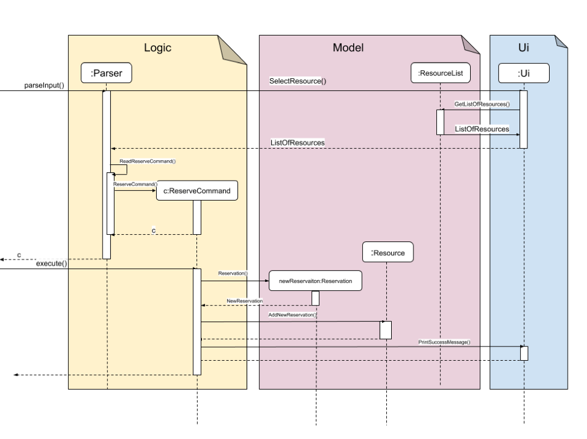

= CAI RONG- Project Portfolio 
:site-section: UserGuide
:toc:
:toc-title:
:toc-placement: preamble
:sectnums:
:imagesDir: images/Bobby
:stylesDir:
:xrefstyle: full
:experimental:
ifdef::env-github[]
:tip-caption: :bulb:
:note-caption: :information_source:
endif::[]
:repoURL: https://github.com/AY1920S1-CS2113T-W12-1/main

== Project: RIMS – Resource & Inventory Management System

This portfolio documents my contributions to the RIMS project, in terms of coding contributions towards implementing main features, project management on GitHub, and written contributions towards the User Guide, Developer Guide and general documentation.

My project team consists of 4 computing students and I. Our project is about morphing an existing command-line note-taker into a storage management application. This application is a basic command-line interface application. This morphed application aims to serve as a user-friendly book-keeping system for logistics management. 

My role was to design and program the return feature. The following sections illustrate these enhancements in more detail, as well as the relevant documentation I have added to the user and developer guides about these enhancements.

== Summary of contributions
This section shows a summary of the codes I have contributed, and other helpful contribution to the project.

* Created a basic structure to store reservations pertaining to each item. 

* Created the return feature, allowing users to cancel/return a borrowed resource by removing the corresponding reservation date from the storage. 

* Created 

Extensive analysis and testing has been done to ensure this feature works cohesively with other features such as reserve and storage. 

- *Major enhancement: added the ability to loan out and reserve items and rooms*

* What it does: 
** The `loan` command allows the user to temporarily loan out a resource in the organisation’s inventory to a requester, from the time the loan request is registered in the RIMS program, to a user-specified date of return. 
** The `reserve` command allows the user to reserve a resource for the requester, between two future dates as specified by the requester.

* Justification:
** This feature enhances the effectiveness of RIMS as a digital inventory tracker for its intended audience of resource managers, for whom making and tracking loans are crucial responsibilities. Including this feature allows RIMS to further assist our intended audience by digitally keeping track of resources they have loaned out.

* Highlights:
** The implementation of this feature was challenging due to the need to check the availability of the resource being requested.
** The inventory had to be searched to check whether there was enough of that resource in the inventory to meet the requester’s demand, and whether those resources had not already been reserved for another requester.

- *Major enhancement: added a reminder of all resources that are due soon or overdue for return*

* What it does:
** When RIMS is started up, the program creates a list of loaned-out resources that are either due for return within 3 days, or overdue for return.

* Justification:
** This feature enhances the effectiveness of RIMS by letting the program remind the user of all the resources that he must ensure will be returned to him soon. This eases the burden of him having to manually type in multiple commands to check whether any of the various types of resources in the inventory are due for return soon.

* Highlights:
** The enhancement will be able to work with future changes to code and new features to be added.
** The enhancement also features an `[OVERDUE]` tag to distinguish resources that are already overdue, from resources that are due soon but not overdue yet.

- *Minor enhancement: allowing the return of multiple items simultaneously*

** Each requester has a unique ID by which they are identified
** When the command to return an item is called in the RIMS program, the program first asks for the ID of the requester who is returning their item
** The program then lists all the reservations and loans that have been made by that user, allowing them to select multiple reservations/loans to return simultaneously

- *Code contributed:* 

** https://github.com/AY1920S1-CS2113T-W12-1/main/tree/master/src/main/java/rims/core[Functional code - Core classes] 
** https://github.com/AY1920S1-CS2113T-W12-1/main/tree/master/src/main/java/rims/command[Functional code - Command classes]
** [Test code]
** The links in square brackets [ ] contain samples of my code.

- *Other contributions:*

** Project management:
*** Managed releases v1.3 and v1.4 on GitHub

** Enhancements to existing features:
*** Added a list of supported input commands to be displayed by RIMS upon start-up
*** Helped edit RIMS logo upon start-up of the program

** Documentation:
*** Helped with formatting and cosmetic improvements of User Guide to enhance readability

** Community:
*** Pull Requests reviewed (with non-trivial review comments): #40
*** Contributed to forum discussions

== Contributions to the User Guide

Given below is an excerpt of the RIMS User Guide, featuring my contributions to the guide.

The excerpt describes the usage of the `loan` and `reserve` commands in RIMS, which are used to register the lending out of items in the user’s inventory.

=== Resource Status

==== Loan out resources: `loan`
Registers an item / room as having been lent out, and is unavailable for further loaning until it is returned.

.*Format*:
. `loan /item ITEM_NAME /qty QUANTITY /by DEADLINE`
. `loan /room ROOM_NAME /by DEADLINE`
* If the item or room does not exist in RIMS, then the UI will send a message to inform the user.
* Quantity must be a positive integer.
* Quantity must be less than the total number of items available in RIMS, else it will be reduced to zero.

.*Examples*:
* `delete /item book /qty 5`
* `delete /room multi purpose sports hall`

==== Reserve resources: `reserve`
Registers an item/room as having been reserved (loaned in advance) from a future date to another future date.

.*Format*:
. `reserve /item ITEM /qty QUANTITY /from DATE /to DEADLINE`
. `reserve /room ROOM /from DATE /to DEADLINE`
* While loans take effect from the current date to a specified deadline, reservations specify a future time-frame for an item to be loaned out.
* Quantity must be a positive integer.
* If the user requests a quantity that is greater than the existing amount of that item in the inventory, the UI will send an error message to the user.
* If the item or room does not exist in the inventory, the UI will send an error message to the user.
* Rooms are unique and thus do not require quantities.
* Deadline must be formatted dd/mm/yyyy hhmm in 24-hour time format.

.*Examples*:
* `reserve /item basketball /qty 1 /from 01/10/2019 2300 /to 03/10/2019 2300`
* `reserve /room basketball court /from 01/10/2019 2300 /to 03/10/2019 2300`

== Contributions to the Developer Guide

Given below is an excerpt of the RIMS Developer Guide, featuring my contributions to the guide.

The excerpt describes the implementation and design considerations of the `loan` and `reserve` commands in RIMS.

=== Reserve/Loan

==== Implementation
.Sequence Diagram for Reserve
[caption="Figure 2.2.1: "]

Making a reservation utilizes the following classes. The Parser and UI class will gather inputs from users. Then, these inputs will be used to create new reservation under the ReserveCommand class. New reservations are added to the ReservationList class under each Resource object.

For making a reservation, consider the case where a user wants to make reservation of an existing resource.
When starting up RIMS, a Ui and Parser object is instantiated respectively.

1. Referring to Figure 2.2.1, a parseInput() function is called, prompting for input from the user. He/She enters the relevant input which is gathered by getinput() from Ui object.
2. After selecting a type of Resource, The Ui object will display a list of all Resource belong to that type for the user to choose.
3. The user can then enter the name of the Resource they wish to make a reservation for.
4. Then, the user can choose a time period they wish to reserve.
5. Following that, the Parser object constructs a new ReserveCommand object with the evaluated parameters.
6. Afterwards, the ReserveCommand is executed with the execute() function, which constructs a new Reservation based on the parameters provided in ReserveCommand.
7. The execute() function checks if an object is available for loan. If no Resource object is available, then an exception is thrown.
8. If any Resource is available for loan, then a new reservation object will be instantiated and added to the ReservationList object belonging to this Resource.
9. Lastly, the Ui object prints a message to the user to notify him/her of the resources that have been added into RIMS.

==== Design Considerations

_Aspect 1: Selection of resource and quantity_

* *Alternative 1 (Current choice)*:
User select in terms of the following sequence - resource type, resource name, resource quantity.
When each input is gathered, the ui class will feedback relevant information to help the user make decisions. In case of invalid input (such as invalid name), the parser will throw an exception and display an error message. Using this approach, users can only make one reservation for multiple resources of the same name at a time.
** Advantages: More user friendly as user only requires one single command to make reservations for multiple resources of the same name.
** Disadvantages: More difficult to catch exceptions. User also cannot select the exact resource they wish to borrow since resources are selected by a non-unique attribute.

* *Alternative 2 (Previous version)*:
User select in terms of the following sequence - resource type, resource id.
When parser starts gathering input, it will display a full list of all resources. User then select the resource to make a reservation for by entering a resource id. Using this approach, users can only make one reservation for one resource at a time.
** Advantages: Easy to handle command and catch exceptions.
** Disadvantages:
Less user friendly in handling bulk reservation as user has to repeatedly enter the same command multiple times.
Less user friendly when the resource list becomes long. Users then have to manually find a resource ID

_Aspect 2: Selection of reservation dates_

* *Alternative 1 (Current choice)*:
User enters a single pair of start date followed by an end date. These pair of dates will be checked in the ReserveCommand class.

** Advantages:
-

** Disadvantages:
Users may need to key in repeated commands if they wish to make different reservations for a resource.

* *Alternative 2*:
Users are able to enter a list of pairs of start date followed by an end date. These pair of dates will be checked in the ReserveCommand class

** Advantages:
More user friendly if users wish to make different reservations for a resource.

** Disadvantages:
-

