= OPTIX - Developer Guide
:site-section: DeveloperGuide
:toc:
:toc-title:
:toc-placement: preamble
:sectnums:
:stylesDir: stylesheets
:xrefstyle: full
ifdef::env-github[]
:tip-caption: :bulb:
:note-caption: :information_source:
:warning-caption: :warning:
endif::[]
:repoURL: https://github.com/AY1920S1-CS2113T-T12-1/main

By: `Team AY1920S1-CS2113T-T12-1`      Since: `Oct 2019`

== Introduction
Optix is a desktop application for users to manage ticket booking and the finances of a show at its respective venue.
User input is done mainly using the Command Line Interface (CLI) and GUI is used to display the output. The CLI and GUI
are integrated to make the execution of commands more efficient and user-friendly.

This document describes the architecture and system design of Optix and serves to let other developers understand the
implementation of the program should they wish to work on it. This document is divided into four
parts: System architecture, implementations, functionalities of the program and requirements of the program.

*Problem we are solving*: +
Provide an open-source software for planning committees who wish to schedule shows at a venue but lack proper
management system. Optix is also an all-in-one platform that allows for seat bookings and finance tracking.

=== Target User Profile:
* Any user with a need to track the seat booking of a show or event as well as the finances from the bookings.
* Prefers CLI to mouse input.

=== Product features:
* New shows scheduled can be added to the list.
* Sales of seats for a show.
* Program is designed to price the seats according to the different tiers.
* Revenue earned from a show can be calculated based on the seats booked.

=== Value proposition:
Many planning committees often plan performances and events at various venues for guests. However, as many of them do
not have access to ticket management programs, they use conventional methods like using Microsoft Excel to record seat
purchases and track finances. Such tracking methods are rather inefficient and error prone as it is difficult to check
if a particular seat has been purchased or not. Optix is an all-in-one application that facilitates the management of
seats and finances of  a show more efficiently than an average GUI-based app. Users can easily track the seating
arrangement with the GUI and sell seats to customers efficiently through the CLI. An in-built finance tracker also
helps to track the profit earned from the shows.

== Setting up

=== Prerequisites
. *JDK* `11` or above +
. *IntelliJ* IDE

[NOTE]
IntelliJ by default has Gradle and JavaFx plugins installed. Do not disable them.
If you have disabled them, go to `File` > `Settings` > `Plugins` to re-enable them.

=== Setting up the project
. Fork link:{repoURL}[this] repo, and clone the fork to your computer. +
. Open IntelliJ (if you are not in the welcome screen, click `File` > `Close Project` to close the existing project
dialog first)
. Set up the correct JDK version for Gradle
.. Click `Configure` > `Project Defaults` > `Project Structure`
.. Click `New…` find the directory of the JDK
. Click `Import Project`
. Locate the `build.gradle` file and select it. Click `OK`
. Click `Open as Project`
. Click `OK` to accept the default settings.

=== Verifying the setup
. Run Main and try a few commands.
. Run the tests(To hyperlink to test portion later on) to ensure they all pass.

=== Configurations to do before writing code

== Design

This section documents the system architecture for Optix and noteworthy components that supports Optix.

=== Architecture

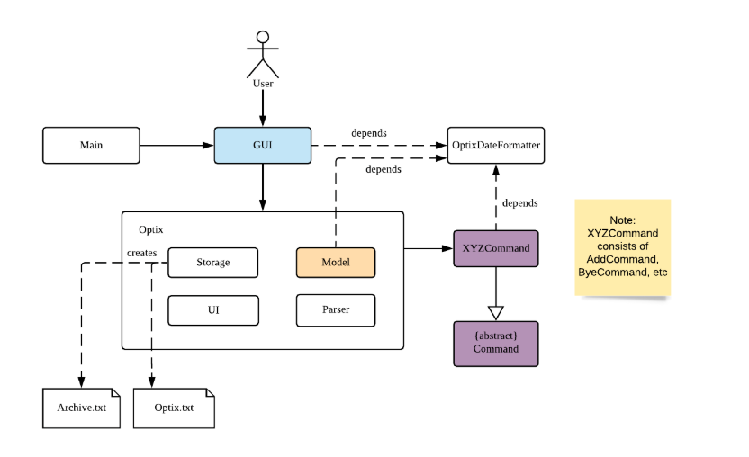

The *_Architecture Diagram_* given above explains the high-level design of the App. Given below is a quick
overview of each component.

`Main` has two classes named `Main` and `MainApp`. It is responsible for,

* At app launch: Initialize the components in the correct sequence, and connects them up with each other.
* At shut down: Shuts down the components and invokes cleanup method where necessary.

The rest of the App consists of 3 components.

* `GUI`: The Graphical User Interface of the App.
* `Optix`: The intermediary between `GUI` and `Command`.
* `XYZCommand`: Various Commands that changes data in `Model`.

==== How the architecture components interact with each other

The Sequence Diagram below shows how the components interact with each other for the scenario where user issues the command
`list Nov 2020`

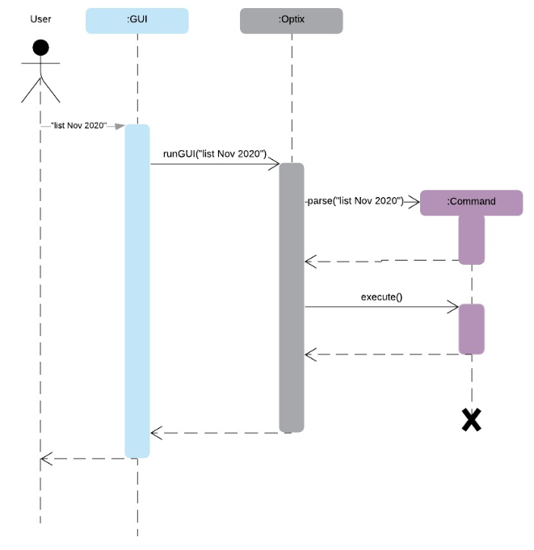

The sections below give more details of each component.

=== GUI Component

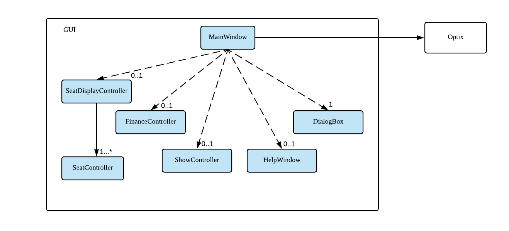

API: `Link for GUI.files`

The `GUI` consists of a `MainWindow` that is made up of parts e.g `DialogBox`, `HelpWindow`, `SeatDisplayController`, etc.
`MainWindow` is split into two segment, on the left the display window and on the right the chat box, as show
in the GUI diagram.

image::images/UI.png[width ="600", align="center"]

The display window consists of 5 different viewing mode.

* *Shows*: Scheduled shows for the event venue. Controlled by `ShowController`.
* *Seats*: The seat availability for a specific show. Controlled by `SeatDisplayController`.
* *Finance*: The projected revenue for scheduled shows. Controlled by `FinanceController`.
* *Archive*: The total revenue for a show that has been performed. Controlled by `FinanceController`.
* *Help*: All possible command to operate Optix. Controlled by `HelpWindow`.

The `GUI` component uses JavaFx UI framework and JFoenix API. The layout of these UI parts are defined in
matching .fxml files that are in the `src/main/resources/view` folder. For example, the layout of the
`MainWindow` is specified in `MainWindow.fxml`.

The `GUI` component,

* Passes user command to `Optix` component to be executed.

* Listens for changes in `Model` in `Optix` so that the GUI can be updated with the modified data.

=== Optix Component

API: `Link for Optix file`

`Optix` is the backend software that acts as the intermediary between `GUI` and `Command` logic.
`Optix`,

* Instantiates `Command` through `Parser` based on user command in `GUI`.
* Passes updated model to be displayed by `GUI`.
* Holds all the file path for `Storage`.
* Stores `Optix` response to user.

The sections below give more details of each component in `Optix`.

==== Model Component

API: `Link for Model file`

`Model` stores the data used for the App. It contains 3 `ShowMap`.

1. *shows*: All the shows that are scheduled for the future.
2. *showsHistory*: All the shows that are in the past.
3. *showsGui*: All the shows that are to be displayed on the `GUI` component.

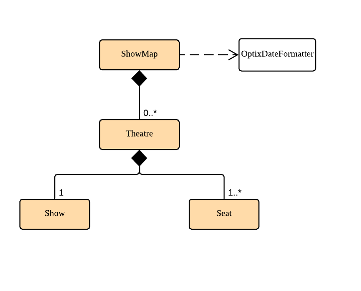

The ShowMap Class Diagram shown is the structure for all ShowMap with the exception of *showsHistory*.
For *showsHistory* the multiplicity of Seat is 0 as it is irrelevant.

==== Storage Component

API: `Link for Storage file`

`Storage` reads and writes to its respective .txt files so that information can be loaded on the
following app launch. The .txt files are saved in `{currDir}/src/main/data`. There is a total of 2
.txt files that are written and read in `Storage` component.

1. optix.txt

2. archive.txt

==== UI Component

API: `Link for UI file`

The `UI` component handles all of `Optix` response. `Optix` response is determined by `Command` component
and subsequently displayed using `GUI` component.

==== Parser Component

API: `Link for Parser file`

The `Parser`,

* Determines the command word and constructs `Command` component.
* Stores command aliases in a HashMap.
* Updates command aliases in the HashMap.
* Reads and writes to parserPreferences.txt.

=== Command Component

API: `Link for Command folder`

All commands found in commands package extends `Command`. The `Command` for the different data structures
are stored under different subpackages. Currently the commands package consists of 4 different subpackages.

* *shows*: Commands that deal with the management fo shows for the theatre.
* *seats*: Commands that deal with the management of seats within the theatre.
* *finance*: Commands that manage finances within the theatre.
* *parser*: Commands that deal with command aliases.

== Implementation
This section describes some noteworthy details on how certain features are implemented.

=== [Proposed] View Monthly Revenue Feature
Allows user to view their profit for a specific month.

==== Proposed Implementation
Viewing the monthly revenue is executed by the `ViewMonthlyCommand`, which extends from the abstract class `Command` and
is stored under the commands package. +
Additionally, it implements the following operations based on the query date:

* Model#findMonthly() -- Retrieves the list of shows in the month specified by the input.
* Model#getShows() -- Retrieves the current list of shows should the user query be in the future.
* Model#getShowshistory() -- Retrieves the archive list should the user query be in the past.
* OptixDateFormatter#getMonth() -- get the integer value of the month.
* OptixDateFormatter#getYear() -- get the integer value of the year.
* Theatre#getProfit() -- get the profit earned for the show.

Given below is an example usage scenario of the `ViewMonthlyCommand` at each step.

*Step 1* +
The user starts the application. `Storage` will be initialised with the saved contents from previous runs. `Model`
will then be initialised and the current list and archived list of shows are loaded into `Model`.

*Step 2* +
The user executes `view-monthly June 2017` to check the revenue earned by all shows in June 2017. Once `Parser` verifies
that the command is of correct format, `ViewMonthlyCommand` calls `OptixDateFormatter#getMonth()` and
`OptixDateFormatter#getYear()` to get the integer values of month and year respectively.

*Step 3* +
`ViewMonthlyCommand` calls `Model#getShowsHistory()` since the date is in the past. This hashmap of `ShowsHistory` is
then passed into the `Model#findMonthly()` of the `Model` where a list of the shows in the specified month is created.

*Step 4* +
The profit for each of the shows in the remaining list is then added up in `Model` by calling `Theatre#getProfit()`.

The following sequence diagram shows how the view-monthly operation works:

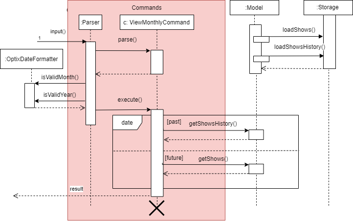

The following activity diagram summarizes what happens when a user executes the ViewMonthly Command:

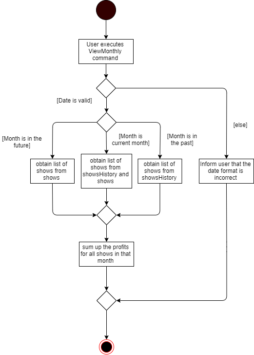

==== Design Considerations

*Aspect: How view-monthly executes*

* Alternative 1 (current choice): Saves the archive shows and current shows separately.
** Pros: Reduces search time Optix knows which list to search from.
** Cons: Archive list does not need any methods and certain parameters since it is only a list to store show names and
revenue. Have to insert dummy values for Archive list since Archive and current list are from the same class and now
use the same parameters.

* Alternative 2: Save archive and current shows together
** Pros: Archive list and current list will have their own class and reduces dependency.
** Cons: Certain code needs to be repeated which may be confusing.

=== [Proposed] Sell Seats Feature
Allows user to sell seats for a specific show.

==== Proposed Implementation
Selling of seats is executed by the `SellSeatCommand`, which extends from an abstract class `Command` and
is stored under the commands package. Additionally, it implements the following operations based on the user input.

* OptixDateFormatter#isValidDate -- Ensures that the date keyed is valid.
* Model#containsKey -- Check if the date has any show scheduled.
* Model#hasSameName -- Check if the show name matches the show in the TreeMap for the specified date.
* Model#sellSeat -- Sell seats corresponding to the seat number that is keyed by user.

Given below is an example usage scenario and how the sell seat mechanism behaves at each step.

*Step 1* +
The user executes `sell Phantom of the Opera|5/5/2020|C1 D6 E10` command to sell the following seats C1 D6 E10
for the show Phantom of the Opera on 5th May 2020. The `SellSeatCommand` command calls `OptixDateFormatter#isValidDate(String date)`
to first check if the given date is a valid date.

*Step 2* +
Once verified, the `SellSeatCommand` command calls `Model#containsKey(LocalDate date)` and `Model#hasSameName(LocalDate date, String showName)`
to check if the show in query exist within `Model`.

*Step 3* +
Once it has been confirmed that the show exist, the `SellSeatCommand` command calls `Model#sellSeats(LocalDate date, String[] seats)`
to query if the seats have been booked. Whenever a seat has been purchased successfully, the revenue obtained from
the show will then be updated accordingly.

The following activity diagram summarizes what happens when a user executes sell seat command.

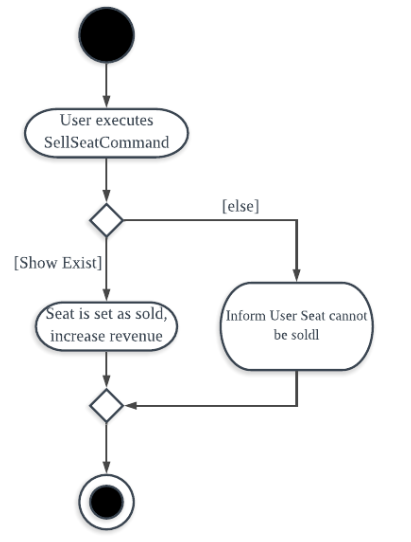

==== Design Considerations

*Aspect: How sell seat executes* +

* Alternative 1 (current choice)
** Format: `sell Harry Potter | 5/5/2020 | A1 A2 A3 A4`

** Pros:
*** Easy to implement and less buggy.
*** Simplicity of code allows it to handle exception and edge cases more efficiently.
*** Ability to bulk purchase seats.

** Cons:
*** Less intuitive. User has to carry out one additional command view before carrying out the booking.

* Alternative 2 (previous choice):
** Format: `sell Harry Potter | 5/5/2020`
** Alternative: `sell Harry Potter | 5/5/2020 | A1 A2 A3 A4`

** Pros:
*** More flexible. Seating arrangement will be shown without explicit command for it.
*** Ability to bulk purchase seats.

** Cons:
*** Incompatible with GUI as code requires CLI query for seats, causing GUI to hang once command is used.
*** Code is deeply-nested which violates coding standards.
*** User has to key in the seats 1 by 1.

Below is the code snippet for our previous implementation:

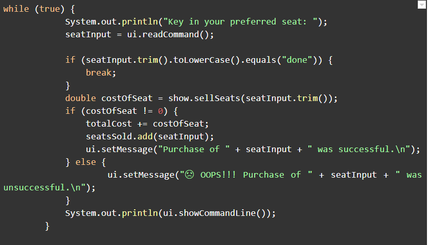

*Choice for current implementation:* +

While *Alternative 2* is more intuitive and allows for better control over the sales of seats,
ultimately we have chosen *Alternative 1* as it is more compatible with our GUI codebase.
Furthermore with the implementation of GUI, it would also be more intuitive for the users
to get the seating arrangements for a particular show before they attempt to make any sales for the seat
as it would be impossible for them to memorise all the seats that they have sold.

=== Delete Show Feature
Allows users to delete shows from the shows ShowMap.

==== Implementation
It is executed by the `DeleteCommand`, which is extended from the abstract class `Command`, and is stored under the
Command package. Additionally, it implements the following operations based on the user input:

* DeleteCommand#hasValidDate -- checks if the input date is of a valid format
* Model#containsKey -- Checks for key in ShowMap.
* Model#hasSameName -- Checks for the existence of the show for the specified date in ShowMap.
* Model#deleteShow -- Removes the show from ShowMap.

Given below is an example usage scenario and how the sell seat mechanism behaves at each step.

*Step 1* +
The user inputs `delete Phantom of the Opera|5/5/2020|6/5/2020`, with the intention to delete shows dated on 5th May 2020
and 6th May 2020. The `DeleteCommand` is initialised with `Phantom of the Opera|5/5/2020|6/5/2020` as the `details`
attribute. The `details` string is parsed into the show name, and the individual dates.

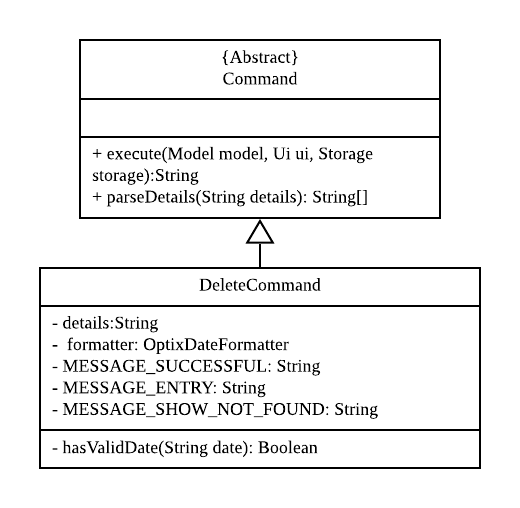

*Step 2* +
`DeleteCommand` iterates through the dates. It formats and verifies them through
`OptixDateFormatter#hasValidDate(String date)` to ensure the given dates are valid(that the date follows the format
DD/MM/YYYY). `LocalDate` instances are generated from these date strings.

*Step 3* +
`DeleteCommand` checks if the specified show exists on the verified dates using
`Model#containsKey(LocalDate showLocalDate)` and `Model#hasSameName(LocalDate showLocalDate, LocalDate showName)`. If it
exists, `Model#deleteShow(LocalDate showLocalDate)` is called to remove the show from the shows ShowMap. The details are
also appended to message to record the successful deletion. If it does not exist, then the date is added to
`missingShows`.

*Step 4* +
`DeleteCommand` checks if the specified show exists on the verified dates using
`Model#containsKey(LocalDate showLocalDate)` and `Model#hasSameName(LocalDate showLocalDate, LocalDate showName)`.

The activity diagram below illustrates the logic process of the `DeleteCommand`:

image::images/devguide/DG_Delete_ActivityDiagram.png[width ="300", align="center"]

The following code snippet highlights the key logic of the `DeleteCommand`.

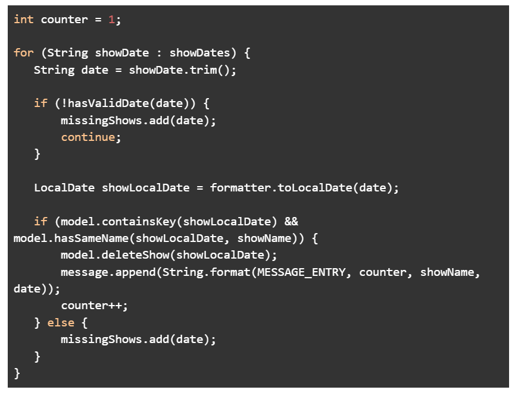

==== Design Considerations

* Aspect: How delete works

* *Alternative 1*: Splitting the delete feature into `delete-one` and `delete-all`. I.e. Splitting the delete feature
into the 2 abilities: to delete 1 specific show, and to delete all shows of the specified show name. +
This design would use 2 separate commands, `DeleteOneCommand` and `DeleteAllCommand`. The user would use
`delete-one SHOW_NAME|SHOW_DATE`, and `delete SHOW_NAME` as the input format for the function to delete one
show, and to delete all the specified shows respectively.

** Pros: `delete-all` would enable the user to delete all the shows of specified show name with less hassle, without
having to input all the dates.
** Cons: Having 2 delete functions is less intuitive and may confuse new users, making them more prone to deleting
multiple shows unintentionally.

* *Alternative 2 (Current Implementation)*: One common delete feature that can delete multiple shows at once.

** Pros: This method is intuitive and flexible, as it enables users to delete multiple shows with a single command.
This makes deletions faster, and users will save time by typing less. This is important since this is a command-line
based application.
** Cons: If the user wishes to delete all shows of a specific name, the user has to input all of the dates which the
show is scheduled for. This can in turn slow down the user instead. However, the instances of this happening is less
likely.

=== Command Aliasing
Enabling users to set up aliases for the commands.

==== Implementation
Command aliasing is executed primarily by the `Parser`, which is stored under the `util` package. Some features related
to command aliasing such as adding, removing, or listing of aliases is executed via commands. The aliases for commands
are stored in the `commandAliasMap` within the Parser object. These pairs are also saved within a text file,
`ParserPreferences.txt`, so that the user can continue to use the aliases after the application is restarted. The
location of `ParserPreferences.txt` is decided in `Optix.java`. By default, it is located in `src/main/data`.

The following operations are operations related to command aliasing:

* Parser#addAlias(NEW_ALIAS, COMMAND) -- adds a alias-command pair to the commandAliasMap.
* Parser#removeAlias(NEW_ALIAS, COMMAND) -- removes a alias-command pair from the commandAliasMap.
* Parser#loadPreferences() -- loads all alias-command pairs from `ParserPreferences.txt`. `ParserPreferences.txt` is the
file where all the alias-command pairs are saved.
* Parser#resetPreferences() -- clears all alias-command pairs from `commandAliasMap` and adds in the default
alias-command pairs. This method does not access `ParserPreferences.txt`.

Given below is an example usage scenario of where command aliasing is used.

*Step 1* +
The user starts the application. A parser object will be initialised, and `loadPreferences()` will be called as part of
the initialisation process for it. If `ParserPreferences.txt` does not exist, it is created, and `resetPreferences()` is
called. `CommandAliasMap` is populated, and these pairs are also written to `ParserPreferences.txt`.

*Step 2* +
The user adds a new alias. An example input would be `add-alias q|add`. This command would associate the character
q with the command `add`. This calls the `AddAliasCommand`, which verifies that ‘q’ and “add” are valid aliases and
commands respectively (more on valid aliases and commands below). After the alias-command pair is verified, the pair
is put in the `commandAliasList`, and a success message is presented.

*Step 3* +
The user uses the alias by replacing “add” with “q” for any input. An example would be to use
`q The Lion King|20|31/12/2019` instead of `add The Lion King|20|31/12/2019`.

*Step 4* +
The user decides that setting this alias was a mistake, and decides to remove it with the input `remove-alias q|add`.
This calls the `RemoveAliasCommand()`. The command verifies that this pair exists, and can be removed. It then
removes this pair from the `commandAliasList`.

*Step 5* +
The user decides to list all aliases with the input `list-alias`. This calls the `ListAliasCommand`, which prints
all alias-command pairs in the `commandAliasList`.

*Step 6* +
The user decides that he has too many self-added aliases which he no longer wants. He uses the reset alias function
to reset his aliases to the default settings, with the input `reset-alias`. This calls the `ResetAliasCommand`, which
clears all existing aliases, and adds in the default aliases, which are defined in the `resetPreferences()` method in
the `Parser` class.

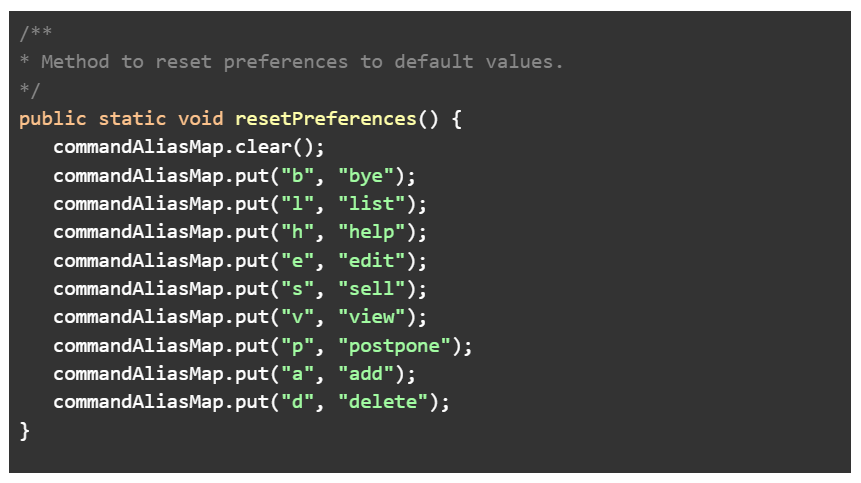

[appendix]
== Product Scope

*Target user profile*:

* Stakeholders like SISTIC theatre managers who need to track a large number of theatre bookings as well as seat bookings for each show.
* Prefers CLI to mouse input.

*Product*:

* New shows by performers can be added to the list.
* Seats requested by customers for a show can be booked by the theatre manager.
* Program is desgined to price the seats according to the different tiers.
* Revenue earned from a show can be calculated based on the seats booked.

*Value proposition*: manage seats and finances faster than an average GUI-based app.

[appendix]
== User stories

// tag::base-alt[]
[width="90"]
|===
|Priority |As a ... |I want to ... |So that I can ...
|Must-have |new user |see the command summary |refer to them when I forgot how to use the system.

|Must-have |manager |track seats sold to customers |track my sales and avoid double-selling the same seat.

|Must-have |manager |add new shows to my current list |record the booking of the venue on a particular date.

|Must-have |user |view all the seats of a particular show |inform my customers on the availability of seats.

|Must-have |accountant |view the finances from each show |calculate my profits from my business.

|Must-have |manager |set the prices of the seats |vary seat prices depending on the popularity of the show.

|Must-have |manager |remove a particular show from my listing |free up the cancelled slot to other performers.

|Must-have |manager |remove shows that are in the past |reduce the quantity of shows in the listing to make query more
efficient

|Must-have |manager |set the tiers of the seats |set different prices depending on the popularity of the seats.

|Must-have |manager |reschedule shows |keep track of my shows even in the event of unforeseen circumstances.

|Must-have |manager |edit the name of existing shows |correct spelling mistakes.

|Must-have |user |customise the hotkeys for the different commands |increase the efficiency of keying in commands.

|Must-have |manager |remove the booking on a seat |keep track of finances properly in case the booking was made wrongly.

|Nice-to-have |user |add seats from different shows to a customer's purchase |manage bookings across multiple shows in one transaction.

|Nice-to-have |user |refund seats before a certain date |Accomodate the needs of customers while being able to resell
the seats to new customers

|Nice-to-have |user |keep track of payments |track the expenditure by each customer and find out the specific amount for a refund(if applicable).

|Nice-to-have |user |reassign seats booked by customers |fulfill customers' requests to change seats.

|Nice-to-have |user |blacklist customers who break the rules |serve as a deterrent for potential troublemakers and avoid further losses.

|Nice-to-have |user |know the number of available seats in each tier for a particular show |get a rough idea of the number of seats left to sell from each tier.

|Nice-to-have |user |modify the prices of the seats relative to the date of the show |sell off the seats and maximise my profits.

|Nice-to-have |accountant |view monthly revenue |compare earnings and make new policies to improve business.

|Nice-to-have |user |query shows by month |would not be flooded with information that is not relevant.

|Unlikely-to-have |user |keep track of the number of tickets each customer can buy |limit the number of tickets a customer can buy to avoid ticket scalping.

|Unlikely-to-have |manager |customer rewards system |encourage customers to visit more often and thank loyal customers for their patronage.

|Unlikely-to-have |manager |put seats on hold |give customers more time to decide if they want to purchase the seats.

|Unlikely-to-have |manager |reserve seats for VIPs |allow VIPs to enjoy benefits as a reward for their support.

|===
// end::base-alt[]

[appendix]
== Use cases

=== Use case: UC01 - Add new shows to list of shows

*Actor*: Theatre manager

*MSS*

. User enters the add command, followed by the name of the show, the date, the cost of the show and the base selling price of the seats.
. Optix responds by displaying the show that the user has added to the list.

Use case ends.

==== *Extensions*

* Extension 1
.. Optix detects an error in the details entered.
.. Optix displays an error message that shows the part of the command that was entered incorrectly.
.. Optix requests command from user again.
.. User re-enters details.

Steps i to iv are repeated until details entered are correct.
Use case resumes from step 2 of MSS. +

Use case ends.

 

=== Use case: UC02 - Sell seats to buyer

*Actor*: Theatre manager

*MSS*

. User enters the sell command, followed by the name of the show, the date, the name of the buyer and lastly the seats requested by the buyer.
. Optix responds by displaying the seats bought and the cost of the transaction.

Use case ends.

==== *Extensions*
* Extension 1
.. Optix detects an error in the details of the show entered.
.. Optix displays an error message that shows the part of the command that was entered
      incorrectly.
.. Optix requests command from user again.
.. User re-enters details.

Steps i to iv are repeated until details entered are correct.
Use case resumes from step 1 of MSS.

* Extension 2
.. Optix detects that the seats entered are unavailable.
.. Optix requests command from user again.
.. User re-enters details.

Steps i to iii are repeated until details entered are correct.
Use case resumes from step 2 of MSS.

=== Use case: UC03 - Delete a single show scheduled on a particular date

*Actor*: Theatre manager

*MSS*

. User enters the delete command followed by the date of the show, and the show name.
. Optix responds by displaying the show/shows that have been removed from the list.

Use case ends.

*Extensions*

* Extension 1
.. Optix cannot find the show using the details entered.
.. Optix requests command from user again.
.. User re-enters command.

Steps i to iii are repeated until shows entered are correct.
Use case resumes from step 2 of MSS.

=== Use case: UC04 - Delete multiple shows by show name

*Actor*: Theatre manager

*MSS*

. User enters the delete command followed by the names of the shows to delete.
. Optix searches through the list of shows for all shows with the specified name, and deletes them.
. Optix replies by displaying the show/shows that have been removed from the list.
         Use case ends.

*Extensions*

* Extension 1
.. Optix cannot find intended show(s) using the show name(s) specified.
.. Optix replies by listing all the shows the could not be found.
.. User re-enters command.

Steps i to iii are repeated until shows entered are correct.
Use case resumes from step 2 of MSS.

=== Use case: UC05 - View the entire list of shows

*Actor*: Theatre manager

*MSS*

. User enters the list command.
. Optix responds by displaying the list of shows available for booking.

Use case ends.

=== Use case: UC06- View available seats of a show

*Actor*: Theatre Manager

*MSS*

. User enters the view command, followed by the show name and date of the show.
. Optix responds by displaying the available seats of the theatre for the show, by marking reserved seats with a cross, and available seats with a tick.

Use case ends.

*Extensions*

* Extension 1
.. Optix detects that there is no such show on that date.
.. Optix replies that there is no such show on the date.
.. Optix requests command from user again.
.. User re-enters command.

Steps i to iv are repeated until the command entered is correct.
Use case resumes from step 2 of MSS.

=== Use Case: UC07 - Refund ticket for seat

*Actor*: Theatre manager

*MSS*

. User enters the refund command, followed by show name, show date, and seat number.
. Optix responds by querying if the ticket for the seat was purchased. If it is, then the seat is marked as available again.
. Optix updates the finances from the refund.
. Optix replies with a success confirmation.

Use case ends.

*Extensions*

* Extension 1
.. Optix detects that the show does not exist
.. Optix replies that there is no such show.
.. Optix requests command from user again.
.. User re-enters command, with the correct show name.

Steps i to iv are repeated until the command entered is valid.
Use case resumes from step 3 of MSS.

* Extension 2

.. Optix detects that the seat was not purchased.
.. Optix replies that the request to refund this seat is invalid.
.. Optix requests command from user again.
.. User re-enters command, with a correct seat number.

Steps i to iv is repeated until the command entered is valid.
Use case resumes from step 3 of MSS.

=== Use case: UC08- Tutorial/ Help Command

*Actor*: Theatre Manager

*MSS*

. User enters the help command.
. Optix responds by displaying all available commands and their usage.

=== Use case: UC09 - Reschedule shows to another day

*Actor*: Theatre manager

*MSS*:

. User enters the reschedule command, followed by the name of the show, the current-date of the show to reschedule and the new-date.
. Optix responds by displaying the new-date for the show.
         Use case ends.

*Extensions*:

* Extension 1
.. Optix detects an error in the details entered.
.. Optix informs the user that the show has passed.
.. Optix requests command from user again.
.. User re-enters command.

Steps i to iv are repeated until the command entered is correct.
Use case resumes from step 2 of MSS.

* Extension 2
.. Optix detects that  there is no show of the given input in the list.
.. Optix informs the user that the show does not exist.
.. Optix requests command from user again.
.. User re-enters command.

Steps i to iv are repeated until the command entered is correct.
Use case resumes from step 2 of MSS.

=== Use Case: UC10 - Edit show's name without removal and addition
*Actor*: Theatre manager

*MSS*:

. User enters the edit command, followed by the show name, the show date of the show to edit and the new show name.
. Optix responds by displaying the new show name for the show.

Use case ends.

*Extensions*:

* Extension 1
.. Optix detects an error in the details entered.
.. Optix informs the user that the show has passed.
.. Optix requests command from user again.
.. User re-enters command.

Steps i to iv are repeated until the command entered is correct. Use case resumes from step 2.

* Extension 2
.. Optix detects that there is no show of the given input in the list.
.. Optix informs the user that the show does not exist.
.. Optix requests command from user again.
.. User re-enters command.

Steps i to iv are repeated until the command entered is correct. Use case resumes from step 2.

=== Use Case: UC11 - View profit of a show
*Actor*: Theatre manager

*MSS*:
. User enters the view-profit command, followed by the show name, the show date of the show
to reschedule and the new show name.
. Optix responds by displaying the profit for the show.

Use case ends.

*Extensions*:

* Extension 1
.. Optix detects that there is no such show on that date.
.. Optix replies that there is no such show on the date.
.. Optix requests command from user again.
.. User re-enters command.

Steps i to iv are repeated until the command entered is correct.
Use case resumes from step 2.

=== Use Case: UC12 - View profit of a certain month
*Actor*: Accountant

*MSS*:
. User enters the view-monthly command, followed by the month and year.
. Optix responds by displaying the profit for that month.

Use case ends.

*Extensions*:

* Extension 1
.. Optix detects that there are no shows for that particular month.
.. Optix replies that there is no show.
.. Optix requests command from user again.
.. User re-enters command.
Steps i to iv are repeated until the command entered is correct.
Use case resumes from step 2.

* Extension 2
.. Optix detects that the month and year entered are in the future.
.. Optix replies with the projected profit for that month.

Use case resumes from step 2.

=== Use Case: UC13 - Reassign seat
*Actor*: User

*MSS*:
. User enters the reassign command, followed by the show name, show date, old seat and new seat.
. Optix searches for that specific seat in that particular show and removes the seat.
. Optix marks the new seat as booked and updates the profit of that show as well as the number of seats left.
. Optix responds by displaying the success message and the cost difference between the seats.

Use case ends.

*Extensions*:

* Extension 1
.. Optix detects that there is no such show on that date.
.. Optix replies that there is no such show on the date.
.. Optix requests command from user again.
.. User re-enters command.
Steps i to iv are repeated until the command entered is correct.
Use case resumes from step 2.

* Extension 2
.. Optix detects that the old seat and new seat are the same.
.. Optix replies that the command is invalid.
.. Optix requests command from user again.
.. User re-enters command.
Steps i to iv are repeated until the command entered is correct.
Use case resumes from step 2.

* Extension 3
.. Optix detects that the seats entered are invalid.
.. Optix replies that the command is invalid.
.. Optix requests command from user again.
.. User re-enters command.

Steps i to iv are repeated until the command entered is correct.
Use case resumes from step 2.

* Extension 4
.. Optix detects that the old seat has not been booked.
.. Optix replies that there is no need to reassign the seat.
.. Optix requests command from user again.
.. User re-enters command.

Steps i to iv are repeated until the command entered is correct.
Use case resumes from step 2.

* Extension 5
.. Optix detects that the new seat has already been booked.
.. Optix replies that the seat cannot be reassigned.
.. Optix requests the user to view the seating arrangement and re-enter the command with a valid seat.
.. User re-enters command.

Steps i to iv are repeated until the command entered is correct.
Use case resumes from step 2.

[appendix]
== Functional Requirements

* Command to add shows
* Command to Sell Tickets to audience.
* Command to delete a particular show. 
* Command to delete multiple shows (by showName).
* Command to list all shows before date of showing. (Query for booking and check seat availability)
* Command to list specific show to get date of showing (To check when the show is happening and check seat availability)
* Command to refund ticket for the show.
* Tutorial/ Help function
* Command to reschedule particular show to an empty slot

[appendix]
== Non-functional Requirements

* Should work on any OS as long as it has Java 11 or above installed.
* The list should be able to hold at least 100 shows without reduction in performance.
* The system should be usable by a novice who has never booked theatres/ theatre seats before. I.e. the commands should be intuitive for any user.
* Parser to parse user input
* Command class to execute add/ delete/ list tasks
* UI class to format output 

[appendix]
== Glossary

*Must-have*:

A feature that is declared as must have is viewed as a priority for development

*Nice-to-have*:

A feature that is declared as nice-to-have is viewed as a non- priority. The feature with this label will not be completed with as much urgency, and may not even be developed at all if it is deemed unimportant.

*Unlikely-to-have*:

A feature that is declared as unlikely-to-have is viewed as the least priority. The features with this label are likely to be ignored and only be done should they be viewed as extensions that could add on to the functionality of the program.

