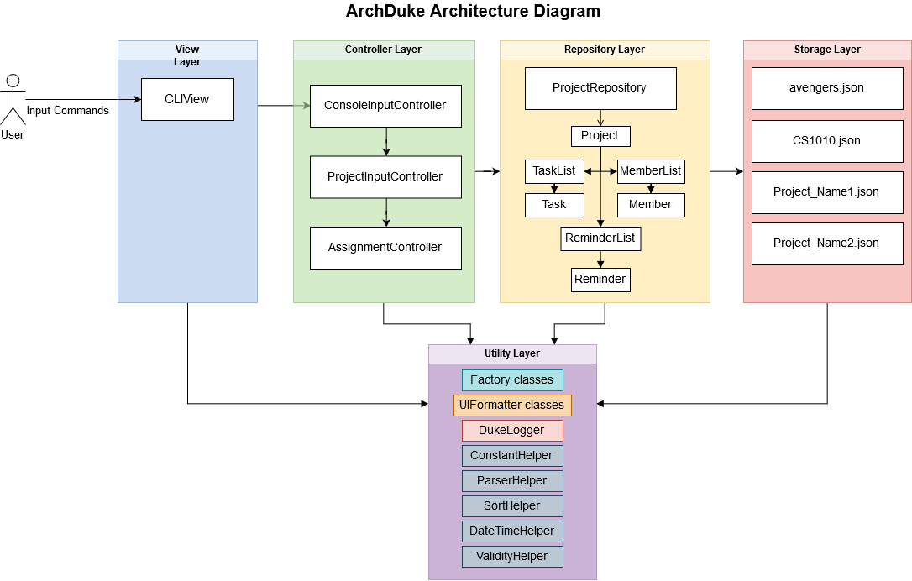
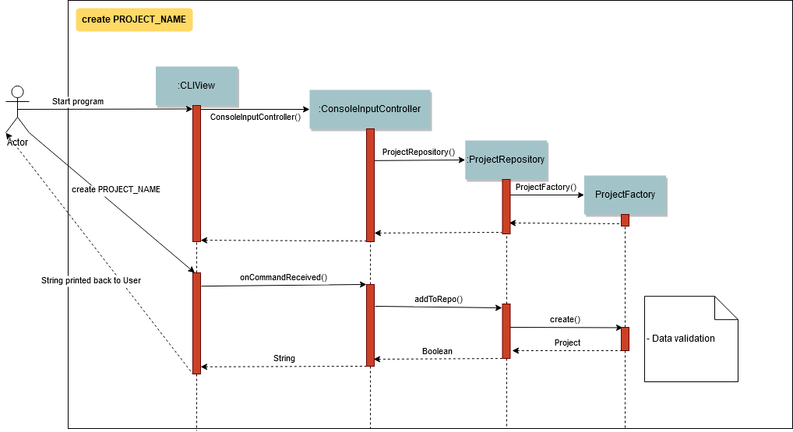
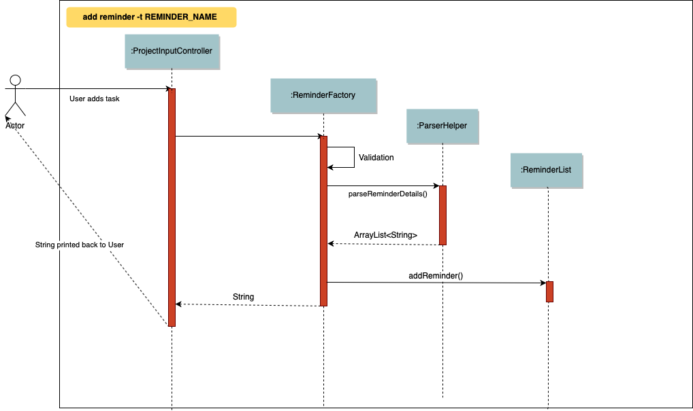

= ArchDuke - Developer Guide
:toc:
:toc-title: Table of Contents
:toc-placement: preamble
:repoURL: https://github.com/AY1920S1-CS2113-T13-1/main

By: `CS2113-T13-1`      Since: `Aug 2019`      Licence: `MIT`

== Preface
=== About ArchDuke
Team leaders often face problems managing multiple projects, especially software development projects where the usage of a Kanban board is common.

Having to manage multiple Kanban boards for each individual project is a huge hassle for team leaders.
As such, ArchDuke solves this issue by allowing team leaders to manage

. Team members

* ArchDuke allows users to assign tasks to team members, and track their workload, progress on tasks, and contributions.

. Tasks in a group project

* ArchDuke allows users to track multiple tasks within a project. Tasks can be created and assigned to members.
* ArchDuke tracks the deadlines and priority levels of tasks, to help the user organise which tasks should be assigned
and completed.

. Multiple group projects

* ArchDuke allows users to track multiple group projects. New group projects can be created and a default Kanban board will be created for users to start adding tasks.

=== Document Change History
[width="100%",cols="25%, <75%", options="header"]
|=======================================================================
| Revision Date | Summary of Changes
| 23 October 2019   | Version 1.0: Added implementation design for Assignment Controller and Project functions
| 22 October 2019   | Version 0.9: Updated Architecture Design
| 15 October 2019   | Version 0.8: Updated the name of project from Duke to ArchDuke
| 2 October 2019    | Version 0.7: Updated Prerequisites and removed unwanted lines
| 30 September 2019 | Version 0.6: Added table of contents, preface and document history
| 26 September 2019 | Version 0.5: Updated use cases for a cleaner look
| 24 September 2019 | Version 0.4: Added Non-functional Requirements to DeveloperGuide
| 23 September 2019 | Version 0.3: Added user stories to DeveloperGuide
| 22 September 2019 | Version 0.2: Added use cases to DeveloperGuide
| 18 September 2019 | Version 0.1: Creation of DeveloperGuide based on template
|=======================================================================

== 1. Setting up

=== 1.1. Prerequisites

. *JDK `11`* or above is required
. *IntelliJ* IDE is recommended
+
// [NOTE]
// IntelliJ by default has Gradle and JavaFx plugins installed. +
// Do not disable them. If you have disabled them, go to `File` > `Settings` > `Plugins` to re-enable them.

=== 1.2. Setting up the project environment on your local machine.

. Fork and clone the forked remote on your local machine.
. Launch IntelliJ (If you’re not on the IntelliJ Welcome screen please close your  existing project by going to `File` > `Close Project`.)
. Set up the correct JDK version for Gradle
.. Click `Configure` > `Structure for New Projects`
.. Under `Project Settings` Click on `Project`
.. Under `Project SDK` Click `New…` and point it to JDK 11 path.
.. Click `OK` to save the configuration
. Click `Import Project`
.  Locate the `build.gradle` file and select it. Click `Open`.
. Open the IntelliJ console/terminal and run the gradle command `gradlew processResource` on *Windows* or 
`./gradlew processResource` on *Mac/Linux*  (If you are encountered a permission error: `./gradlew: Permission denied` add the executable permission to the 
the shell script by running `chmod 744 gradlew` in your terminal)
It should finish with the `BUILD SUCCESSFUL` message. This will generate the resources required by the application and tests.

=== 1.3. Verifying the setup

. Run Duke to verify and try a few commands. (Refer here {insert link to the command page} the commands)
. Run the JUNIT Test/gradlew test command to ensure that all the test case passes.
// . <<Testing#,Run the tests>> to ensure they all pass.

// === 1.4. Configurations to do before writing code

// ==== Configuring the coding style

// This project follows https://github.com/oss-generic/process/blob/master/docs/CodingStandards.adoc[oss-generic coding standards]. IntelliJ's default style is mostly compliant with ours but it uses a different import order from ours. To rectify,

// . Go to `File` > `Settings...` (Windows/Linux), or `IntelliJ IDEA` > `Preferences...` (macOS)
// . Select `Editor` > `Code Style` > `Java`
// . Click on the `Imports` tab to set the order

// * For `Class count to use import with '\*'` and `Names count to use static import with '*'`: Set to `999` to prevent IntelliJ from contracting the import statements
// * For `Import Layout`: The order is `import static all other imports`, `import java.\*`, `import javax.*`, `import org.\*`, `import com.*`, `import all other imports`. Add a `<blank line>` between each `import`

// Optionally, you can follow the <<UsingCheckstyle#, UsingCheckstyle.adoc>> document to configure Intellij to check style-compliance as you write code.

// ==== Setting up CI

// Set up Travis to perform Continuous Integration (CI) for your fork. See <<UsingTravis#, UsingTravis.adoc>> to learn how to set it up.

// After setting up Travis, you can optionally set up coverage reporting for your team fork (see <<UsingCoveralls#, UsingCoveralls.adoc>>).

// [NOTE]
// Coverage reporting could be useful for a team repository that hosts the final version but it is not that useful for your personal fork.

// Optionally, you can set up AppVeyor as a second CI (see <<UsingAppVeyor#, UsingAppVeyor.adoc>>).

// [NOTE]
// Having both Travis and AppVeyor ensures your App works on both Unix-based platforms and Windows-based platforms (Travis is Unix-based and AppVeyor is Windows-based)

// ==== Getting started with coding

// When you are ready to start coding, we recommend that you get some sense of the overall design by reading about <<DeveloperGuide#Design-Architecture, Duke's architecture>>.

== 2. Design

=== 2.1. Architecture Design

.Architecture Diagram

The Architecture Diagram given above explains the high-level design of ArchDuke. ArchDuke is based on the n-tier
architecture design. Below is a quick overview of each component based on our Architecture.

Not included in the diagram is the `Main` program in the folder *_launcher_*. The Main program is responsible for
initializing the `View` layer.

* In our case, as ArchDuke is a command line program, `Main` will initialize `CLIView`.

`Utility` represents a collection of classes used by multiple other components and can be accessed by all layers.

* `Factory` classes : Used mainly by `Repositories` and `Controllers` to create objects based on user input.
* `Logger` classes: Used by all classes to write log messages to ArchDuke's log file.
* `ParserHelper` class: Used by all classes for user user input parsing
* `SortHelper` class: Used primarily by `Repositories` and `Controllers` for sorting objects based on description
before a Response model is generated for the `View` layer.
* `DateTimeHelper` class: Used for handling anything that is related to Date objects or parsing inputs for Date objects

The rest of the App consists of four main layers.

* `View` layer: The UI of ArchDuke. Responsible for printing everything that the user will see and reading inputs
from the user.
* `Controller` layer: Responsible for handling user inputs and sending them to the respective classes for parsing,
cleaning, or object creation.
* `Repository` layer: Responsible for holding data in-memory
* `Data` layer: Responsible for saving and loading persistent data from hard disk.

Each layer will be discussed in detail below.
// Each of the four components

// * Defines its _API_ in an `interface` with the same name as the Component.
// * Exposes its functionality using a `{Component Name}Manager` class.

// For example, the `Logic` component (see the class diagram given below) defines it's API in the `Logic.java` interface and exposes its functionality using the `LogicManager.java` class.

// .Class Diagram of the Logic Component
// // image::LogicClassDiagram.png[]

// [discrete]
// ==== How the architecture components interact with each other

// The _Sequence Diagram_ below shows how the components interact with each other for the scenario where the user issues the command `delete 1`.

// .Component interactions for `delete 1` command
// // image::ArchitectureSequenceDiagram.png[]

// The sections below give more details of each component.

=== 2.2. View Layer
Our main UI Component is a class called CLIView. It is mainly responsible for reading the user input and displaying
formatted messages to the user.

When ArchDuke is running, CLIView repeatedly reads the user input line by line, and sends it to the parsing components
(Controllers) to make sense of the input. Eventually, the controllers will retrieve the relevant messages and
information for CLIView to display. Currently, the main CLIView is being called directly by the controllers to execute
the commands by coordinating all other components.

// .Structure of the UI Component
// image::UiClassDiagram.png[]

=== 2.3. Controller Layer

// [[fig-LogicClassDiagram]]
// .Structure of the Logic Component
// image::LogicClassDiagram.png[]
// *API* :
// link:{repoURL}/src/main/java/seedu/address/logic/Logic.java[`Logic.java`]

==== 2.3.1 ConsoleInputController

==== 2.3.2 ProjectInputController

==== 2.3.3 AssignmentController
AssignmentController is a class which acts as a parser for commands regarding the assignment of tasks to group members.

*Rationale for implementation*

Before the implementation of AssignmentController, the parsing of assign commands was planned to be done within the
ProjectInputController class. However, we realised that parsing for assignment commands would be extremely complex due
to the potentially high number of arguments.

* Example command: `assign task -i 1 2 -to 1 2 3 -rm 4 5`

The task index numbers (1, 2) , assignee indexes (1, 2, 3) and unassigned indexes (4, 5) must be parsed. They should also be validated to ensure that the index numbers exist, and do not cause errors/exceptions such as IndexOutOfBoundException. From the parsed input, task assignments can then be managed. Therefore, the AssignmentController was created for the following reasons:

1. To ensure that these 3 parts of the input can be easily managed
2. To isolate the assignment commands to avoid making the code in projectInputController too long

=== 2.4. Repository layer

// .Structure of the Model Component
// image::ModelClassDiagram.png[]

// *API* : link:{repoURL}/src/main/java/seedu/address/model/Model.java[`Model.java`]

// The `Model`,

// * stores a `UserPref` object that represents the user's preferences.
// * stores the Address Book data.
// * exposes an unmodifiable `ObservableList<Person>` that can be 'observed' e.g. the UI can be bound to this list so that the UI automatically updates when the data in the list change.
// * does not depend on any of the other three components.

// [NOTE]
// As a more OOP model, we can store a `Tag` list in `Address Book`, which `Person` can reference. This would allow `Address Book` to only require one `Tag` object per unique `Tag`, instead of each `Person` needing their own `Tag` object. An example of how such a model may look like is given below. +
//  +
// image:BetterModelClassDiagram.png[]

=== 2.5. Data Layer

// .Structure of the Storage Component
// image::StorageClassDiagram.png[]

// *API* : 
// link:{repoURL}/src/main/java/seedu/address/storage/Storage.java[`Storage.java`]

//The `Storage` component,

// * can save `UserPref` objects in json format and read it back.
// * can save the Address Book data in json format and read it back.

//[[Design-Commons]]
//=== 2.6. Common classes

//Classes used by multiple components are in the `seedu.addressbook.commons` package.

== 3. Implementation
This section describes in detail on how certain features of ArchDuke are implemented. Most features are based on
Create, Read, Update, Delete, also known as *CRUD* functions

=== 3.1. CRUD functionality for Projects
==== Implementation

CRUD functions are facilitated by `ConsoleInputController`, `ProjectRepository` and `ProjectFactory`. It allows
ArchDuke to be able to do some basic CRUD functions for a Project, namely only Creation, Reading and Deletion.
`ConsoleInputController` will
read the relevant
commands from the `View` layer and call the relevant methods in `ProjectRepository`.

It implements the following commands:

* `create PROJECT_NAME` -- Creation of a new Project
* `list` --  Viewing all Projects that have been created
* `delete PROJECT_INDEX` -- Delete a Project that has been created previously

These operations are exposed in the `IRepository` interface as `addToRepo()`, `getAll()` and `deleteItem()`.

[NOTE]
However, in order to create a object, inputs sent to the `Repository` layer must be sent to a `Factory` class as the
`Repository` layer is not responsible for the creation of Objects.

The example usage scenario below will explain in detail the data flow and how the program behaves at each step of
CRUD functions with regards to a Project object.

Step 1) ArchDuke is launched for the first time by the user. A new `CLIView()` and `ConsoleInputController` is
created upon initialization. Immediately after initialization, `CLIView.start()` will be called which prints a welcome
message to the user and awaits for user input.

Step 2) The user executes the command `create Avengers Assemble!` to create a new Project with the description
"Avengers Assemble!". User input is fed from `CLIView` to `ConsoleInputController`, where simple parsing will be done
to determine the type of command that the user has executed.

Step 3) User input will be understood as a command to create a new project and thus sent to `ProjectRepository` where
it will call on `ProjectFactory` for the creation of a new Project object.

Step 4) `ProjectRepository` will check if `ProjectFactory` managed to create an object successfully. Any unsuccessful
creation will be due to wrong user commands or a bug during data validation in `ProjectFactory`.

Step 5) Assuming Project creation was a success, `ProjectRepository` will store it in an ArrayList and return `True`
back to `ConsoleInputController` to signify the successful creation of a new Project object. `ConsoleInputController`
will call `CLIView` to print appropriate messages to the user based on whether a new Project object was created
successfully or not.

The following sequence diagram shows how the `create PROJECT_NAME` operation works.

The `delete PROJECT_INDEX` command works similarly to `create PROJECT_NAME`. Both commands will result in a
`Boolean` of either `True` or `False` to indicate whether command was executed successfully. There are minor
differences, listed below:

* Instead of creating a new Project object, the `delete PROJECT_INDEX` command will call `deleteItem()` in
`ProjectRepository` instead of `addToRepo()`.
* Deletion of Project works by Project Index instead of Project Name.

*Manage project*

ArchDuke allows users to manage each individual project in the `ProjectRepository`.

image::images/ManageProject_Sequence.png[]

*Task assignments*

ArchDuke allows users to track tasks and their assignments to members in a project.
Assignments establish a relationship between a task and a member. When a member is assigned a task,
they are expected to complete it, and will be given the stipulated credit upon completion. The degree
of each member's contributions are measured by task credit.

Assignments are tracked in the `Project` class using 2 Java HashMaps.

* `taskAndListOfMembersAssigned`
    ** Key: `Task`
    ** Value: ArrayList of assigned `Member` objects (List of members assigned to task)

* `memberAndIndividualListOfTasks`
    ** Key: `Member`
    ** Value: ArrayList of `Task` objects (List of each member's individual tasks)

Using a HashMap for storage would allow for fast and easy writing and retrieval of data.
It also prevents cyclic dependencies as `Task` and `Member` objects would not have to be aware of
each other (such as each class keeping an ArrayList of the assignment) in order to establish the
assignment.

=== 3.2. CRUD functionality for Tasks
==== Implementation

CRUD Task functions are handled by `Task`, `TaskList` and `TaskFactory`,`Project` and `ProjectInputController`.
It allows ArchDuke to perform simple CRUD function for Task in the Project, these simple functions include Create, Read,
Update and Delete. `TaskFactory` will create the relevant task with the apporatied input from the user which will then be
added into the `TaskList` managed by the `Project`. `ProjectInputController` will read the relevant command related to task
function and call the relevant methods in `TaskFactory` And `ParserHelper`.

It implements the following commands:

* `add task -t TASK_NAME  -p TASK_PRIORITY-c TASK_CREDIT -d TASK_DUEDATE -s TASK_STATE -r TASK_REQUIREMENT1` -- Creation of a
new Task with the task name, priority, credit, due date (optional), state(optional) and additional requirements (if any)

* `edit task TASK_INDEX -t TASK_NAME -p TASK_PRIORITY -c TASK_CREDIT -s TASK_STATE` -- Edits existing task with the new input
values

* `view tasks` -- Viewing of all tasks in current project

* `view task requirements TASK_INDEX` -- Viewing of all additional requirements of a specified task

* `edit task requirements TASK_INDEX rm/TASK_INDEXES r/TASK_REQUIREMENT1` -- Edits task requirements of specified task by
removing unwanted requirements and adding new ones

* `delete task TASK_INDEX` -- Deletion of task with stated index

The example usage scenario below will explain in detail the data flow and how the program behaves at each step of CRUD
functions with regards to a Task object.

Step 1) Assuming Project have been created and the user is currently managing a specific project.

Step 2) The user execute the command `add task -t kill thanos! -p 100 -c 100` to create a new task with the task
name “kill thanos!”, priority value “100” and a credit of “100”. These input will be consumed by `ProjectInputController.manageProject()`

Step 3) The `ProjectInputController.manageProject()` will trigger the `TaskFactory` which will do a  validation to ensure the
required input are given.

Step 4) `TaskFactory` will then call parserHelper.parseTaskDetails() to do a simple parsing which will clean up the
flags and return `ArrayList<String>` for `TaskFactory` to create the task.

Step 5) `TaskFactory` will create the task based on the information given by the user. The created task will subsequently
be added into `taskList` managed by the project and successfully or unsuccessfully a message in String will be returned.

The following sequence diagram show how `create task` operation works.

image::images/CreateTask_Sequence.png[]

=== 3.2. CRUD functionality for Reminder [Plan to do]
==== Implementation

Implementation
CRUD Reminder functions are handled by `Reminder`, `ReminderList` and `ReminderFactory`,`Project` and `ProjectInputController`.
It allows ArchDuke to perform simple CRUD function for Reminder in the Project, these simple functions include Create, Read,
Update and Delete. `TaskFactory` will create the relevant task with the apporatied input from the user which will then be
added into the `TaskList` managed by the `Project`. `ProjectInputController` will read the relevant command related to task
function and call the relevant methods in `TaskFactory` And `ParserHelper`.

Reminder function implements the following commands:

* `add reminder -n REMINDER_NAME  --d REMINDER_DUEDATE` -Tag REMINDER_TAG -- Creation of a new Reminder with the reminder
name and due date (optional)

* `edit reminder TASK_INDEX -n REMINDER_NAME -d REMINDER_DUEDATE` -- Edits existing task with the new input values

* `view reminder` -- Viewing of all reminders in current project

// ==== Design Considerations

// ===== Aspect: How undo & redo executes

// * **Alternative 1 (current choice):** Saves the entire address book.
// ** Pros: Easy to implement.
// ** Cons: May have performance issues in terms of memory usage.
// * **Alternative 2:** Individual command knows how to undo/redo by itself.
// ** Pros: Will use less memory (e.g. for `delete`, just save the person being deleted).
// ** Cons: We must ensure that the implementation of each individual command are correct.

// ===== Aspect: Data structure to support the undo/redo commands

// * **Alternative 1 (current choice):** Use a list to store the history of address book states.
// ** Pros: Easy for new Computer Science student undergraduates to understand, who are likely to be the new incoming developers of our project.
// ** Cons: Logic is duplicated twice. For example, when a new command is executed, we must remember to update both `HistoryManager` and `VersionedAddressBook`.
// * **Alternative 2:** Use `HistoryManager` for undo/redo
// ** Pros: We do not need to maintain a separate list, and just reuse what is already in the codebase.
// ** Cons: Requires dealing with commands that have already been undone: We must remember to skip these commands. Violates Single Responsibility Principle and Separation of Concerns as `HistoryManager` now needs to do two different things.
// end::undoredo[]

// tag::dataencryption[]
// === 3.2. [Proposed] Data Encryption

// _{Explain here how the data encryption feature will be implemented}_

// end::dataencryption[]

=== 3.2. Logging

We are using `org.apache.logging.log4j` package for logging. The `DukeLogger` class under `Utility` layer is used for
logging every step that ArchDuke takes so that debugging will be easier.

//* The logging level can be controlled using the `logLevel` setting in the configuration file (See <<Implementation-Configuration>>)
//* The `Logger` for a class can be obtained using `LogsCenter.getLogger(Class)` which will log messages according to the specified logging level
//* Currently log messages are output through: `Console` and to a `.log` file.
//
//*Logging Levels*
//
//* `SEVERE` : Critical problem detected which may possibly cause the termination of the application
//* `WARNING` : Can continue, but with caution
//* `INFO` : Information showing the noteworthy actions by the App
//* `FINE` : Details that is not usually noteworthy but may be useful in debugging e.g. print the actual list instead of just its size

// [[Implementation-Configuration]]
// === 3.4. Configuration

// Certain properties of the application can be controlled (e.g user prefs file location, logging level) through the configuration file (default: `config.json`).

== 4. Documentation

// Refer to the guide <<Documentation#, here>>.

== 5. Testing

// Refer to the guide <<Testing#, here>>.

== 6. Dev Ops

// Refer to the guide <<DevOps#, here>>.

[appendix]
== Product Scope

*Target user profile*:

* Team leaders of group projects
* Group project team leaders who monitor contributions of team members
* Project managers who track progress for multiple projects
* Teachers who evaluate and act upon their students’ progress
* Technical professionals who keep track of task deadlines
* Project planners who plan out priority and assignment of roles

[appendix]
== User Stories

Priorities: High (must have) - `* * \*`, Medium (nice to have) - `* \*`, Low (unlikely to have) - `*`

[width="100%",cols="22%,<23%,<25%,<30%",options="header",]
|=======================================================================
|Priority |As a ... |I want to ... |So that I can...
|`* * *` |project leader |be able to track deadlines for each project |prioritize which project to be completed earlier

|`* * *` |project leader |be able to manage multiple projects and view all the task delegations of my team members in them |distribute my resources appropriately

|`* * *` |project leader |be able to create projects |keep track of all my projects using a command line application

|`* * *` |project leader |be able delete projects that are completed |have a cleaner working environment

|`* * *` |project leader |view a progress bar for each project |have a clearer view of the total progress for each project

|`* * *` |project leader |manage my team members |assign different roles to team members so that they are clear of their relevant roles

|`* * *` |project leader |manage my team members |assign different tasks to team members so that they will be clear of the work that they are supposed to do

|`* * *` |project leader |add team members to a specific group project |assign different roles and tasks to them
based on the project they belong to

|`* * *` |project leader |update the details of my team members |have up to date information about them whenever needed

|`* * *` |project leader |remove members from a particular project |remove unwanted or old members from a project
that they are no longer contributing

|`* * *` |project leader |keep track of each member’s progress and contributions |ensure all students contribute to their respective tasks sufficiently

|`* * *` |project leader |find a person by name |locate details of persons without having to go through the entire list

|`* * *` |project leader |generate a report of the contributions of the members |credit can be rightfully assigned to the respective members

|`* * *` |project leader |indicate the credit of each task |track the level of contribution by each member

|`* * *` |project leader |track the status of every task |track the progress of each project

|`* * *` |project leader |indicate the priority of the tasks |ensure members know what order to be done

|`* * *` |project leader |input the requirements of the tasks I have been assigned |ensure needs members are clear about what needs to be done

|`* * *` |project leader |be able to track deadlines for each task |I will know if a group member is slacking.

|`* * *` |project leader |assign one task to multiple students |more than one student can contribute to the task

|`* * *` |project leader |delete erroneous tasks from the project I am managing| prevent any confusion and achieve a
cleaner work space

|`* * *` |project leader |view tasks sorted by name, index, date, priority, credit, assigned member names or Kanban
board style | I can view all the tasks in a customised manner according to the required scenario.

|`* * *` |project leader |import files from other sources |track all my projects from different workstations or work environments

|`* * *` |project leader |be able to edit and read the exported file |have other people can add in details as well into the file and send back

|`* * *` |project leader |have a good overview of all the projects I am managing |I can distribute my resources appropriately

|`* * *` |project leader |define a clear end goal/target for the project |that we stay on the right track

|`* * *` |project leader |I can view the tasks and roles that I have assigned |ensure members can complete them

|`* * *` |project leader |keep track of the contributions of members |ensure everyone does his/her fair share

|`* * *` |project leader |create task dependencies |members can complete tasks in a certain order

|`* * *` |project leader |calculate the total weightage of tasks done by each member |keep track of the amount of contributions done by each member

|`* *` |project leader |schedule project meet-ups |group members can meet at a stipulated date and time

|`* *` |project leader |be able to export the relevant details for each project |send it to other people for viewing

|`* *` |project leader |be able to export the details for each project in different formats |avoid compatibility issues with a specific file format

|`* *` |project leader |view a calendar with all tasks, milestones and deadlines |easily visualise the progress of the project

|`* *` |project leader |have a more intuitive way to view the current task and role assigned to a particular team member |better manage their well being

|`* *` |project leader |be able to track the technical and non-technical roles assigned to my team members |I can keep track of the overall progress of the project

|`* *` |project leader |define milestones to track the progress of the entire project |have users work towards each milestone sequentially

|`*` |project leader |save time managing my team members from the manual way of tracking my group progress |make this group can be as efficient as possible

|`*` |project leader |change the assignment of tasks halfway through the project |cater to different needs and schedules of team members
|=======================================================================

_{To be edited}_

[appendix]
== Use Cases

(For all use cases below, the *System* is the `ArchDuke` and the *Actor* is the `user`, unless specified otherwise)

[discrete]
=== Use case: Create project (UC01)

*MSS*

1.  User requests to create project with desired project name and number of members
2.  ArchDuke creates a project named after desired project name and number of members
+
Use case ends.

*Extensions*

[none]
* 1a. The given input is wrong.
** 1a1. ArchDuke shows an error message.
+
Use case ends.

[discrete]
=== Use case: View all projects (UC02)

*MSS*

1.  User requests to view all projects.
2.  ArchDuke shows a list of all projects with their respective details.
+
Use case ends.

*Extensions*

[none]
* 1a. The given input is wrong.
** 1a1. ArchDuke shows an error message.
+
Use case ends.

[discrete]
=== Use case: Manage a project (UC03)

*MSS*

1.  User requests to view all projects.
2.  ArchDuke shows a list of all projects with their respective details.
3.  User requests to manage a project specified in the list.
4.  ArchDuke opens up the specified project.
+
Use case ends.

*Extensions*

[none]
* 2a. The list is empty.
+
Use case ends.

* 3a. The given index is invalid.
** 3a1. ArchDuke shows an error message.
+
Use case resumes at step 2.

[discrete]
=== Use case: Add members to a specific project (UC04)

*MSS*

1.  User [underline]#selects a specific project to manage (UC03)#.
2.  User requests to add member specifying name, phone number and email address.
3.  ArchDuke adds specified member into current project.
+
Use case ends.

*Extensions*

[none]

* 2a. The given information is invalid.
** 2a1. ArchDuke shows an error message.
+
Use case resumes at step 1.

[discrete]
=== Use case: Edit members in a specific project (UC05)

*MSS*

1.  User [underline]#selects a specific project to manage (UC03)#.
2.  User requests to edit member specifying member index and fields that require editing.
3.  ArchDuke edits specified fields of specified member in current project.
+
Use case ends.

*Extensions*

[none]
* 2a. The given index is invalid.
** 2a1. ArchDuke shows an error message prompting user to check again and enter the correct index.
+
Use case resumes at step 1.

[discrete]
=== Use case: Add task in a specific project (UC06)

*MSS*

1.  User [underline]#selects a specific project to manage (UC03)#.
2.  User requests to add task.
3.  ArchDuke adds task to current project.
+
Use case ends.

[discrete]
=== Use case: Edit task in a specific project (UC07)

*MSS*

1.  User [underline]#selects a specific project to manage (UC03)#.
2.  User requests to edit task specifying task index and fields that require editing
3.  ArchDuke edits specified fields of specified task in current project.
+
Use case ends.

*Extensions*

[none]
* 2a. The given index is invalid.
** 2a1. ArchDuke shows an error message.
+
Use case resumes at step 1.

[discrete]
=== Use case: Assign tasks to members (UC08)

*MSS*

1.  User [underline]#selects a specific project to manage (UC03)#.
2.  User requests to assign a specific task to one or several members.
3.  ArchDuke assigns specified members to specified task in current project.
+
Use case ends.

[discrete]
=== Use case: Complete tasks in a specific project (UC09)

*MSS*

1.  User [underline]#selects a specific project to manage (UC03)#.
2.  User requests to mark a specific task as completed.
3.  ArchDuke marks specified task in current project as completed.
+
Use case ends.

*Extensions*

[none]
* 2a. The given index is invalid.
** 2a1. ArchDuke shows an error message.
+
Use case resumes at step 1.

[discrete]
=== Use case: Generate report for a specific project (UC10)

*MSS*

1.  User [underline]#selects a specific project to manage (UC03)#.
2.  User requests to generate a report of of the project and members' contributions.
3.  ArchDuke gathers information from tasks, and presents it in a report.
4.  ArchDuke saves a copy of the report in a readable format to the hard disk.

// _{More to be added}_

[appendix]
== Non Functional Requirements

1. ArchDuke should be able to run on any machine with Java Development Kit (JDK 11) installed.
2. ArchDuke should be able to handle up to a thousand tasks and projects.
3. ArchDuke should be secure, to prevent unauthorised modification.
4. ArchDuke should not save passwords in plain text.
5. ArchDuke should be smooth and fast to view and edit.
6. ArchDuke output should be organised clearly with proper tabbing.

//[appendix]
//== Glossary

// [[mainstream-os]] Mainstream OS::
// Windows, Linux, Unix, macOS

// [[private-contact-detail]] Private contact detail::
// A contact detail that is not meant to be shared with others
