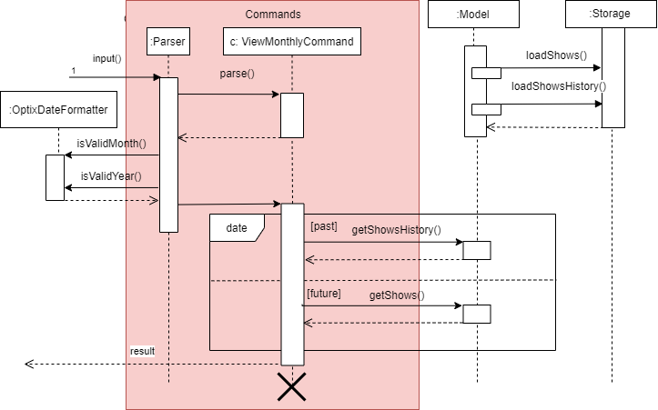

= OPTIX - Developer Guide
:site-section: DeveloperGuide
:toc:
:toc-title:
:toc-placement: preamble
:sectnums:
:stylesDir: stylesheets
:xrefstyle: full
ifdef::env-github[]
:tip-caption: :bulb:
:note-caption: :information_source:
:warning-caption: :warning:
endif::[]
:repoURL: https://github.com/AY1920S1-CS2113T-T12-1/main

By: `Team AY1920S1-CS2113T-T12-1`      Since: `Oct 2019`

== Introduction
Optix is a desktop application for users to manage ticket booking and the finances of a show at its respective venue.
User input is done mainly using the Command Line Interface (CLI) and GUI is used to display the output. The CLI and GUI
are integrated to make the execution of commands more efficient and user-friendly.

This document describes the architecture and system design of Optix and serves to let other developers understand the
implementation of the program should they wish to work on it. This document is divided into four
parts: System architecture, implementations, functionalities of the program and requirements of the program.

*Problem we are solving*: +
Provide an open-source software for planning committees who wish to schedule shows at a venue but lack proper
management system. Optix is also an all-in-one platform that allows for seat bookings and finance tracking.

=== Target User Profile:
* Any user with a need to track the seat booking of a show or event as well as the finances from the bookings.
* Prefers CLI to mouse input.

=== Product features:
* New shows scheduled can be added to the list.
* Sales of seats for a show.
* Program is designed to price the seats according to the different tiers.
* Revenue earned from a show can be calculated based on the seats booked.

=== Value proposition:
Many planning committees often plan performances and events at various venues for guests. However, as many of them do
not have access to ticket management programs, they use conventional methods like using Microsoft Excel to record seat
purchases and track finances. Such tracking methods are rather inefficient and error prone as it is difficult to check
if a particular seat has been purchased or not. Optix is an all-in-one application that facilitates the management of
seats and finances of  a show more efficiently than an average GUI-based app. Users can easily track the seating
arrangement with the GUI and sell seats to customers efficiently through the CLI. An in-built finance tracker also
helps to track the profit earned from the shows.

== Setting up

=== Prerequisites
. *JDK* `11` or above +
. *IntelliJ* IDE

[NOTE]
IntelliJ by default has Gradle and JavaFx plugins installed. Do not disable them.
If you have disabled them, go to `File` > `Settings` > `Plugins` to re-enable them.

=== Setting up the project
. Fork link:{repoURL}[this] repo, and clone the fork to your computer. +
. Open IntelliJ (if you are not in the welcome screen, click `File` > `Close Project` to close the existing project
dialog first)
. Set up the correct JDK version for Gradle
.. Click `Configure` > `Project Defaults` > `Project Structure`
.. Click `New…` find the directory of the JDK
. Click `Import Project`
. Locate the `build.gradle` file and select it. Click `OK`
. Click `Open as Project`
. Click `OK` to accept the default settings.

=== Verifying the setup
. Run Main and try a few commands.
. Run the tests(To hyperlink to test portion later on) to ensure they all pass.

=== Configurations to do before writing code

== Implementation
This section describes some noteworthy details on how certain features are implemented.

=== [Proposed] Sell Seats Feature
Allows users to sell seats for a specific show.

==== Proposed implementation
//todo
==== Design Considerations
//todo

=== [Proposed] View Monthly Revenue Feature

==== Proposed Implementation
Viewing the monthly revenue is executed by the `ViewMonthlyCommand`, which extends from the abstract class `Command` and
is stored under the Command package. +
Additionally, it implements the following operations based on the query date:
* Model#findMonthly() -- Retrieves the list of shows in the month specified by the input.
* Model#getShows() -- Retrieves the current list of shows should the user query be in the future.
* Model#getShowshistory() -- Retrieves the archive list should the user query be in the past.
* OptixDateFormatter#getMonth() -- get the integer value of the month.
* OptixDateFormatter#getYear() -- get the integer value of the year.
* Theatre#getProfit() -- get the profit earned for the show.

Given below is an example usage scenario of the `ViewMonthlyCommand` at each step.

*Step 1* +
The user starts the application. `Storage` will be initialised with the saved contents from previous runs. `Model`
will then be initialised and the current list and archived list of shows are loaded into `Model`.

*Step 2* +
The user executes `view-monthly June 2017` to check the revenue earned by all shows in June 2017. Once `Parser` verifies
that the command is of correct format, `ViewMonthlyCommand` calls `OptixDateFormatter#getMonth()` and
`OptixDateFormatter#getYear()` to get the integer values of month and year respectively.

*Step 3* +
`ViewMonthlyCommand` calls `Model#getShowsHistory()` since the date is in the past. This hashmap of `ShowsHistory` is
then passed into the `Model#findMonthly()` of the `Model` where a list of the shows in the specified month is created.

*Step 4* +
The profit for each of the shows in the remaining list is then added up in `Model` by calling `Theatre#getProfit()`.

The following sequence diagram shows how the view-monthly operation works:

The following activity diagram summarizes what happens when a user executes the ViewMonthly Command:

image::images/ActivityDiagram_ViewMonthly.png[width ="600", align="center"]

==== Design Considerations

*Aspect: How view-monthly executes* +

* Alternative 1 (current choice): Saves the archive shows and current shows separately. +
** Pros: Reduces search time Optix knows which list to search from.
** Cons: Archive list does not need any methods and certain parameters since it is only a list to store show names and
revenue. Have to insert dummy values for Archive list since Archive and current list are from the same class and now
use the same parameters.

* Alternative 2: Save archive and current shows together
** Pros: Archive list and current list will have their own class and reduces dependency.
** Cons: Certain code needs to be repeated which may be confusing.

=== Delete Show Feature
Allows users to delete shows from the shows ShowMap.

==== Implementation
//todo

===  Design Considerations
//todo

== Command Aliasing
Enable users to set up aliases for the commands.

=== Implementation
//todo

=== Design Considerations

[appendix]
== Product Scope

*Target user profile*:

* Stakeholders like SISTIC theatre managers who need to track a large number of theatre bookings as well as seat bookings for each show.
* Prefers CLI to mouse input.

*Product*:

* New shows by performers can be added to the list.
* Seats requested by customers for a show can be booked by the theatre manager.
* Program is desgined to price the seats according to the different tiers.
* Revenue earned from a show can be calculated based on the seats booked.

*Value proposition*: manage seats and finances faster than an average GUI-based app.

[appendix]
== User stories

// tag::base-alt[]
[width="90"]
|===
|Priority |As a ... |I want to ... |So that I can ...
|Must-have |new user |see the command summary |refer to them when I forgot how to use the system.

|Must-have |manager |track seats sold to customers |track my sales and avoid double-selling the same seat.

|Must-have |manager |add new shows to my current list |record the booking of the venue on a particular date.

|Must-have |user |view all the seats of a particular show |inform my customers on the availability of seats.

|Must-have |accountant |view the finances from each show |calculate my profits from my business.

|Must-have |manager |set the prices of the seats |vary seat prices depending on the popularity of the show.

|Must-have |manager |remove a particular show from my listing |free up the cancelled slot to other performers.

|Must-have |manager |remove shows that are in the past |reduce the quantity of shows in the listing to make query more
efficient

|Must-have |manager |set the tiers of the seats |set different prices depending on the popularity of the seats.

|Must-have |manager |postpone shows |keep track of my shows even in the event of unforeseen circumstances.

|Must-have |manager |edit the name of existing shows |correct spelling mistakes.

|Must-have |user |customise the hotkeys for the different commands |increase the efficiency of keying in commands.

|Must-have |manager |remove the booking on a seat |keep track of finances properly in case the booking was made wrongly.

|Nice-to-have |user |add seats from different shows to a customer's purchase |manage bookings across multiple shows in one transaction.

|Nice-to-have |user |refund seats before a certain date |Accomodate the needs of customers while being able to resell
the seats to new customers

|Nice-to-have |user |keep track of payments |track the expenditure by each customer and find out the specific amount for a refund(if applicable).

|Nice-to-have |user |reassign seats booked by customers |fulfill customers' requests to change seats.

|Nice-to-have |user |blacklist customers who break the rules |serve as a deterrent for potential troublemakers and avoid further losses.

|Nice-to-have |user |know the number of available seats in each tier for a particular show |get a rough idea of the number of seats left to sell from each tier.

|Nice-to-have |user |modify the prices of the seats relative to the date of the show |sell off the seats and maximise my profits.

|Nice-to-have |accountant |view monthly revenue |compare earnings and make new policies to improve business.

|Nice-to-have |user |query shows by month |would not be flooded with information that is not relevant.

|Unlikely-to-have |user |keep track of the number of tickets each customer can buy |limit the number of tickets a customer can buy to avoid ticket scalping.

|Unlikely-to-have |manager |customer rewards system |encourage customers to visit more often and thank loyal customers for their patronage.

|Unlikely-to-have |manager |put seats on hold |give customers more time to decide if they want to purchase the seats.

|Unlikely-to-have |manager |reserve seats for VIPs |allow VIPs to enjoy benefits as a reward for their support.

|===
// end::base-alt[]

[appendix]
== Use cases

=== Use case: UC01 - Add new shows to list of shows

*Actor*: Theatre manager

*MSS*

----
1. User enters the add command, followed by the name of the show, the date, the cost of the show and the base selling price of the seats.
2. Optix responds by displaying the show that the user has added to the list.

Use case ends.
----

*Extensions*

----
1a. Optix detects an error in the details entered.
1a1. Optix displays an error message that shows the part of the command that was entered incorrectly.
1a2. Optix requests command from user again.
1a3. User re-enters details.
Steps 1a2-1a3 are repeated until details entered are correct.
Use case resumes from step 2.

Use case ends.
----
 

=== Use case: UC02 - Sell seats to buyer

*Actor*: Theatre manager

*MSS*

----
1. User enters the sell command, followed by the name of the show, the date, the name of the buyer and lastly the seats requested by the buyer.
2. Optix responds by displaying the seats bought and the cost of the transaction.
         Use case ends.
----

*Extensions*

----
      1a. Optix detects an error in the details of the show entered.
      1a1. Optix displays an error message that shows the part of the command that was entered  
              incorrectly.
      1a2. Optix requests command from user again.
      1a3. User re-enters details. 
      Steps 1a2-1a3 are repeated until details entered are correct.
      Use case resumes from step 1.

      1b. Optix detects that the seats entered are unavailable. 
      1b1. Optix requests command from user again.
      1b2. User re-enters details.
      Steps 1b1-1b2 are repeated until details entered are correct.
      Use case resumes from step 2.
          Use case ends.
----

=== Use case: UC03 - Delete a single show scheduled on a particular date

*Actor*: Theatre manager

*MSS*

----
1. User enters the delete command followed by the date of the show, and the show name. 
2. Optix responds by displaying the show/shows that have been removed from the list.
         Use case ends.
----

*Extensions*

----
      1a. Optix cannot find the show using the details entered.
      1a1. Optix requests command from user again.
      1a2. User re-enters command. 
      Steps 1a1-1a2 are repeated until shows entered are correct.
      Use case resumes from step 2.
          Use case ends.
----

=== Use case: UC04 - Delete multiple shows by show name

*Actor*: Theatre manager

*MSS*

----
1. User enters the delete command followed by the names of the shows to delete.
2. Optix searches through the list of shows for all shows with the specified name, and deletes them.
3. Optix replies by displaying the show/shows that have been removed from the list.
         Use case ends.
----

*Extensions*

----
      1a. Optix cannot find intended show(s) using the show name(s) specified.
      1a1. Optix replies by listing all the shows the could not be found.
      1a2. User re-enters command. 
      Steps 1a1-1a2 are repeated until shows entered are correct.
      Use case resumes from step 2.
          Use case ends.
----

=== Use case: UC05 - View the entire list of shows

*Actor*: Theatre manager

*MSS*

----
1. User enters the list command.
2. Optix responds by displaying the list of shows available for booking.
         Use case ends.
----

=== Use case: UC06- View available seats of a show

*Actor*: Theatre Manager

*MSS*

----
1. User enters the view command, followed by the show name and date of the show.
2. Optix responds by displaying the available seats of the theatre for the show, by marking reserved seats with a cross, and available seats with a tick.
          Use case ends.
----

*Extensions*

----
      1a. Optix detects that there is no such show on that date. 
      1a1. Optix replies that there is no such show on the date.
      1a2. Optix requests command from user again.
      1a3. User re-enters command. 
      Steps 1a1-1a3 are repeated until the command entered is correct.
      Use case resumes from step 2.
          Use case ends.
----

=== Use Case: UC07 - Refund ticket for seat

*Actor*: Theatre manager

*MSS*

----
1. User enters the refund command, followed by show name, show date, and seat number.
2. Optix responds by querying if the ticket for the seat was purchased. If it is, then the seat is marked as available again.
3. Optix updates the finances from the refund. 
4. Optix replies with a success confirmation.
          Use case ends.
----

*Extensions*

----
      1a. Optix detects that the show does not exist
      1a1. Optix replies that there is no such show.
      1a2. Optix requests command from user again.
      1a3. User re-enters command, with the correct show name.
      Steps 1a1-1a3 is repeated until the command entered is valid.
      Use case resumes from step 3.
          Use case ends.

      2a. Optix detects that the seat was not purchased.
      2a1. Optix replies that the request to refund this seat is invalid.
      2a2. Optix requests command from user again.
      2a3. User re-enters command, with a correct seat number.
      Steps 2a1-2a3 is repeated until the command entered is valid.
      Use case resumes from step 3.
          Use case ends.
----

=== Use case: UC08- Tutorial/ Help Command

*Actor*: Theatre Manager

*MSS*

----
1. User enters the help command.
2. Optix responds by displaying all available commands and their usage.
----

=== Use case: UC09 - Postpone shows to a later date

*Actor*: Theatre manager

*MSS*:

----
1. User enters the postpone command, followed by the name of the show, the current-date of the show to postpone and the new-date.
2. Optix responds by displaying the new-date for the show.
         Use case ends.
----

*Extensions*:

----
      1a. Optix detects an error in the details entered.      
      1a1. Optix informs the user that the show has passed.      
      1a2. Optix requests command from user again.
      1a3. User re-enters command. 
      Steps 1a1-1a3 are repeated until the command entered is correct.
      Use case resumes from step 2.
          Use case ends.

      1b. Optix detects that  there is no show of the given input in the list.
      1b1. Optix informs the user that the show does not exist.
      1b2. Optix requests command from user again.
      1b3. User re-enters command. 
      Steps 1b1-1b3 are repeated until the command entered is correct.
      Use case resumes from step 2.
          Use case ends.
----

[appendix]
== Functional Requirements

* Command to add shows
* Command to Sell Tickets to audience.
* Command to delete a particular show. 
* Command to delete multiple shows (by showName).
* Command to list all shows before date of showing. (Query for booking and check seat availability)
* Command to list specific show to get date of showing (To check when the show is happening and check seat availability)
* Command to refund ticket for the show.
* Tutorial/ Help function
* Command to postpone particular show to an empty slot

[appendix]
== Non-functional Requirements

* Should work on any OS as long as it has Java 11 or above installed.
* The list should be able to hold at least 100 shows without reduction in performance.
* The system should be usable by a novice who has never booked theatres/ theatre seats before. I.e. the commands should be intuitive for any user.
* Parser to parse user input
* Command class to execute add/ delete/ list tasks
* UI class to format output 

[appendix]
== Glossary

*Must-have*:

A feature that is declared as must have is viewed as a priority for development

*Nice-to-have*:

A feature that is declared as nice-to-have is viewed as a non- priority. The feature with this label will not be completed with as much urgency, and may not even be developed at all if it is deemed unimportant.

*Unlikely-to-have*:

A feature that is declared as unlikely-to-have is viewed as the least priority. The features with this label are likely to be ignored and only be done should they be viewed as extensions that could add on to the functionality of the program.

