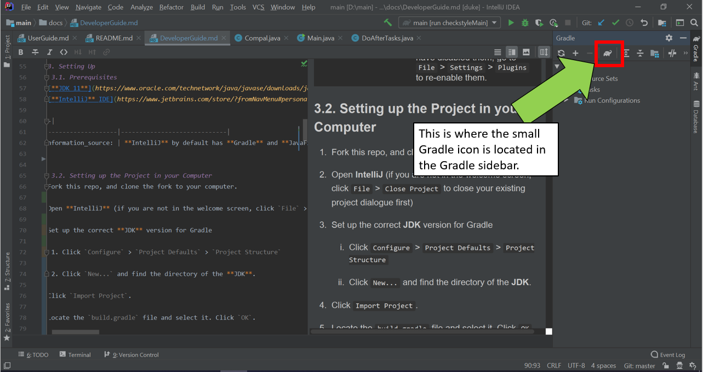
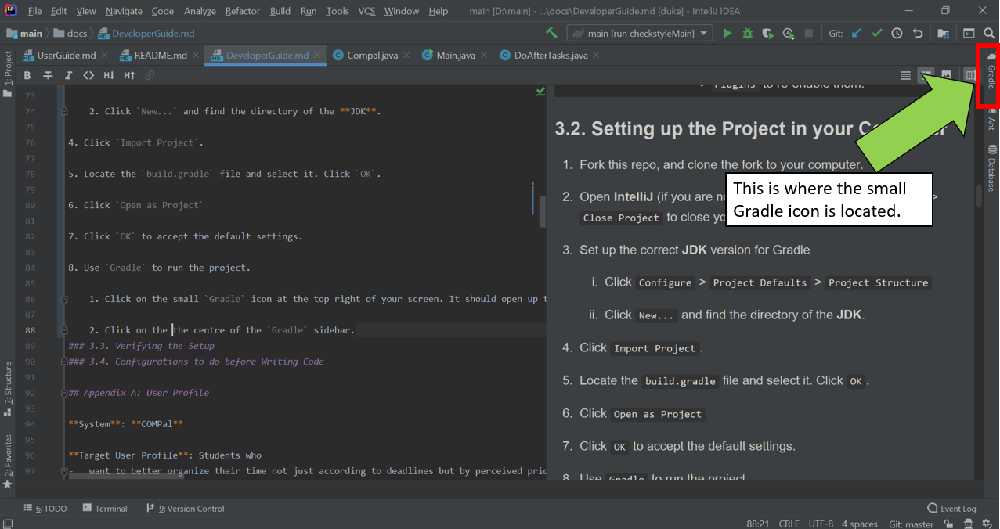

# COMPal - Developer Guide

Welcome to the **COMPal** Developer Guide! This Developer Guide is still being worked on for now!

# Table of Contents
[**1. Introduction**](/docs/DeveloperGuide.md#1-introduction)

[**2. About this Developer Guide**](/docs/DeveloperGuide.md#2-about-this-developer-guide)

[**3. Setting Up**](/docs/DeveloperGuide.md#3-setting-up)
+ [3.1 Prerequisites](/docs/DeveloperGuide.md#31-prerequisites)
+ [3.2 Setting up the Project in your Computer](/docs/DeveloperGuide.md#32-setting-up-the-project-in-your-computer)
+ [3.3 Verifying the Setup](/docs/DeveloperGuide.md#33-verifying-the-setup)
+ [3.4 Configurations to do before Writing Code](/docs/DeveloperGuide.md#34-configurations-to-do-before-writing-code)

[**4. Design**](/docs/DeveloperGuide.md#4-design)
 + [4.1 Architecture](/docs/DeveloperGuide.md#41-architecture)
 + [4.2 UI Component](/docs/DeveloperGuide.md#42-ui-component)
 + [4.3 Logic Component](/docs/DeveloperGuide.md#43-logic-component)
 + [4.4 Commons Component](/docs/DeveloperGuide.md#44-commons-component)
 + [4.5 Storage Component](/docs/DeveloperGuide.md#45-storage-component)
 + [4.6 Model Component](/docs/DeveloperGuide.md#46-model-component)

[**5. Implementation**](/docs/DeveloperGuide.md#5-implementation)

[**6. Documentation**](/docs/DeveloperGuide.md#6-documentation)

[**7. Testing**](/docs/DeveloperGuide.md#7-testing)

[**8. DevOps**](/docs/DeveloperGuide.md#8-dev-ops)

[**Appendix A: User Profile**](/docs/DeveloperGuide.md#appendix-a-user-profile) 
 
[**Appendix B: User Stories**](/docs/DeveloperGuide.md#appendix-b-user-stories)  

[**Appendix C: Use Cases**](/docs/DeveloperGuide.md#appendix-c-use-cases)  

[**Appendix D: Non-Functional Requirements**](/docs/DeveloperGuide.md#appendix-d-non-functional-requirements)  

[**Appendix E: Glossary**](/docs/DeveloperGuide.md#appendix-e-glossary)  

## 1. Introduction
**COMPal** is a desktop application specifically designed for the **hectic schedule** for the **modern student** in mind. By **simply inputing** their busy and compact schedule, the application is able to automatically **generate a prioritize daily schedule** for the user ! This ensures that the student can **focus** on the more **important upcoming task**! Additionally with **features such as** reminders of task and also finding of free time slot, COMPal allows the **ease of planning** for future task.

It is catered to student-users who prefer to use and are adept at using a **Command-Line Interface (CLI)**, while still having a clean **Graphical User Interface (GUI)** to properly **visualize schedules** and **organize tasks** better. 

## 2. About This Developer Guide

This **Developer Guide** provides a detailed documentation on the implementation of all the time-management tools of **COMPal**. To navigate between the different sections, you could use the [**Table of Contents**](/docs/DeveloperGuide.md#table-of-contents) above.

For ease of communication, tbe following **terminology** will be used:

Term                 | Definition
---------------------|-----------------------------
Task                 | The general term that is used to describe an action that might need to be done by the user. 
 
Additionally, throughout this **Developer Guide**, there will be various **icons** used as described below.

Icon                 | Description
---------------------|-----------------
:information_source: | Additional important information about a term/concept
:bulb:               | A tip that can improve your understanding about a term/concept
:warning:            | A warning that you should take note of  

## 3. Setting Up
### 3.1. Prerequisites
1. [**JDK 11**](https://www.oracle.com/technetwork/java/javase/downloads/java-archive-javase11-5116896.html) or later
2. [**IntelliJ** IDE](https://www.jetbrains.com/store/?fromNavMenu#personal?billing=yearly)

 
<!---| | |
|---------------------|-----------------------------|
|:information_source: | **IntelliJ** by default has **Gradle** and **JavaFx** plugins installed. Do not disable them. If you have disabled them, go to `File` > `Settings` > `Plugins` to re-enable them.|--->

### 3.2. Setting up the Project in your Computer
1. Fork this repo, and clone the fork to your computer. 

2. Open **IntelliJ** (if you are not in the welcome screen, click `File` > `Close Project` to close your existing project dialogue first)

3. Set up the correct **JDK** version for Gradle  
    
    1. Click `Configure` > `Project Defaults` > `Project Structure`  
    
    2. Click `New...` and find the directory of the **JDK**.
    
4. Click `Import Project`.

5. Locate the `build.gradle` file and select it. Click `OK`.

6. Click `Open as Project`

7. Click `OK` to accept the default settings. 

8. Use `Gradle` to run the project. 
    
    1. Click on the small `Gradle` icon at the top right of your screen. It should open up the `Gradle` sidebar.
        
    
    2. Click on the small `Gradle` icon at the centre of the `Gradle` sidebar.
        
        
    3. Type `gradle run` to run the project.
    
    4. The **GUI** should show up in a few seconds. Try running a few commands.
    
9. Observe for any code errors displayed in the **console** of the **IntelliJ** IDE. 

### 3.3. Verifying the Setup

1. Run the project using `gradle run`. Try a few commands in the **GUI**.

2. [Run the tests](/docs/DeveloperGuide.md#7-testing) to ensure that they all pass. 

### 3.4. Configurations to do before Writing Code

## 4. Design

#### 4.1. Architecture

Figure 1. Architecture Diagram

   
|||
|--|--|       
| :bulb: | The `.pptx` files used to create diagrams in this document can be found in the [diagrams](https://github.com/AY1920S1-CS2113T-W17-1/main/docs/diagrams/) folder. To update a diagram, modify the diagram in the pptx file, select the objects of the diagram, and choose `Save as picture`. |

The  **_Architecture Diagram_**  given above explains the high-level design of the App. Given below is a quick overview of each component.

[**`Commons`**](https://github.com/AY1920S1-CS2113T-W17-1/main/tree/master/src/main/java/compal/commons)  represents a collection of classes used by multiple other components. Two of those classes play important roles at the architecture level.

-   `Messages`  : This class contain all types of messages that are to be called from depending  on the type of execution. E.g. Invalid syntax commands messages

-   `COMPal`  : Used by many classes to call the needed functionality such as user interface, storage or parser.
    
The rest of the App consists of four components.

-   [**`UI`**](https://github.com/AY1920S1-CS2113T-W17-1/main/tree/master/src/main/java/compal/ui): The UI of the App.
    
-   [**`Logic`**](https://github.com/AY1920S1-CS2113T-W17-1/main/tree/master/src/main/java/compal/logic): The command executor.
    
-   [**`Model`**](https://github.com/AY1920S1-CS2113T-W17-1/main/tree/master/src/main/java/compal/model): Holds the data of the App in-memory.
    
-   [**`Storage`**](https://github.com/AY1920S1-CS2113T-W17-1/main/tree/master/src/main/java/compal/storage): Reads data from, and writes data to, the hard disk.

For example, the `Parser` component (see the class diagram given below) defines it’s API in the `CommandParser.java` interface and exposes its functionality using the `ParserManager.java` class.

Figure 2. Class Diagram of Logic Parser Component

**Events-Driven nature of the design**

The  _Sequence Diagram_  below shows how the components interact for the scenario where the user issues the command  `delete 1`.

Figure 3. Component interactions for `delete 1` command.

The sections below give more details of each component.

### 4.2. UI component

Figure 5. Structure of the UI Component

**API**  :  [`Ui.java`](https://github.com/AY1920S1-CS2113T-W17-1/main/blob/master/src/main/java/compal/ui/Ui.java)

The UI consists of a `MainWindow` that is made up of parts e.g.`UserInput`,`SecondaryOutput`, `tabWindow`which tabs consist of `MainOutput`, `DailyCalender`. Although the application is only input text-based application, our outputs are both GUI and text-based. 

The  `UI`  component uses JavaFx UI framework. The layout of these UI parts are defined in matching  `.fxml`  files that are in the  `src/main/resources/view`  folder.   For example, the layout of the  [`MainWindow`](https://github.com/AY1920S1-CS2113T-W17-1/main/blob/master/src/main/java/compal/ui/MainWindow.java)  is specified in  [`MainWindow.fxml`](https://github.com/AY1920S1-CS2113T-W17-1/main/blob/master/src/main/resources/view/MainWindow.fxml)

The `DailyCalender` use information from the `Model` and `COMPal` component to generate or refresh the stage to reflect changes made to the data.

The  `UI`  component,

- Executes user commands using the  `Logic`  component.  
- Displays text-based command results in to the user via `MainOutput` or `SecondaryOutput`.
- Display ​daily calendar of the user via `DailyCalender`. 

### 4.3. Logic component

Figure 6. Structure of the Logic component

**API**  :  [`CommandParser.java`](https://github.com/AY1920S1-CS2113T-W17-1/main/blob/master/src/main/java/compal/logic/parser/CommandParser.java)

The  `Logic`  component,

- Set up `ParserManager` to parse the user command.
- `ParserManager` creates respective `xCommand` class.
- `xCommand` class can execute the command and can affect the `model`.
- `xCommand` class can instruct the `ui` to print information.

### 4.4. Commons Component
Classes used by multiple components are in the [`commons`](/src/main/java/compal/commons) package. It contains 2 important classes: [`Compal`](/src/main/java/compal/commons/Compal.java) and [`Messages`](/src/main/java/compal/commons/Messages.java).

`Compal.java` creates an instance of `Ui`, `Storage`, `TaskList` and `ParserManager`. Other classes will then use `Compal` to call on the aforementioned classes for different method invocations.

In addition, `Compal` contains the `viewReminder` method, which will be called when the GUI is initialised. This provides the user with the reminders set or due within 7 days.

`Messages.java` contains all the error messages that will be printed on the GUI when the user has made an error in their input. This will notify the user to check what he/she has keyed in the command box, and make necessary adjustments. 

### 4.5. Storage Component
API: StorageManager.java

We use very simple and user-editable text files to store user data. Data is stored as data strings separated by underscores. The separation token however, can be easily changed if desired. 
Data is thereafter parsed as a string and then processed by our storage API into application-useful datatypes such as Task Objects. 

While it might be viewed as primitive, the advantage of this approach is that it is an almost no-frills implementation and is easily comprehended the average developer. The average user can also understand and easily directly edit the data file if so desired. 

### 4.6. Model Component

Figure 2. Overall structure of the Model Component

**API**: [`Model`](https://github.com/AY1920S1-CS2113T-W17-1/main/tree/master/src/main/java/compal/model)
 
 The `Model` component
 - stores a `TaskList` object that represents the list of user's tasks
 - stores the Schedule data.
 - does not depend on any of the other four components.

## 5. Implementation

## 6. Documentation

## 7. Testing

## 8. Dev Ops

## Appendix A: User Profile

**System**: **COMPal**

**Target User Profile**: Students who
-   want to better organize their time not just according to deadlines but by perceived priorities
-   prefer interacting with a CLI
-   prefers typing over mouse input

**Persons that can play this role** : Undergraduate student, graduate student, a staff member doing a part-time course, exchange student

**Value Proposition**: Students wanting to be more organized without going through too much of a hassle can now better manage their schedules and tasks with Compal’s clean and intuitive user-interface and user-defined priority-based organization.

## Appendix B: User Stories

Priorities: High (must have) - `* * *`, Medium (nice to have) - `* *`, Low (unlikely to have) - `*`

| As a ...|      I want to...     |  So that I can ... | Priority |
|:----------|:-------------:|:------:|:----------|
|Student| Add the due dates of tasks that I have| Neatly organize my schedule|***
|Student| Add my academic timetable| Store my academic schedule|***
|Student| Add meeting schedules| Easily remember about scheduled meetings|***
|Student| Add examination dates and times| View and track upcoming assessments|***
|Student| Add a description to a task that I have| Record necessary information about the task|***
|Student| Edit due dates of tasks that I have| Update the description and deadlines of the tasks|***
|Student| Edit my academic timetable| Update my academic schedule|***
|Student| Edit meeting schedules| Update my appointment timings|***
|Student| Edit examination dates and times| Update assessment dates|***
|Student| View the application in a graphical user interface| View things in an organised and quick manner|***
|Student| View the tasks that are soon to be overdue| Keep track of the things to do|***
|Student| View the timetable in a daily view| See the overview of the whole day|***
|Student| View my ongoing school-related task| Keep track of my progress|***
|Student| Be notified of my classes to attend|Be reminded of my schedule|***
|Student| Be notified of the tasks due|Be reminded of my schedule|***
|Student| Be notified of upcoming examinations| Be reminded of my schedule|***
|Student| Be notified of upcoming meetings| Be reminded of my schedule|***
|Student| Sort my tasks according to the deadlines and importance| Know which task needs to be focused on|***
|Student| Find specific things in the application using a keyword| Find related things|***
|Student| Remove a scheduled slot| Delete cancelled meetings/classes|***
|Student| Remove tasks| Delete tasks|***
|Student| Priortise more important timetable slots based on personal ranking| rearrange my schedule in the event that there is a timetable clash|***
|Student| View the timetable in a monthly view| See the overview of the whole month|**
|Student| View the timetable in a weekly view| See the overview of the whole week|**
|Student| Mark my ongoing school-related task as completed by task and subtask| Keep track of the progress of individual task and subtasks|**
|Student| Track my assignment progress| Know what needs to be done|**
|Student| Add the result/grade of module assignment, attendance, midterm results|Store module's component grades|*
|Student| Add my received module grades for each semester| Store the semester's grades|*
|Student| Edit the result/grade of module assignment, attendance, midterm results| Estimate the grade that I will receive|*
|Student| Track my cumulative GPA| Work towards the GPA I aim for|*

## Appendix C: Use Cases

**Use case 1: Store task or academic schedule**

**_Main Success Scenario (MSS)_**
1.  . User inputs event command followed by all the mandatory parameters.
    
2.  . System reflects the additions to the planner.

	Use case ends.
	
**_Extensions_**

-   1a. System detects an error in the entered data.
    
    -   1a1. System outputs error message.
        
        Use case ends.
        
    
-   1b. System detects insufficient parameters in the entered data.
    
    -   1b1. System outputs error message.
        
        Use case ends.​

**Use Case 2: Edit Task**

*Prerequisite: User is aware of the TaskID*

**MSS**
1. User inputs command to edit a task along with the TaskID, followed by the parameters which is needed to be changed.
    
2. System changes the specified parameters for the slot.
    
3. System then reflects the task parameters as well as the parameters changed.

   Use case ends.

**_Extensions_**

-   1a. TaskID does not exist in COMPal.
    
    -   1a1. System outputs error message.
        
        Use case ends.
        
    
-   1b. System detects an error in the entered data.
    
    -   1b1. System outputs error message.
        
        Use case ends.​

**Use Case 3: Mark Task as Done**

*Prerequisite: User is aware of the TaskID.*

**MSS**
1.  User enters command to mark task as done
    
2.  COMPal reflects task status changes

     Use case ends.

 **_Extensions_**

-   1a. TaskID does not exist in COMPal.
    
    -   1a1. System outputs error message.
        
        Use case ends.
        
    
-   1b. System detects an error in the entered data.
    
    -   1b1. System outputs error message.
        
        Use case ends.​
    
  

**Use Case 4: Change the daily view date**

**MSS**
1.  User enters command to change the date of daily calendar view.
  
2.  COMPal displays the selected view date on GUI.

    Use case ends.
 
 **_Extensions_**

-   1a. System detects an error in the entered data.
    
    -   1a1. System outputs error message.
        
        Use case ends.
-   1b. System detects no task on selected view date.
    
    -   1b1. System outputs message indicating no task on chosen date.
        
        Use case ends.​
    

**Use Case 5: Search for Tasks**

**MSS**
1.  User enter find command along with the parameter to search for.
    
2.  COMPal reflects search results

  **_Extensions_**

-   1a. System does not find matching keyword
    
    -   1a1. System indicates that there are no matching keyword.
    
    Use case ends.

## Appendix D: Non-Functional Requirements
    
1.  COMPal can store up to 1,000,000 tasks in a clear text file.
    
2.  COMPal must respond fast, within 2 seconds so that the user does not have to wait too long.
    
3.  COMPal system application should take up relatively little space on the local machine.
    
4.  COMPal’s GUI must be intuitive and pleasant to the eyes.
    
5.  COMPal consistently performs specified function without failure.

6.  The user’s OS date and time must be correctly synchronizes to local date and time.

## Appendix E: Glossary
**Task**:  A generic term used to refer to any instance of an object in the user's schedule  
**View**: The layout in which the schedule is displayed to the user 
