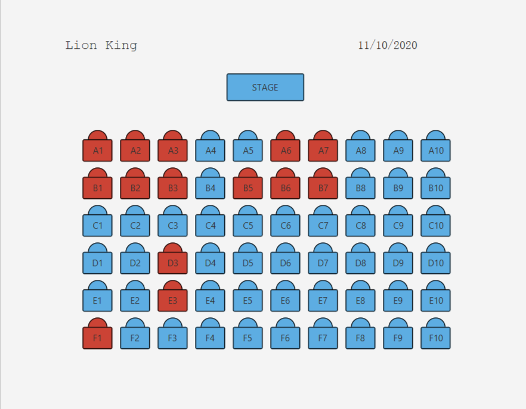
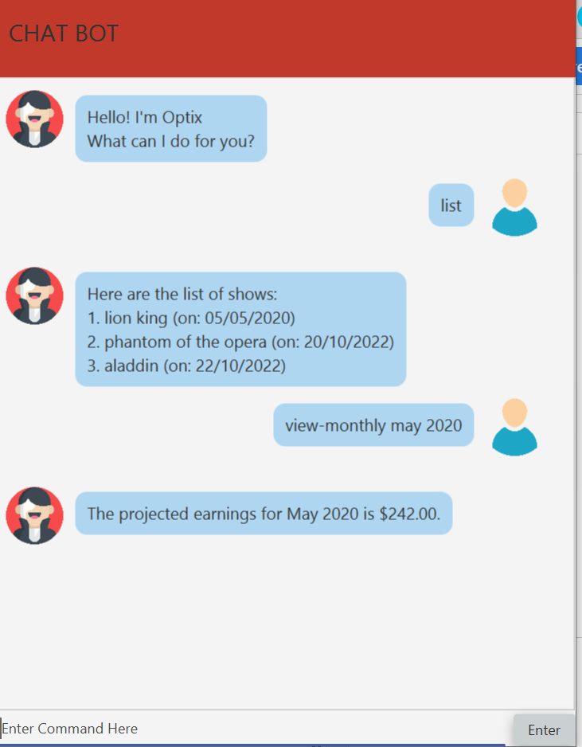
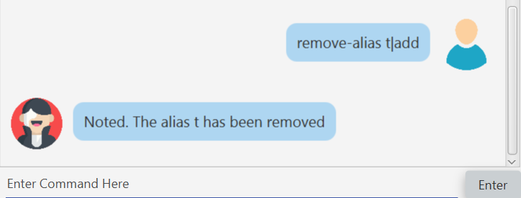
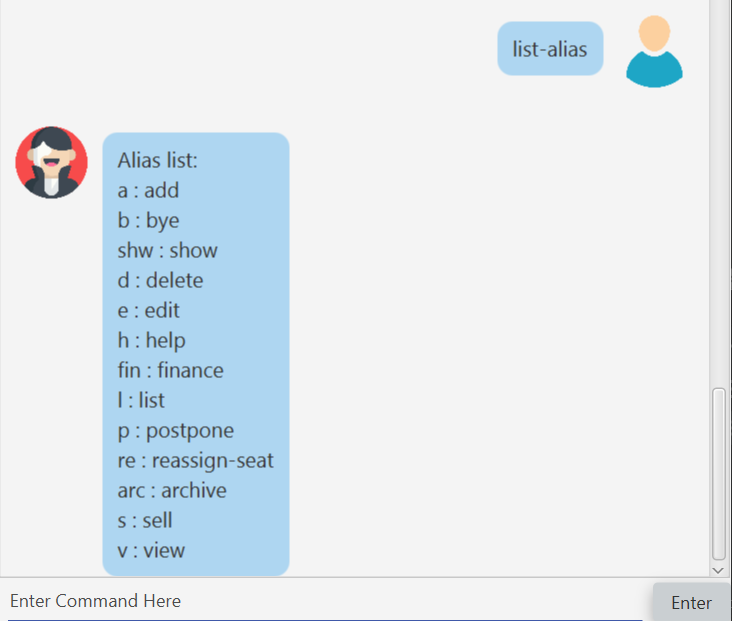

= Optix User Guide
:site-section: UserGuide
:toc:
:toclevels: 4
:toc-title:
:toc-placement: preamble
:sectnums:
:stylesDir: stylesheets
:xrefstyle: full
:experimental:
ifdef::env-github[]
:tip-caption: :bulb:
:note-caption: :information_source:
endif::[]
:repoURL: https://github.com/AY1920S1-CS2113T-T12-1/main

By: `Team AY1920S1-CS2113T-T12-1`      Since: `Oct 2019`

== Introduction

Optix is a desktop application made for users who want to manage the seating of a theatre or other venues while keeping track of the finances earned. Optix is optimised for users who can type fast and prefers using a Command Line Interface (CLI) to other methods. A Graphical User Interface (GUI) is also developed for additional user interaction. Want to skip the process of going through multiple steps to manage bookings and viewing your profits? If you can type fast and want to avoid this hassle, Optix is the perfect application for you! Jump to <<Quick Start>> to get started.

== Quick Start

. Ensure that Java 11 or above is installed on your computer.
. Download the latest `optix.jar` link:{repoURL}/releases[here].
. Copy the file to the folder you want to use as the home folder for your theatre bookings.
. Double-click the file to start the application. The GUI should appear in a few seconds.

image::images/UI.png[width ="600", align="center"]

[start=5]
. Type the command in the command box and press kbd:[Enter] to execute it
(e.g. type help and press kbd:[Enter] to open the help window.)
. Some example commands you can try:
** `add` Phantom of the Opera|20|5/5/2020 : adds a show called “Phantom of the Opera” to be scheduled on the 5/5/2020 and the base price of $20 per seat to Optix.
** `list`: list all shows currently added to Optix.
** `delete` Phantom of the Opera|5/5/2020 : finds a show called Phantom of the Opera scheduled on the 5/5/2020 in Optix, and deletes it.
** `help`: displays the list of commands available.
** `bye`: exits the application.

== Features

=== Command Format

* Words in `UPPER_CASE` are the parameters to be supplied by the user.
e.g. in add `SHOW_NAME|SCHEDULED_DATE|PRICE`, the `SHOW_NAME`, `SCHEDULED_DATE`, and `PRICE` are parameters that can be used as `add Phantom of the Opera|5/5/2020|20`.

* Items with `...` after them can be used multiple times (minimally once).
e.g. `SEAT` can be used as `A1 A2 B6` etc.

* Parameters have to be in order.
e.g. if the command specifies `SHOW_NAME|SHOW_DATE`, `SHOW_DATE|SHOW_NAME` is invalid.

* All `SHOW_DATE` entered must be in the format dd/mm/yyyy

* All *COMMAND* and `SHOW_NAME` are case insensitive.

=== Generic Commands
The following set of commands

==== Viewing Help: `help`
As a new or returning user you may be unsure about the commands.
The `help` command displays descriptions of all the available commands. +
Format: `help`

==== Tab navigation: `show`, `finance`, `archive`
Hate clicking? Simply type in the tab headers to achieve fast navigation
between the various tabs! +
Format: `show`, `finance`, `archive`

==== Exiting the program: `bye`
Saves all the shows and statuses of the seats within the show list, then exits the program.  +
Format: `bye`

=== Show Commands
The following set of commands helps with managing shows within the theatre.

==== Adding shows: `add`
Let's say that a new event is coming up and you'd like to add it to the application showlist.
Use the `add` command to add shows to the current show list. +
Format: `add SHOW_NAME|SEATS_BASE_PRICE|DATE1|DATE2|...`

[TIP]
use `DATE1|DATE2|...` to easily add multiple dates for the show
* `SEATS_BASE_PRICE` represents the lowest cost of a seat in the venue.
* There must be no other show on that `DATE`.
* The `DATE` must be in the future.
* The format of `DATE` must be dd/mm/yyyy
* Shows of the same name can be added.

Examples:
*Add a single show*: +
`add Phantom of the Opera|20|5/5/2020` +
*Add multiple shows*: +
`add Lion King|30|6/5/2020|7/5/2020|8/5/2020`

==== Deleting shows: `delete`
In the event a show is cancelled, you can remove it from the list using the `delete` command. It
deletes shows for specific dates. +
Format: `delete SHOW_NAME|DATE1|DATE2|...`

[TIP]
use `DATE1|DATE2|DATE3|...` to easily remove multiple dates for the show

* Removes `SHOW_NAME` on the specified `DATE`
* The exact `SHOW_NAME` and `DATE` must be entered for show to be removed successfully. +

Examples:
*Delete a single show*: +
----
Delete Lion King|10/10/2020
----

*Delete multiple shows*: +
----
delete Phantom of the Opera|5/5/2020|6/5/2020
----

==== Listing shows: `list`
The `list` command allows you to view all current shows. +
Format: `list`

[TIP]
Use `list` before you type other commands so you can see all the show names and show dates

==== Listing dates for specific show: `list`

You can also search for all listings of a particular show with the `list` command!
Scheduled shows with the specified name will be listed. +
Format: `list SHOW_NAME`

Examples:
----
list Phantom of the Opera
list Lion King
----

==== Listing shows for a specific month: `list`
You can also search for all listings of a particular month!
Lists all the shows for a specific month. +

[TIP]
use numbers or abbreviations to represent the month instead of spelling it out!

Format: `list MONTH YEAR` +

Examples:
----
list 12 2020
list Dec 2020
list December 2020
----

==== Postpone a show to a later date: `postpone`
Use the `postpone` command to postpone the requested
current show in the showlist to a specified date.  +
Format: `postpone SHOW_NAME|OLD_DATE|NEW_DATE`

* Changes the date of the specified `SHOW_NAME` from `OLD_DATE` to `NEW_DATE`
* Invalid if the date of `SHOW_NAME` does not match `OLD_DATE`
* Invalid if `NEW_DATE` has already passed.

Example:
----
postpone Phantom of the Opera|5/5/2020|10/5/2020
----

==== Editing a show’s name: `edit`
If you made a spelling error while adding an event, there is no need to delete and add it again.
Use `edit` to change its name. +
Format: `edit OLD_SHOW_NAME|SHOW_DATE|NEW_SHOW_NAME`

* Changes the name of the specified `SHOW_DATE` with `OLD_SHOW_NAME` to `NEW_SHOW_NAME`

* Invalid if the date of `OLD_SHOW_NAME` does not match `SHOW_DATE`

Example:
----
edit Phanom of the Opera|5/5/2020|Phantom of the Opera
----

[NOTE]
====
Phanom of the Opera is intentionally mispelled
====

=== Seats Commands
The following set of commands helps with managing ticketing for any show that is scheduled
to perform in the theatre.

==== View the seats for a show: `view`
You can use the `view` command to check seat availabilities for shows.
The layout of the seats within the theatre will be displayed. +
Format: `view SHOW_NAME|SHOW_DATE`

* Displays the layout of the specified `SHOW_NAME` on `SHOW_DATE` in a 2D array format.
* The layout will not be displayed if the specified `SHOW_DATE` does not
correspond to the actual show date of the indicated `SHOW_NAME`.
* The layout will not be displayed if the specified `SHOW_DATE` does not have any show scheduled for the day.

Examples:
----
view Lion King|11/10/2020
view Phantom of the Opera|20/11/2021
----

[NOTE]
red seats indicates that seat has been sold, while blue seats
indicates that seat is still available for booking.

==== Sell seats: `sell`
The `sell` command can be used to record bookings. It is useful for managing seats sold to customers and for tracking the availability of the seats +
Format: `sell SHOW_NAME|SHOW_DATE|SEAT …`

[TIP]
Use the `view` command for a visual representation of the statuses of all the seats to ensure successful purchase of seats

* Sells `SEAT` specified by customers for the indicated `SHOW_NAME` on `SHOW_DATE`.
* Each `SEAT` is represented by an alphabet followed by an integer e.g. A1
* Multiple `SEAT` can be entered in the parameter `SEAT ...` to book all those seats

Examples: +
Sell a single seat: +
----
sell Phantom of the Opera|5/5/2020|C1
----

Sell multiple seats in a single command: +
----
sell Lion King|6/5/2020| A1 A2 A3 A4
----

==== Reassign seat for a show: `reassign-seat`
Changes the seat of a customer. +
Format: `reassign-seat SHOW_NAME|SHOW_DATE|OLD_SEAT|NEW_SEAT`

* Reassign a booked seat to another available seat for the show.
* Seat cannot be reassigned if:
** `OLD_SEAT` is not booked previously.
** `NEW_SEAT` has been booked.
** `OLD_SEAT`/`NEW_SEAT` does not exist
** Both `OLD_SEAT` and `NEW_SEAT` are the same.

Examples:
----
reassign-seat Phantom of the Opera|5/5/2020|A1|A2
reassign-seat Lion King|10/5/2020|D6|A1
----

=== Finance Commands
The following set of commands helps with tracking the finance of the theatre.

==== View the profit of a show: `view-profit`

Displays the profit earned from that particular show.
Format: `view-profit SHOW_NAME|SHOW_DATE`

* Displays the profit for the specified `SHOW_NAME` on `SHOW_DATE`
* Displays projected earnings for a show if `SHOW_DATE` is in the future.

Example:
----
view-profit Lion King|5/5/2020
----

==== View the amount earned for a particular month: `view-monthly`

Displays the profit earned for a particular month. +

[TIP]
use numbers or abbreviations to represent the month instead of spelling it out!

Format: `view-monthly MONTH YEAR`

* Displays the total profit collected for all the shows in MONTH YEAR
* Displays projected earnings if MONTH YEAR is in the future.

Examples:
----
view-monthly 1 2020
view-monthly Jan 2020
view-monthly January 2018
----

As shown in the figure above, entering the `view-monthly` command would cause Optix to 
respond with the profit of that month.

image::images/userguide/UG_ViewMonthly_GUI.png[width ="600", align="center"]

As shown in the figure above, the GUI would also display the shows performed in that month, together with
the revenue of each show 

=== Alias Commands
Aliases help you to create shortcuts for commands, hence enabling
you to to input commands with less effort!

==== Add new alias: `add-alias`
As a user, you can give a Command an alternate name for easy access.
You can add them with `add-alias` to an existing command.
After adding the alias, it is immediately available for use! +

Format: `add-alias ALIAS|COMMAND`

* Adds a new alias for `COMMAND`
* The alias must not already be in use.
* The alias must not be the name of a command.

Examples: +
Give the command `add` an alias 't': +
----
add-alias t|add
----

image::images/userguide/UG_add-alias_success.png[width ="600", align="center"]

Assigning an alias that is already in use is not allowed. +
`add-alias t|delete` would not work if 't' is paired to another command already.

image::images/userguide/UG_add-alias_failure.png[width ="600", align="center"]

Assigning an command keyword as an alias is also not allowed: +
`add-alias add|delete` is not allowed.

image::images/userguide/UG_add-alias_illegal.png[width ="600", align="center"]

==== Remove alias: `remove-alias`

Let's say you changed your mind after adding the alias.
Use the `remove-alias` command to delete an existing alias. +
Format: `remove-alias ALIAS|COMMAND`

* Remove the `ALIAS` for `COMMAND`

Example:
----
remove-alias t|add
----

==== List alias: `list-alias`
If you forgot the aliases you set, or would like to view the default aliases,
use the `list-alias` command! +
Format: `list-alias`

==== Reset alias: `reset-alias`
To undo all your alias modifications, use the `reset-alias` command
to set them back to the defaults. After the reset, use `list-alias` to
view the default aliases. +
Format: `reset-alias`

image::images/userguide/UG_reset-alias_success.png[width ="600", align="center"]

== FAQ

*Q*: How do I transfer my data to another computer? +
*A*: Download the link:{repoURL}/releases[optix.jar] in the other computer and paste the file that contains the data from the previous Optix folder in the same folder as the jar file.

== Command summary

* *Add*: `add SHOW_NAME|SEATS_BASE_PRICE|DATE1|DATE2|...`
Eg. `add Phantom of the Opera|20|5/5/2020|6/5/2020`

* *Add-alias*: `add-alias ALIAS|COMMAND`
Eg. `add-alias q|add`

* *Bye*

* *Delete*: `delete SHOW_NAME|DATE1|DATE2|...`
Eg. `delete Phantom of the Opera|5/5/2020`

* *Edit*: `edit OLD_SHOW_NAME|SHOW_DATE|NEW_SHOW_NAME`
Eg. `edit Phanom of the Opera|5/5/2020|Phantom of the Opera`

* *List*: `list`

* *List*: `list SHOW_NAME`
Eg. `list Phantom of the Opera`

* *List*: `list MONTH YEAR`
Eg. `list May 2020`

* *List Alias*: `List-alias`

* *Postpone*: `postpone SHOW_NAME|OLD_DATE|NEW_DATE`
Eg. `postpone Phantom of the Opera|5/5/2020|10/5/2020`

* *Reassign-seat*: `reassign-seat SHOW_NAME|SHOW_DATE|OLD_SEAT|NEW_SEAT`
Eg. `reassign-seat Phantom of the Opera|5/5/2020|A1|A2`

* *Remove-alias*: `remove-alias ALIAS|COMMAND`
Eg. `remove-alias q|add`

* *Reset-alias*: `reset-alias`

* *Sell*: `sell SHOW_NAME|SHOW_DATE|SEAT1 SEAT2 SEAT3 …`
Eg. `sell Phantom of the Opera|5/5/2020| C1 D6 E10`

* *View*: `view SHOW_NAME|SHOW_DATE`
Eg. `view Phantom of the Opera|5/5/2020`

* *View-profit*: `view-profit SHOW_NAME|SHOW_DATE`
Eg. `view-profit Lion King|5/5/2020`

* *View-monthly*: `view-monthly MONTH YEAR`
Eg. `view-monthly May 2020`

* *Help*: `help`
