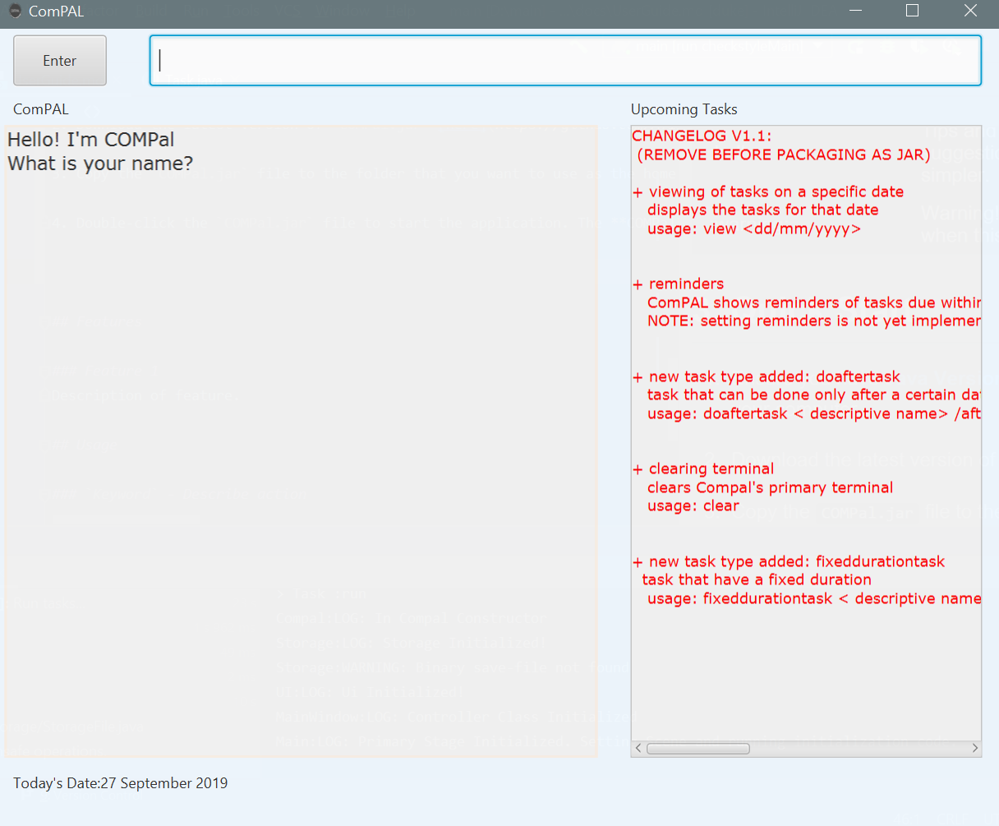
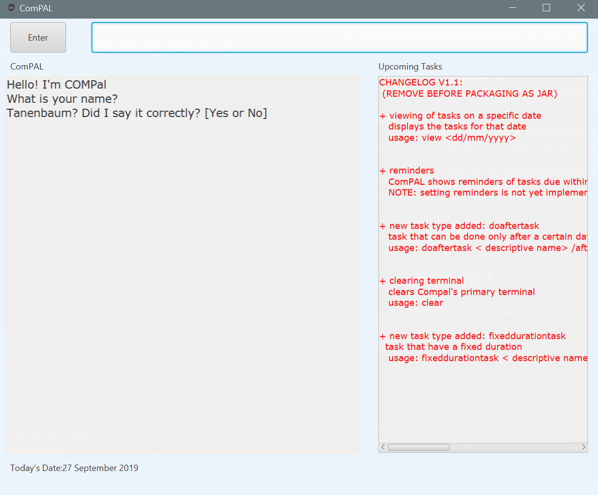
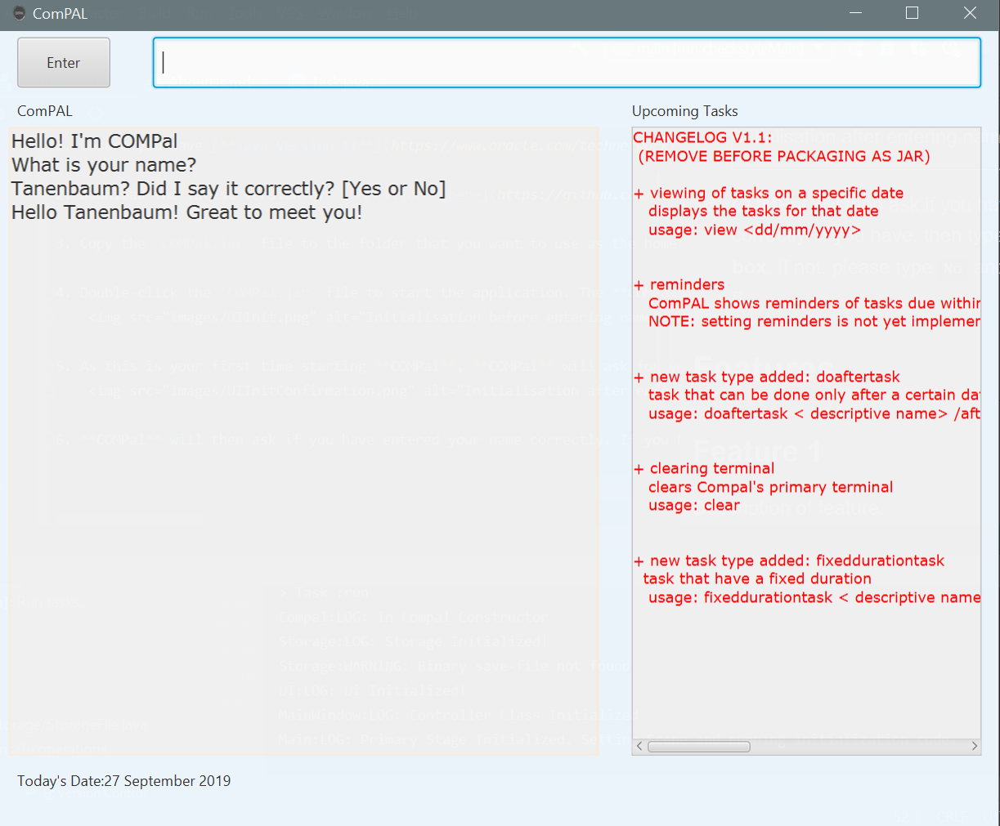
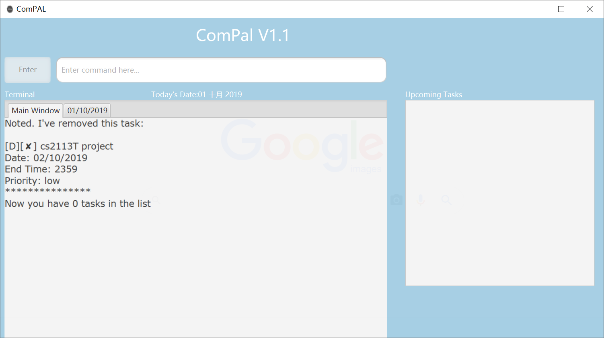
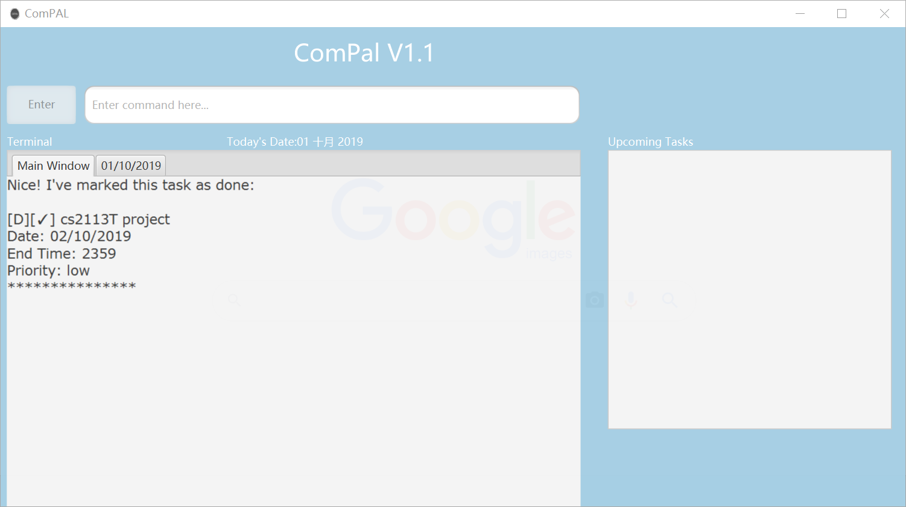
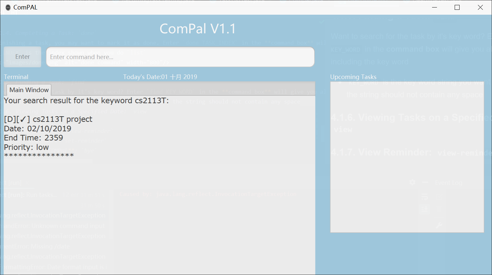
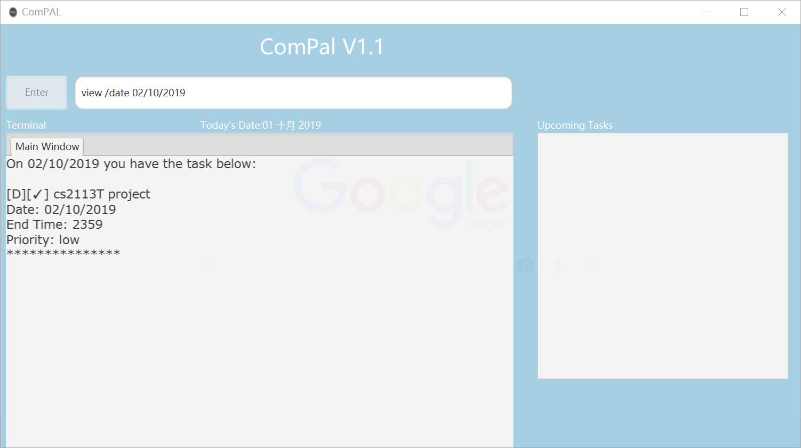
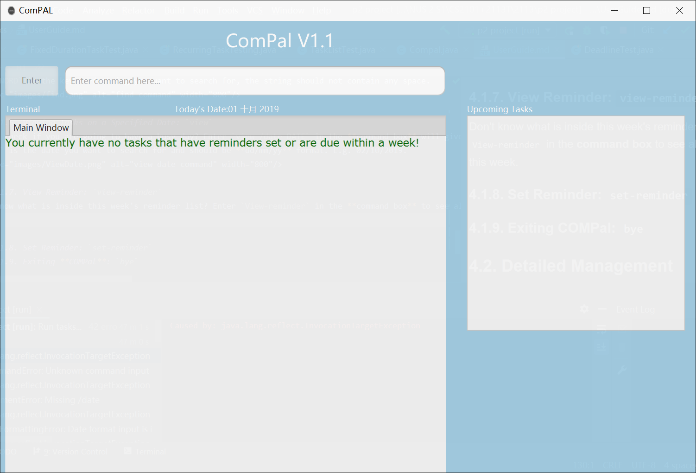
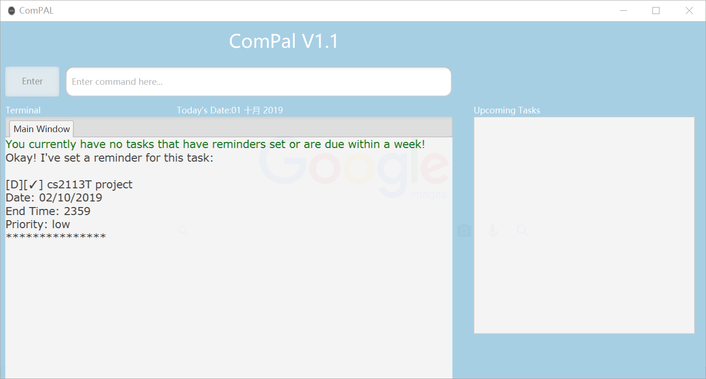

# User Guide
By: `AY1920S1-CS2113T-W17-1` Last Updated: `26/09/2019` License: `MIT`

We are still working on the User Guide. Stay tuned as we roll out more new features!

[**1. Introduction**](/docs/UserGuide.md#1-introduction)

[**2. Understanding This User Guide**](/docs/UserGuide.md#2-understanding-this-user-guide) 
+ [2.1. Basic Information]()
+ [2.2. Navigating Around Our Application]()

[**3. Quick Start**](/docs/UserGuide.md#3-quick-start)

[**4. Features**](/docs/UserGuide.md#4-features)
+ [4.1. General Commands](/docs/UserGuide.md#41-general-commands)
    - [4.1.1. Viewing help: `help`](/docs/UserGuide.md#411-viewing-help-help)
    - [4.1.2. Deleting a Task: `delete`](/docs/UserGuide.md#412-deleting-a-task-delete)
    - [4.1.3. Completing a Task: `done`](/docs/UserGuide.md#413-completing-a-task-done)
    - [4.1.4. Finding a Task: `find`](/docs/UserGuide.md#414-finding-a-task-find)
    - [4.1.5. Viewing Tasks on a Specified Date: `view`](/docs/UserGuide.md#415-viewing-tasks--view)
    - [4.1.6. View Reminder: `view-reminder`](/docs/UserGuide.md#416-view-reminder-view-reminder)
    - [4.1.7. Set Reminder: `set-reminder`](/docs/UserGuide.md#417-set-reminder-set-reminder)
    - [4.1.8. Editing Tasks: `edit`](/docs/UserGuide.md#418-editing-tasks-edit)
    - [4.1.9. Exiting **COMPal**: `bye`](/docs/UserGuide.md#419-exiting-compal-bye)
+ [4.2. Detailed Task Management Commands](/docs/UserGuide.md#42-detailed-task-management-commands)
    - [4.2.1. Adding **Deadline**: `deadline`](/docs/UserGuide.md#421-adding-deadline-deadline)
    - [4.2.2. Adding **Event**: `event`](/docs/UserGuide.md#422-adding-event-event)
    - [4.2.3. Adding **Recurring Task**: `recurtask`](/docs/UserGuide.md#423-adding-recurring-task-recurtask)
    - [4.2.4. Adding **Lecture Session**: `lect`](/docs/UserGuide.md#424-adding-lecture-session-lect)
    - [4.2.5. Adding **Tutorial Session**: `tut`](/docs/UserGuide.md#425-adding-tutorial-session-tut)
    - [4.2.6. Adding **Sectional Session**: `sect`](/docs/UserGuide.md#426-adding-sectional-session-sect)
    - [4.2.7. Adding **Lab Session**: `lab`](/docs/UserGuide.md#427-adding-lab-session-lab)

[**5. Future Enhancements**](/docs/UserGuide.md#5-future-enhancements)

[**6. Frequently-Asked Questions**](/docs/UserGuide.md#6-frequently-asked-questions)

[**7. Command Summary**](/docs/UserGuide.md#7-command-summary)

## 1. Introduction
Welcome to **COMPal**!

**COMPal** is a Command Line Interface calendar application that targets students who prefer to use a desktop application for managing their busy student life. **COMPal** captures your timetable in a ***user-friendly layout***, giving you an ***informative overview*** of your schedule in a brief glance. 

Additionally, you can ***include non-academic activities*** along with your academic timetable, unlike other widely-used timetable tools. You also have the ***freedom to prioritise certain tasks*** over less important ones, and make use of ***timely reminders*** on pending tasks.

Take control with our [**Quick Start**](/docs/UserGuide.md#3-quick-start) guide. ***COMPal*** your life, today.

## 2. Understanding This User Guide
### 2.1 Basic Information

This guide explains how you can use **COMPal** to divide your time between your academic commitments and non-academic activities.

You can find comprehensive steps on how to fully utilise **COMPal**'s extensive suite of time-management tools. **Frequently Asked Questions** can also clarify any pressing doubts that you may have. Our **Command Summary** provides a concise, easy-to-read summary of our commands for your easy perusal. 

You can use the **Table of Contents** above to navigate effortlessly between each section.

We have developed a list of icons below that will help you a lot in digesting our material.

Icon                 | What does it mean?
---------------------|-----------------
:information_source: | Important information that you may want to take note of 
:bulb:               | Tips and Tricks! Follow these suggestions to make your life simpler.
:warning:            | Warning! You need to be careful when this appears.

## 3. Quick Start
1. Ensure you have [**Java Version 11**](https://www.oracle.com/technetwork/java/javase/downloads/java-archive-javase11-5116896.html) or above installed on your computer. 

2. Download the latest version of `COMPal.jar` [here](https://github.com/AY1920S1-CS2113T-W17-1/main/releases).

3. Copy the `COMPal.jar` file to the folder that you want to use as the home folder for **COMPal**.

4. Double-click the `COMPal.jar` file to start the application. The **COMPal** GUI should appear in a few seconds.
    

5. As this is your first time starting **COMPal**, **COMPal** will ask for your name, like any new friend. You can type your name in the **command box** and press the `Enter` key.
    
    
6. **COMPal** will then ask if you have entered your name correctly. If you have, then type `Yes` in the **command box** and press the `Enter` key. If not, please type `No` and press the `Enter` key, and **COMPal** will repeat **Step 5**.
    

7. And that's it! Initialisation is complete and **COMPal** just became your newest friend / most awesome assistant. You can now try entering commands in the **command box** and press `Enter` to execute it. 

8. Some example commands you can try:
    * `clear` : **clears** all output in the **output box**. Use this if the **output box** becomes too cluttered after typing too many commands.
    * `deadline <task description> /date <date of deadline>` : **adds** a task with a **deadline** 
    * `event <task description> /date <date of event> /time <time of event>` : **adds** an **event** that occurs at a specific time on a specific date
    * `find <search term>` : **find** a certain task related to a **search term**.
    * `list` : **displays the entire list of tasks** stored in **COMPal**'s massive memory. However, if you have just downloaded **COMPal**, it's likely that **COMPal** will not display any tasks. 
    * `bye` : **bid goodbye** to **COMPal** and exit the program. See you soon!!

This is the end of the **Quick Start** guide. Please refer to [4. Features](/docs/UserGuide.md#4-features) for more details on more commands. Enjoy planning your life with **COMPal**!

## 4. Features 
**Command format**  
   * Words in UPPER_CASE are the parameters to be supplied by the user. E.g. in `delete TASK_INDEX`, `TASK_INDEX` is the index number of the task which the user wants to delete
### 4.1. General Commands

#### 4.1.1. Viewing help: `help`
Can't remember so many tedious commands? Enter `help` in the **command box**, you can see a list of all commands available.

#### 4.1.2. Deleting a Task: `delete`
Don't like any task? Enter `delete TASK_INDEX` in the **command box** will delete the task you want to delete.
* `TASK_INDEX` is the index shown when you do `list`.

#### 4.1.3. Completing a Task: `done`
After Finishing a task, you may want to mark it as done. Enter `done TASK_INDEX` in the **command box** will mark the task as done.
* `TASK_INDEX` is the index shown when you do `list`.

#### 4.1.4. Finding a Task: `find`
Want to search for the task by it's key word? Enter `find KEY_WORD` in the **command box** will give you all the tasks including the key word.
* `KEY_WORD` is the key word string you want to search for, the string can contain a space.
* Just entering the find command will display all tasks to you

#### 4.1.5. Viewing Tasks : `view`
View the tasks stored in COMPal in a day/week/month view.

1. View the daily task of a particular day.

	Format: `view day /date DATE`  
	
|| Description
---------------------|-----------------
:information_source: |  `DATE` is the date you want to search for and should be **dd/mm/yy** format. E.g. 02/10/2019.

2. View the weekly task of the given date.  
Format: `view week /date DATE`

|| Description
---------------------|-----------------
:bulb: |  You may add in the parameter  `/type`  after  `DATE`  to view only the details of all `type` input. E.g.  `view week/day DATE /type deadline`  will allow you to view only deadline of the given week.  

3. View the monthly calendar tasks of the given date.  
Format: `view month`

|| Description
---------------------|-----------------
:bulb:| You may omit `DATE` to view the calendar with respect to the current date!  E.g. `view week` will allow you to view the current week and `view day` will allow you to view the current day!  

The following are some examples of the `view` command which you can try to run.

Day view examples:

-   `view day`  
    View all tasks for the current date.
    
-   `view day /date 01/02/2020`  
    View all tasks for the date of `01/02/2020`.
    
-   `view day /date 01/02/2020 /type events`  
    View task for the date of `01/02/2020` and view only `type` events.​
    
Week view examples:

-   `view week`  
    View all tasks for current week.
    
-   `view week /date 01/02/2020`  
    View all tasks of the week starting from `01/02/2020`.
    
-   `view week /date 01/02/2020 /type events`  
    View tasks for the week starting of `01/02/2020` and view only `type` events.​
    
Month view example:

-   `view month`  
    View all tasks for the current month.

-   `view month /date 01/02/2020`  
    View all tasks for the month of February.
    
-   `view month /date 01/02/2020 /type deadline`  
    View tasks for the month of February and view only `type` deadline.​

#### 4.1.6. View Reminder: `view-reminder`
Don't know what is inside this week's reminder list? Enter `View-reminder` in the **command box** to see all reminders in this week.

#### 4.1.7. Set Reminder: `set-reminder`
Need a reminder for a task? Enter `set-reminder TASK_INDEX` in the **command box** will set a reminder for that task.
* `TASK_INDEX` is the index shown when you do `list`.

#### 4.1.8. Editing Tasks: `edit`
Need to change information about a task? Enter `edit /id <id> <options>` where options is any combination of the following:
* `/description <new description> `
* `/date <new date>`
* `/priority <new priority>`
* `/start <new start time> `
* ` /end <new end time>`

For example, if you wish to increase the priority of a task with an id number of 4 currently set to low and bring forward its starting time to 9am, do:
`edit /id 4 /priority high /start 0900`

#### 4.1.9. Exiting **COMPal**: `bye`
Bye-Bye! Enter `bye` in the **command box** will quit **COMPal**. Have a nice day! :blush:

### 4.2. Detailed Task Management Commands
In this section, you will be taken through the various types of tasks that **COMPal** can track for you. 

#### 4.2.1. Adding **Deadline**: `deadline`
Dread them. Run from them. But **deadlines** still arrive.  
Certain tasks have to be done by a **certain date**. You can use the `deadline` command to get **COMPal** to keep track of such impending **deadlines**. 

**Command Syntax:** `deadline <task description> /end DD-MM-YYYY `

**Example:**  
* `deadline Submit CS2113T User Guide for Review /end 02/10/2019`  
Adds a task with `Submit CS2113T User Guide for Review` as **description** and `02/10/2019` as the **date of the deadline**.

#### 4.2.2. Adding **Event**: `event`

Your best friend's birthday party. Your sibling's graduation. Your cousin's wedding. Your favourite band is coming to town. Life is full of cheerful events like these.  
Events happen on a certain **date** for a fixed **duration of time**. You can use the `event` command to get **COMPal** to keep track of all types of **events**.

**Command Syntax:** `event <task description> /date DD-MM-YYYY /start hhmm /end hhmm`

**Example:** 
* `event Linus Torvald's birthday party /date 28/12/2019 /start 1700 /end 2100`  
Adds an **Event** with `Linus Torvald's birthday party` as **description**, `28/12/2019` as the **date that event will occur on**, `1700` as the **start time** and `2100` as the **end time**.

#### 4.2.3. Adding **Recurring Task**: `recurtask`

Cracking open a cold one with the boys. Unwind with a girls' night out. Things like this, you just want to do it again. Again. And again.  
Recurring Tasks are like events - they are held on a certain **date** for a fixed **duration of time**. However, they can recur at **fixed intervals of a few days**. You can use the `recurtask` command to get **COMPal** to keep track of **Recurring Tasks**.

**Command Syntax:** `recurtask <task description> /date <starting date of the first task> /start <the starting time of each task> /end <ending time of each task> /rep <number of repetitions(integer)> /freq <number of days between each iteration of the task>`

**Example:** 
* `recurtask English Premier League Game /date 10/08/2019 /start 2200 /end 0000 /rep 38 /freq 7`  
Adds a **Recurring Task** with `English Premier League Game` as **description**, `10/08/2019` as the **start date** of the first **Recurring Task**, `2200` as the **start time** of each **Recurring Task**,`0000` as the **end time** of each **Recurring Task**, `38` as the **total number of times** that the **Recurring Task** will repeat, and `7` as the **number of days** between each **Recurring Task**.

#### 4.2.4. Adding **Lecture Session**: `lect`

**Lectures** are where you can catch your favourite professors deliver their engaging material. They **repeat at regular intervals**, for **fixed periods of time**. You can use the `lect` command to get **COMPal** to keep track of your **lectures**. 

**Command Syntax:** `lect <task description> /date <starting date of the first task> /start <the starting time of each task> /end <ending time of each task> /rep <number of repetitions(integer)> /freq <number of days between each iteration of the task>`

**Example:**
* `lect CS2113T /date 16/08/2019 /start 1600 /end 1800 /rep 12 /freq 7`  
Adds a **Lecture** with `CS2113T` as **description**, `16/08/2019` as the **start date** of the first **Lecture**, `1600` as the **start time** of each **Lecture**,`1800` as the **end time** of each **Lecture**, `12` as the **total number of times** that the **Lecture** will repeat, and `7` as the **number of days** between each **Lecture**.

#### 4.2.5. Adding **Tutorial Session**: `tut`

**Tutorials** are amazing venues for you to clarify your doubts on the lesson material. You can use the `tut` command to get **COMPal** to keep track of your **tutorials**.

**Command Syntax:** `tut <task description> /date <starting date of the first task> /start <the starting time of each task> /end <ending time of each task> /rep <number of repetitions(integer)> /freq <number of days between each iteration of the task>`

**Example:**
* `tut CS2101 /date 12/08/2019 /start 0800 /end 1000 /rep 13 /freq 7`  
Adds a **Tutorial** with `CS2101` as **description**, `12/08/2019` as the **start date** of the first **Tutorial**, `0800` as the **start time** of each **Tutorial**,`1000` as the **end time** of each **Tutorial**, `13` as the **total number of times** that the **Tutorial** will repeat, and `7` as the **number of days** between each **Tutorial**.

#### 4.2.6. Adding **Sectional Session**: `sect`

You can use the `sect` command to get **COMPal** to keep track of your **Sectionals**.

**Command Syntax:** `sect <task description> /date <starting date of the first task> /start <the starting time of each task> /end <ending time of each task> /rep <number of repetitions(integer)> /freq <number of days between each iteration of the task>`

**Example:**
* `sect CS1010X /date 06/01/2019 /start 1100 /end 1300 /rep 12 /freq 7`  
Adds a **Sectional** with `CS1010X` as **description**, `06/01/2019` as the **start date** of the first **Sectional**, `1100` as the **start time** of each **Sectional**,`1300` as the **end time** of each **Sectional**, `12` as the **total number of times** that the **Sectional** will repeat, and `7` as the **number of days** between each **Sectional**.

#### 4.2.7. Adding **Lab Session**: `lab`

**Labs** provide valuable hands-on experience that add to the content taught in the classroom. You can use the `lab` command to get **COMPal** to keep track of your **lab sessions**.

**Command Syntax:** `lab <task description> /date <starting date of the first task> /start <the starting time of each task> /end <ending time of each task> /rep <number of repetitions(integer)> /freq <number of days between each iteration of the task>`

**Example:**
* `lab CS2106 /date 27/08/2019 /start 1000 /end 1100 /rep 11 /freq 7`  
Adds a **Lab Session** with `CS2106` as **description**, `27/08/2019` as the **start date** of the first **Lab Session**, `1000` as the **start time** of each **Lab Session**,`1100` as the **end time** of each **Lab Session**, `11` as the **total number of times** that the **Lab Session** will repeat, and `7` as the **number of days** between each **Lab Session**.

### **5. Future Enhancements**

### **6. Frequently-Asked Questions**

### **7. Command Summary**
