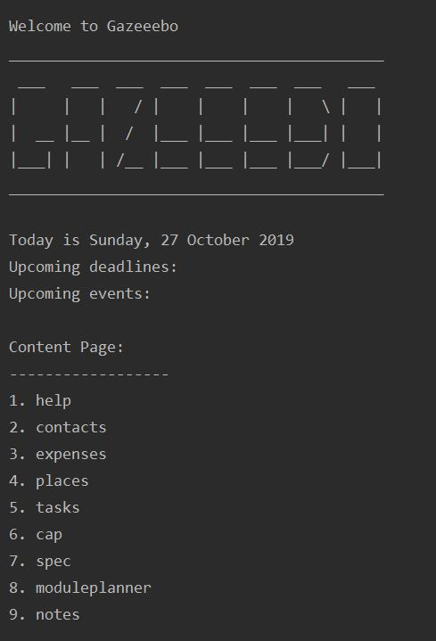

= JessTeo - Project Portfolio
:site-section: AboutUs
:imagesDir: ../images
:stylesDir: ../stylesheets

== PROJECT: Gazeeebo

---

== Overview

My team of 5 software engineering students and I were tasked with developing a basic command line
interface application for our Software Engineering project. We chose to morph
it into a Computer Engineering (CEG) school life planner called Gazeeebo. This enhanced
application enables CEG students to plan their CEG life in university with more knowledge about the course.

This the current design of Gazeeebo:

My role was to come up with a function for students to search for places in National University of Singapore (NUS)
School of Computing (SOC), design a calendar view and write the codes for the undo features. The following sections
illustrate these enhancements in more detail, as well as the relevant sections I have added to the user and developer
guides in relation to these enhancements.

== Summary of contributions

* Enhancement added: *Ability to undo/redo previous commands*
** What it does: It allows the user to undo all previous commands one at a time.
** Justification: This feature improves the product significantly because a user can make mistakes in commands and the app should provide a convenient way to rectify them.
** Highlights: This enhancement affects existing commands and commands to be added in future. It required an in-depth analysis of design alternatives. The implementation too was challenging as it required changes to existing commands.
** Credits: _{mention here if you reused any code/ideas from elsewhere or if a third-party library is heavily used in the feature so that a reader can make a more accurate judgement of how much effort went into the feature}_

* *Minor enhancement*: added a history command that allows the user to navigate to previous commands using up/down keys.

* *Code contributed*: [https://github.com[Functional code]] [https://github.com[Test code]] _{give links to collated code files}_

* *Other contributions*:

** Project management:
*** Managed releases `v1.3` - `v1.5rc` (3 releases) on GitHub
** Enhancements to existing features:
*** Updated the GUI color scheme (Pull requests https://github.com[#33], https://github.com[#34])
*** Wrote additional tests for existing features to increase coverage from 88% to 92% (Pull requests https://github.com[#36], https://github.com[#38])
** Documentation:
*** Did cosmetic tweaks to existing contents of the User Guide: https://github.com[#14]
** Community:
*** PRs reviewed (with non-trivial review comments): https://github.com[#12], https://github.com[#32], https://github.com[#19], https://github.com[#42]
*** Contributed to forum discussions (examples:  https://github.com[1], https://github.com[2], https://github.com[3], https://github.com[4])
*** Reported bugs and suggestions for other teams in the class (examples:  https://github.com[1], https://github.com[2], https://github.com[3])
*** Some parts of the history feature I added was adopted by several other class mates (https://github.com[1], https://github.com[2])
** Tools:
*** Integrated a third party library (Natty) to the project (https://github.com[#42])
*** Integrated a new Github plugin (CircleCI) to the team repo

_{you can add/remove categories in the list above}_

== Contributions to the User Guide

|===
|_Given below are sections I contributed to the User Guide. They showcase my ability to write documentation targeting end-users._
|===

include::../UserGuide.adoc[tag=delete]

include::../UserGuide.adoc[tag=dataencryption]

== Contributions to the Developer Guide

|===
|_Given below are sections I contributed to the Developer Guide. They showcase my ability to write technical documentation and the technical depth of my contributions to the project._
|===

include::../DeveloperGuide.adoc[tag=ndoredo]

include::../DeveloperGuide.adoc[tag=dataencryption]

== PROJECT: PowerPointLabs

---

_{Optionally, you may include other projects in your portfolio.}_
