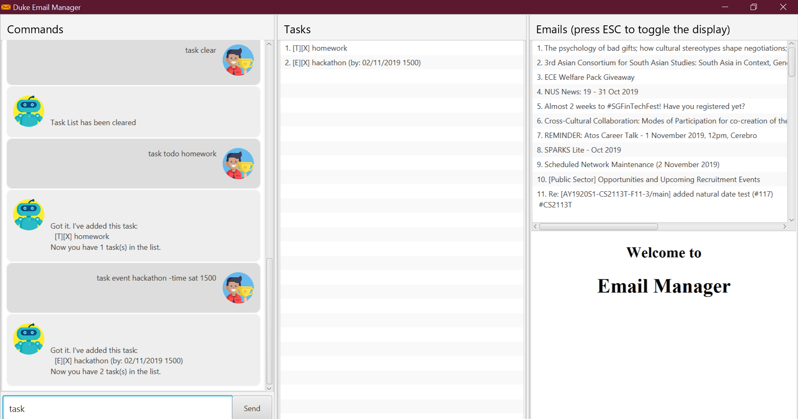

= Vivian Lee - Project Portfolio
:site-section: AboutUs
:imagesDir: ../images
:stylesDir: ../stylesheets

== PROJECT: Duke Email Manager

== About the Project

My team consists of 4 software engineering students, who were tasked with enhancing a basic command line
interface of a personal task manager (Duke) for our Software Engineering Project. We chose to morph the
task manager to an email manager called Duke Email Manager, catered exclusively to students in School Of
Computing to help them better manage their emails. The various features of Duke Email Manager includes a task
manager and email manager that are switchable between each other. Duke Email Manager uses Graphical User
Interface (GUI) for students to use its functionalities by typing in commands.

This is what our project looks like:

My role was to write codes to enhance the task manager in our project. These includes codes for more
natural date format feature, priority feature and sorting feature. The following sections illustrate these
implementations in more detail, as well as relevant documentation I have contributed to the user and developer
guides in relation to these implementations.

Note the following symbols and formatting used in this document:
|===
| 💡 |This is a tip. Follow these tips to aid your development of Email Manager.

|===

|===
| ℹ |This is a note. Read these for additional information.

|===

|===
| ⚠ |This is a warning. Heed these warnings to avoid making mistakes that will hamper your development
efforts.

|===

== Summary of contributions

This section summarizes the contribution I made towards the project. They mainly include, but not
limited to coding, documentation, and other helpful contributions to the team project.

=== *Enhancement Added*

==== Natural Date Format feature
* *What it does:* Students can define the date (where needed) in International Organization for
Standardization (ISO) date format, or define the date in terms of a day of the week. The natural date
format assumes that the student wants to input the date of the next nearest day of the week.

** For example, if the date today is Thursday, 31/10/2019, and the input date is "Wed", the date will be
saved as 06/11/2019, which is the date of the coming Wednesday.
+
This feature also include the time. If no time is inputted after a day of the week, the time will be
indicated as 0000.

** For example, "Thu" will give a date and time of '31/10/2019 0000', while "Thu 1200" will give
'31/10/2019 1200'.

* *Justification:* This feature significantly reduces the time and effort needed to input the date and
time, especially if students are not exactly sure of the time. It gives more flexibility to students when
inputting dates.

* *Highlights:* This feature also works well with other commands like `update`, where students can update
the date and time of the task using natural date format as well.

* *Code contributed:* Please click the links below to examine code contributed to the creation and
maintenance of this feature:

** Initial implementation of natural date format
+
https://github.com/AY1920S1-CS2113T-F11-3/main/pull/91[#91]
** Renamed variable and fix bug which causes error in Todo task
+
https://github.com/AY1920S1-CS2113T-F11-3/main/pull/92[#92]
** Fix code to allow update command to take in natural date format
+
https://github.com/AY1920S1-CS2113T-F11-3/main/pull/93[#93]
** Refactor all methods related to natural date into the same class
+
https://github.com/AY1920S1-CS2113T-F11-3/main/pull/99[#99]
** Refactor natural date class to allow easier testing and added test code for natural date format feature
+
https://github.com/AY1920S1-CS2113T-F11-3/main/pull/117[#117]

==== Priority feature
* *What it does:* Students can set priorities for tasks according to its urgency or severity. (Future
implementation: Tasks will be sorted and displayed in the GUI according to the priorities.)

* *Justification:* With so many tasks in hand, students need a way to indicate which tasks are of higher
priority so that they can complete those tasks first before proceeding to the lower priorities ones.

* *Highlights:* This feature can work in two ways
* *Code contributed:* Please click the links below to examine code contributed to the creation and
maintenance of this feature:

** Initial implementation of priority feature
+
https://github.com/AY1920S1-CS2113T-F11-3/main/pull/79[#79]
** Added fixed input for priorities
+
https://github.com/AY1920S1-CS2113T-F11-3/main/pull/121[#121]

=== *Other contributions:*
==== Enhancements to existing features:
* Implemented `snooze` command feature and further enhanced it to take in the number of days to snooze a
deadline or event task: https://github.com/AY1920S1-CS2113T-F11-3/main/pull/99[#99]
* Added key binding to allow scrolling of inputs in the GUI input field: https://github.com/AY1920S1-CS2113T-F11-3/main/pull/74[#74]

==== Documentation:
* Updated the user guide

==== Community:
*** PRs reviewed: https://github.com/AY1920S1-CS2113T-F11-3/main/pull/81[#81],
https://github.com/AY1920S1-CS2113T-F11-3/main/pull/114[#114]

*** C-Tagging adopted by group mate and was further enhanced to allow for more tags to be included in a
task: https://github.com/AY1920S1-CS2113T-F11-3/main/pull/60[#60], https://github.com/AY1920S1-CS2113T-F11-3/main/pull/62[#62]

== Contributions to the User Guide
We had to update our original User Guide with instructions for the enhancements we had added.
The following is an excerpt from our Duke Email Manager User Guide, showing additions that I have
made for Natural Date Format feature and Priority feature.

|===
|_Given below are sections I contributed to the User Guide. They showcase my ability to write documentation targeting end-users._
|===

==== Snooze Command: `snooze`

This commands allows student to snooze their task by NO_OF_DAYS. The NO_OF_DAYS and ITEM_NUMBER are
_int_ inputs. ITEM_NUMBER refers to the index number of the task in the task list.

Format: `snooze ITEM_NUMBER -by NO_OF_DAYS`.

Example: `snooze 1 -by 5` | `snooze 1`

** If the NO_OF_DAYS is not inputted, the `snooze` command will automatically snooze the task by 3 days.
** Only tasks of type `deadline` and `event` can be snoozed.

==== Set Priority Command: `set`

This command allows student to set priorities to their tasks. The ITEM_NUMBER is an _int_ inputs, while
PRIORITY is a _String_ input. ITEM_NUMBER refers to the index number of the task in the task list, while
PRIORITY refers to the priority that the student wants to set to a task.

Format: `set ITEM_NUMBER -priority PRIORITY`

Example: `set 1 -priority high` | `set 1 -priority med`

** PRIORITY inputs are restricted to *high*, *med* or *low* only. Any other PRIORITY input will be invalid.
** Each task can only have one priority value.

== Contributions to the Developer Guide

|===
|_Given below are sections I contributed to the Developer Guide. They showcase my ability to write technical documentation and the technical depth of my contributions to the project._
|===

=== Natural Date Format Feature

The email manager aims to help computing students handle their tasks efficiently. Therefore, one of its main
goals is to speed up the process at which students enter their task details so that their task can be added
into the task list quickly. The benefits of having this Natural Dates support are:

* Reduce the time and effort needed to key in the date and time for deadline and event tasks.

The Natural Dates support is facilitated by two main classes, namely `TaskCommandParseHelper` and `TaskParseNaturalDateHelper`.

`TaskParseNaturalDateHelper` is an element of the will retrieve the parsed time string from
`TaskCommandParseHelper` and convert
the extracted string to LocalDateTime format. It implements the following operations:

* `TaskParseNaturalDateHelper#isCorrectNaturalDate(input)` - Checks if input contains natural date format.
* `TaskParseNaturalDateHelper#convertNaturalDate(day, time)` - Converts string day and time to local date in
LocalTimeDate format.
* `TaskParseNaturalDateHelper#getDate(input)` - Returns a date and time(if applicable) after checking if
natural date input contains a time element.

`TaskCommandParseHelper` is an element of the Command component. It handles all parsing of inputs when the
input type is set to `task`.

Given below is an example usage scenario and how Natural Dates Support behaves at each step.

Step 1: The user launches the application. The input type is currently in `email` mode. The user wishes
to add a task and key in `flip` to switch input type to `task` mode.

Step 2: The user executes `deadline homework -time Mon 1200` to add a new deadline task.

* `TaskCommandParseHelper` takes in the command, parses and extracts the date and time information of the task
and saves it inside a list of type `ArrayList<Command.Option>`.
* The extracted date and time will go through `TaskParseNaturalDateHelper#getDate()`, which calls the relevant
methods in the class to process the date and time.

Step 3: The user wishes to update the date and time for the task above, let the task above be task 1 in the
task list. The user executes `update 1 -time Tue` to change the task date from Mon to Tue.

* `TaskParseNaturalDateHelper` will be called to process the time information and update the task accordingly.
When no time is entered, the time is set to 0000 (HHmm).

