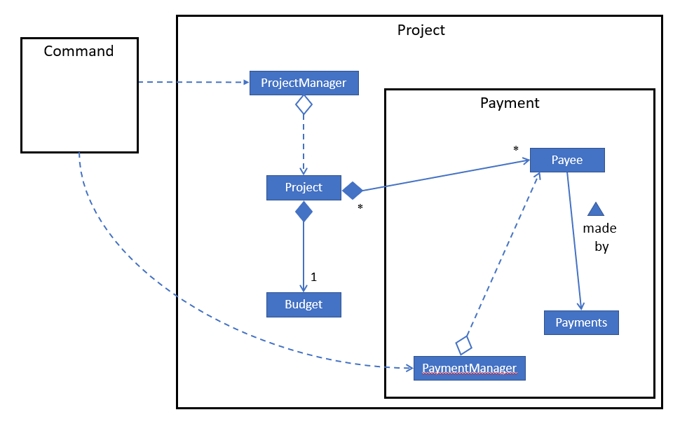

= Leow Yong Heng - Project Portfolio for AlphaNUS

== Overview

NUS treasurers often come face to face with piles of payment forms filled with payments for claims and also need to
keep track of their statuses. Having to manage and allocate club funds to multiple projects, treasurers
may find it a chore to keep up to date with their finances.

*AlphaNUS* is a financial management assistant for treasurers to manage their payment forms made by payees as well as manage the club's funds for projects. The application is CLI-based and aims to help treasurers save time in carrying out their duties.

== Summary of contributions

This section shows a summary of my coding, documentation, and other helpful contributions
to the team project.

* *Enhancement feature added*: The ability to manage multiple projects*.
** What it does: The user(treasurer) would be able to create and delete projects that he or she is currently in charge of. The treasurer would also be able to go to assign budgets to projects and go to a particular project to add payments under the project.
** Justification: This is a core functionality in our product that allows the treasurer to be able to keep track of the various payments and budget for each project.
** Highlights: This enhancement connects to many other existing functionalities. For example, the treasurer would need to keep track of the budget that has been assigned to a project and also the corresponding payments made for each project. The implementation required careful consideration of the structure of how the projects were going to be stored and integrate well with the various functionalities.

* *Code contributed*:
Samples of my code contributions can be found here
https://nuscs2113-ay1920s1.github.io/dashboard/#search=leowyh

* *Other notable contributions*:

** Project management:
*** Managed releases `v1.1` - `v1.3` (3 releases) on GitHub
*** Assigned features to members
** Enhancements to existing features:
*** Wrote `add payee` functionality to keep track of payments made by a certain payee (Pull requests https://github.com[#33], https://github.com[#34])
*** Created PaymentManager and Payments class for existing payment features to be added (Pull requests https://github.com[#36], https://github.com[#38])
** Documentation:
*** Added features of project functionality to the User Guide: https://github.com[#14]
*** Wrote the Design section and project feature in the Developer Guide: https://github.com[#14]
** Community:
*** PRs reviewed (with non-trivial review comments): https://github.com[#12], https://github.com[#32], https://github.com[#19], https://github.com[#42]
*** Reported bugs and suggestions for other teams in the class (examples:  https://github.com[1], https://github.com[2], https://github.com[3])
** Tools:
*** Integrated a Continuous Integration service (Travis CI) to the project (https://github.com[#42])
*** Integrated an Open-Source Build-Automation System (Gradle) to the project.

== Contributions to the User Guide

|===
|_We updated the User Guide according to the features that we each implemented. Below is an excerpt of our User Guide, displaying the additions that I added for the project functionality._
|===
=== Adding a project: `add project`
Adds a project called `PROJECT_NAME` to the record. +
Format: `add project pr/PROJECT_NAME`

[TIP]
You can use more than one word for `PROJECT_NAME`.

[TIP]
You may not add a new project with `PROJECT_NAME` if a project named `PROJECT_NAME` already exists.

Examples:

* `add project pr/Rag`
* `add project pr/Arts Night`

=== Deleting a project: `delete project`

Deletes a project called `PROJECT_NAME` from the record +
Format: `delete project pr/PROJECT_NAME`

Examples:

* `delete project pr/Rag`
* `delete project pr/Arts Night`

=== Going to a project to edit it: `goto project`

Goes to a project called `PROJECT_NAME` in the record +
Format: `goto project pr/PROJECT_NAME`

Examples:

* `goto project pr/Rag`
* `goto project pr/Arts Night`

=== List all projects: `list projects`

List all projects in the record +
Format: `list projects`

Examples:

* `list projects`

<<<
== Contributions to the Developer Guide

|===
|_I was in charge of creating and managing the Developer Guide. In addition to adding the implementation for my project functionality, I also wrote the Design section of the guide. Below is an excerpt of our Developer Guide, displaying the additions that I added._
|===

== Design
.Architecture Diagram
image::ArchitectureDiagram.png[]

The *_Architecture Diagram_* given above displays the n-tier architecture design of the AlphaNUS. Given below is a quick overview of each component.

* <<Design-Ui,*`UI`*>>: The UI of the App.
* <<Design-Command,*`Command`*>>: The command executor and parser.
* <<Design-Model,*`Model`*>>: Holds the data of the App in-memory.
* <<Design-Storage,*`Storage`*>>: Reads data from, and writes data to, the hard disk.

<<<
[[Design-Ui]]
=== UI component

.Structure of the UI Component
image::UiClassDiagram.png[]

The UI solely consists of a `Ui` object that is initiated at the start of the program.

The `UI` component,

* Executes user commands using the `Command` component.
* Listens for changes to `Model` data so that the UI can be updated with the modified data.

<<<
[[Design-Command]]
=== Command component

.Structure of the Command Component
image::CommandClassDiagram.png[]

The `Command` component consists of:

* `Parser` to make sense of user input.
* `Instruction` to determine which process to execute.
* `Process` to process the execution of the command.

<<<
[[Design-Model]]
=== Model component
[[fig-ModelClassDiagram]]
.Structure of the Model Component

.  Both `Project Manager` and `Payment Manager` takes in user command from `Command`.
.  The `Project Manager` class manages a HashMap of `Project` objects.
.  Each `Project` object contains a `Budget` and a HashMap of `Payee` objects.
.  Each `Payee` object contains an ArrayList of `Payments` objects.
.  The result of the command execution is encapsulated as a `Project` object by `PaymentManager` and passed back to `Command`.

== Implementation

=== Project Feature
The `project` feature is managed by the `ProjectManager` class, which is called by the
`Process` class in the `Command` component.

This feature supports the following commands:

* `add project pr/PROJECT_NAME` -- Adds a new project to the record.
* `delete project pr/PROJECT_NAME` -- Deletes a project from the record.
* `goto project pr/PROJECT_NAME` -- Go to a project in the record.
* `list project` -- Lists all projects in the record.

A detailed explanation of the use case for the `add project` command is given below to demonstrate how each component interacts with each other.

1. User executes the command `add project pr/RAG` in the CLI. This input is passed from the `Ui` to `Command` where the input will be parsed to determine the command to execute.

2. The `Command` component will process the `add project` command and execute it in the `Model` component, calling `ProjectManager` to add a new `Project` object with the user defined `PROJECT_NAME` to its HashMap of `Project` objects.

3. `ProjectManager` then returns a value of the newly created `Project` object to `Command` which is passed to `Ui` for printing the project details to the user.

Below is a sequence diagram to provide a visual representation of the `add project` command.

[[fig-AddProjectSeqDiagram]]
.Sequence Diagram of the add project command
image::AddProjectSeqDiagram.png[]

The `delete project` command is implemented in the same manner to the `add project` command. Both return the `Project` object that was deleted or added to be passed to `Ui` for printing its details to the user. The `delete project` command only differs from the `add project` command when it deletes the `Project` object from the HashMap of `Project` objects, in contrast to adding a `Project` object to the HashMap.

