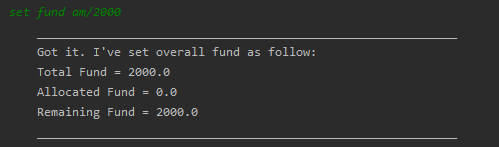
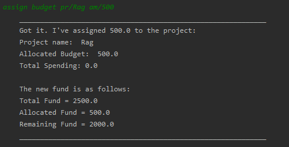
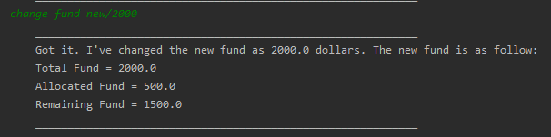
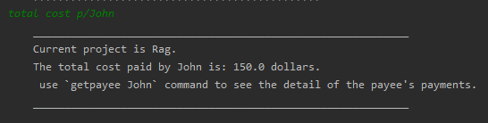
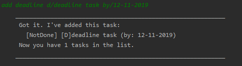
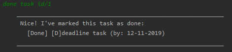

= Li Jiayu - Project Portfolio for AlphaNUS

== Overview

NUS treasurers often come face to face with piles of payment forms filled with payments for claims and also need to
keep track of their statuses. Having to manage and allocate club funds to multiple projects, treasurers
may find it a chore to keep up to date with their finances.

*AlphaNUS* is a financial management assistant for treasurers to manage their payment forms made by payees as well as manage the club's funds for projects. The application is CLI-based and aims to help treasurers save time in carrying out their duties.

== Summary of contributions

This section shows a summary of my coding, documentation, and other helpful contributions
to the team project.

* *Enhancement feature added*: Fund and Budget
** What it does: manage fund and budget, brings convenience for target users.
** Justification: This is a core feature which provides the fundamental finance data to all projects and payments. It makes to project much more meaningful and specially designed for treasurers
** Highlights: It do all possible calculations that treasures need to do for them.

* *Enhancement feature added*:  Reminder
** What it does: provide easy access of payment lists based on the priority
** Justification: this uis the only function that allow users to access all current payments instead of payments under a single project.
** Highlights: It provides a sorted list of all current payments from all existing payments.

* *Code contributed*:
Samples of my code contributions can be found here
https://nuscs2113-ay1920s1.github.io/dashboard/#search=lijiayu980606

* *Other notable contributions*:

** Enhancements to existing features:
*** Wrote `add payee` functionality to keep track of payments made by a certain payee (Pull requests https://github.com[#33], https://github.com[#34])
*** Created PaymentManager and Payments class for existing payment features to be added (Pull requests https://github.com[#36], https://github.com[#38])
** Documentation:
*** Added features of project functionality to the User Guide: https://github.com[#14]
*** Wrote the Design section and project feature in the Developer Guide: https://github.com[#14]
** Community:
*** PRs reviewed (with non-trivial review comments): https://github.com[#12], https://github.com[#32], https://github.com[#19], https://github.com[#42]
*** Reported bugs and suggestions for other teams in the class (examples:  https://github.com[1], https://github.com[2], https://github.com[3])
** Tools:
*** Integrated a Continuous Integration service (Travis CI) to the project (https://github.com[#42])
*** Integrated an Open-Source Build-Automation System (Gradle) to the project.

== Contributions to the User Guide
|===
|I was in charge of creating and managing the User Guide.
|===
=== Fund
//Jiayu
==== Set a total fund: `set fund`

Set a total fund where the projects get their budgets from +
Format: `set fund am/AMOUNT`

[TIP]
The fund must be a positive number of no more than 500,000 dollars.

Examples:

* `set fund am/2000`

UI:

//Jiayu
==== Add value to the total fund: `add fund`

Add a value to the total fund where the projects get their budgets from +
Format: `add fund add/AMOUNT`

[TIP]
The amount to add should be a positive number. To reduce fund please use `change fund` command instead

[TIP]
The total fund after this command should not be more than 500,000

Examples:

* `add fund add/500`

UI:

image::addFund.png[]

//Jiayu
==== Assign a value from total fund to a project: `assign budget`

Assign a value from the total fund to a project +
Format: `assign budget pr/PROJECT_NAME am/AMOUNT`

[TIP]
If there is not enough value for the remaining fund, you will not be able to assign fund to a project.
[TIP]
The assign amount should not be negative.

Examples:

* `assign budget pr/Rag am/500`

UI

//Jiayu
==== Change the current value of fund: `change fund`

Allows the user to change the value of total fund in case that they have input a wrong number
or would like to reduce the total fund. +
Format: `change fund new/NEW_FUND`

[TIP]
The new fund should not be less than the current sum of the assigned budget.
[TIP]
The new fund should be a positive number of no larger than 500,000 dollars.

Example:

* `change fund new/2000`

UI:

//Jiayu
==== Show the current status of fund: `show fund`

Show the total fund, assigned fund and remaining fund +
Format: `show fund`

Examples:

* `show fund`

UI:

image::showFund.png[]

=== Payments and Payee
==== Get total cost of a payee in current project: `total cost`
This command calculates the total cost of all payments under a certain payee's name in the current project. +
Format: `total cost p/PAYEE_NAME`

Example:

* `total cost p/John`

UI:

//Jiayu
==== Sort deadlines af all existing unapproved payments: `reminder`
This command sort payments from all payments that are not approved yet according to its deadline, and
print out a list of such payments. The earlier payments are printed first. +
Format: `reminder`

Example:

* `reminder`

UI:

image::reminder.png[]

=== Task Management
==== Add Todo: `add todo`

Adds a new todo task with description +
Format: `add to d/DESCRIPTION`

[TIP]
there can have spaces in the task description +

Examples:

* `add todo d/meeting with MrLim`

UI:

image::addTodo.png[]

==== Add Deadline: `add deadline`

Adds a new deadline task with description +
Format: `add deadline d/DESCRIPTION by/DATE`

[TIP]
there can have spaces in the deadline description +
[TIP]
format of date should be "dd-MM-yyyy" +

Examples:

* `add deadline d/deadline task by/12-11-2019`

UI:

==== Done Task: `done task`
This command set the status of a task as done. +
Format: `done task id/ID`

[TIP]
The input ID must be a positive number.

Example:

* `done task id/1`

UI:

==== Delete Task: `delete task`
This command delete a task from the task list. +
Format: `delete task id/ID`

[TIP]
The input ID must be a positive number.

Example

* `delete task id/1`

UI:

image::deleteTask.png[]

==== Find Task: `find task`
This command find a task with a key word from the task list. +
Format: `find task key/KEY_WORD`

[TIP]
The input key word can have spaces inside.

Example

* `find task key/MrLim`

UI:

image::findTask.png[]

==== List Tasks: `list tasks`
This command list out all tasks in the task list. +
Format: `list tasks`

Example

* `list tasks`

UI:

image::listTasks.png[]

==== Snooze Deadline: `snooze`
This command snooze a deadline task by 1 day. +
Format: `snooze id/ID`

[TIP]
The input ID must be a positive number.
[TIP]
The input ID must be corresponding to a deadline task.

Example

* `snooze id/1`

UI:

image::snooze.png[]

==== Postpone Deadline: `postpone`
This command postpone a deadline task by customized number of days. +
Format: `postpone id/ID n/DAYS`

[TIP]
The input ID must be a positive number.
[TIP]
The input ID must be corresponding to a deadline task.

Example

* `postpone id/4 n/10`

UI:

image::postpone.png[]

==== Reschedule Deadline: `reschedule`
This command reschedule a deadline task to another date. +
Format: `reschedule id/ID d/DATE`

[TIP]
The input numbers must be positive numbers.
[TIP]
The input ID must be corresponding to a deadline task.
[TIP]
The input date must be in the format of "dd-mm-yyyy".

Example

* `reschedule id/5 d/27-12-2019`

UI:

image::reschedule.png[]

==== View Schedule: `view schedule`
This command allow the user to view their schedule on a certain day. +
Format: `view schedule d/DATE`

[TIP]
The input date must be in the format of "dd-mm-yyyy".

Example

* `view schedule d/13-11-2019`

UI:

image::viewSchedule.png[]

<<<
== Contributions to the Developer Guide

|===
| I have wrote the Design section of the developer guide. Below is an excerpt of our Developer Guide, displaying the additions that I added.
|===

== Implementation
//tag::fund[]
=== Fund feature
The Fund Feature is implemented to provide convenience to our target audience
and reduce the manual calculations required to manage the finance of an organisation. +
This feature extends the AlphaNUS with an overall fund.  The fund is stored locally in a local folder
and is loaded every time the user starts the application. +
Currently, it implements the following implementations:

* `fund#setFund` -- Set a new fund to all projects.
* `fund#takeFund` -- Take value from funds and assign it to a specific project as the project's budget.
* `fund#addFund` -- Add more fund to the original fund
* `fund#retrieveFund` -- Retrieve the unused budget and add it back into fund when a project is deleted.

This feature allows the following commands:

* *Set Fund:*            `set fund am/AMOUNT`
* *Add Fund:*            `add fund add/AMOUNT`
* *Assign budget:*         `assign budget pr/PROJECT_NAME am/AMOUNT`
* *Change Fund:*        `change fund new/AMOUNT`
* *Show Fund:*           `show fund`

Given below is an example usage scenario and how the fund mechanism behaves at each step.

* Step 1: The user run the application for the first time. He cannot call any other fund commands as the fund is not set yet.
He thus input `set fund am/2000` and set the overall command as 2000 dollars.
* Step 2: The user can now perform `add fund add/AMOUNT` and `change fund new/AMOUNT` to change the fund.
He can also call `show fund` to see the current fund status. However he cannot call `assign fund pr/PROJECT am/AMOUNT` as
there is no projects yet.
* Step 3: The user adds a project by calling `add project` command. He can assign a budget from the fund
when creating the project, or assign later by calling the `assign fund` function.
* Step 4: The user exits the application. The fund object is stored in a json file under localdata folder.
* Step 5: The user reopen the application. The fund object is loaded from the json file.
* Step 6: The user can now call all commands related to funds.

==== Design Considerations

===== Aspect: How fund feature executes

* **Alternative 1 (current choice):** automatically save to and load from local folder as string. User can directly call commands to change it.
** Pros: Easy to implement.
** Cons: The data is not safe. unauthorized user can change it from the json file or call relative commands.
* **Alternative 2(Proposed and preferred):** automatically save to and load from local folder as encoded strings. User needs to input a security key to call commands to changeit.
** Pros: Protect important data such as total fund to be changed by unauthorized user.
** Cons: The steps would become more tedious and les convenient.

===== Aspect: Data structure to support the fund commands

* **Alternative 1 (current choice):** Use a Fund object.
** Pros: Can show different attributes such as fund.remaining and fund.taken, which makes the feature more useful
and easy to use.
** Cons: Relatively more complex as compare to Alternative 2
* **Alternative 2:** Use a global double variable.
** Pros: Simple and straightforward.
** Cons: Less useful as it provides less functions and implementations as in Alternative 1
// end::fund[]

//tag::budget[]
=== Budget feature
The Budget Feature is implemented to provide convenience to our target audience
and reduce the manual calculations required to manage the finance of an organisation. +
This feature  extends the project features with a budget for each project object. The budget for a project is automatically
saved in a json file in localdata folder.

This feature allows the following commands:

* *Assign budget:*         `assign budget pr/PROJECT_NAME am/AMOUNT`
* *Reduce budget:*         `reduce budget pr/PROJECT_NAME am/AMOUNT`
* *Show Fund:*           `show fund`

Given below is an example usage scenario and how the fund mechanism behaves at each step.

* Step 1: The user run the application for the first time. He cannot call `assign fund pr/PROJECT am/AMOUNT` as
no project is added and fund is not set yet. He cannot call `reduce fund pr/PROJECT am/AMOUNT` as well.
* Step 2: The user sets a fund of 2000 dollars and adds a project named "Rag". He can assign a budget from the fund
when creating the project, or assign later by calling the `assign fund` function.
* Step 3: He can add new payee and payments which take their costs from the budget until the remaining budget is not
enough to cover the cost of the new-added payments. He can reduce budget from the project the the reduced budget will be added back to fund. He can reduce budget from the project the the reduced budget will be added back to fund.
* Step 4: The user exit the application. The budget is saved as an attribute of the relative project in a json file.
* Step 5: The user reopen the application. The budget is loaded together with the project it belongs to.

==== Design Considerations

===== Aspect: How fund feature executes

* **Alternative 1 (current choice):** automatically save to and load from local folder as string. User can directly call commands to change it.
** Pros: Easy to implement.
** Cons: The data is not safe. unauthorized user can change it from the json file or call relative commands.
* **Alternative 2(Proposed and preferred):** automatically save to and load from local folder as encoded strings. User needs to input a security key to call commands to change it.
** Pros: Protect important data such as total fund to be changed by unauthorized user.
** Cons: The steps would become more tedious and les convenient.

// end::budget[]

//tag::task[]
=== Task feature
The Task Feature is implemented to provide convenience to our target audience
to manage other tasks with or without a deadline. +
This feature extends the AlphaNUS with a Arraylist of task named tasklist.  The fund is stored locally in a local folder
and is loaded every time the user starts the application. +
This feature allows the following commands:

* *Add Todo:*            `add todo d/DESCRIPTION`
* *Add Deadline:*        `add deadline d/DESCRIPTION by/DATE.`
* *Done Task:*           `done id/ID`
* *Delete Task:*         `delete task id/ID`
* *Find Task:*          `find task key/KEY_WORD`
* *List Tasks:*          `list tasks`
* *Snooze Deadline:*     `snooze id/ID`
* *Postpone Deadline:*   `postpone id/ID n/DAYS`
* *Reschedule Deadline:* `reschedule id/ID d/DATE`
* *View Schedule:*       `view schedule d/DATE`

Given below is an example usage scenario and how the fund mechanism behaves at each step.

* Step 1: The user run the application for the first time. The first step he can take is adding in todo or deadline tasks based on his needs
* Step 2: The user can now perform other commands such as list/find/view schedule on the tasklist, or done/delete/reschedule on individual tasks.
* Step 4: The user exits the application. The tasklist object is stored in a json file under localdata folder.
* Step 5: The user reopen the application. The tasklist object is loaded from the json file.
* Step 6: The user can now call all commands related to tasks.
//end::task[]

//tag::reminder[]
=== Reminder feature
The reminder feature is implemented to provide convenience to our target audience
by allowing the to keep track on the submission deadlines of payment forms easily. +
This feature  extends the project and payment features and sort payments across all projects based on their deadlines.

This feature allows the following command:
* *Reminder:*            `reminder`

Given below is an example usage scenario and how the fund mechanism behaves at each step.

* Step 1: The user has one or more projects added.
* Step 2: The user has added in one or more payments, each has an auto-generated deadline based on the date it was added.
* Step 3: The user can set the status of some payments as `APPROVED`.
* Step 4: He can then call the `reminder` command, which returns a list of all pending and overdue payments.
The payments are sorted according to their priority(i.e. sorted based on the deadline)

==== Design Considerations

===== Aspect: How fund feature executes

* **Alternative 1 (current choice):** Takes payments from all projects and store it into a temporary arraylist.
Then the arraylist is sorted based on the payments' dates.
** Pros: Provides helpful results which helps users to know the priority of payment forms easier
** Cons: Long execution time as compared to the 2nd alternative when there are a great number of payment forms.
* **Alternative 2(Proposed and preferred):** Only process and sort the payments in current project.
** Pros: Easier to implement and faster
** Cons: Less Meaningful.
//end::reminder[]
